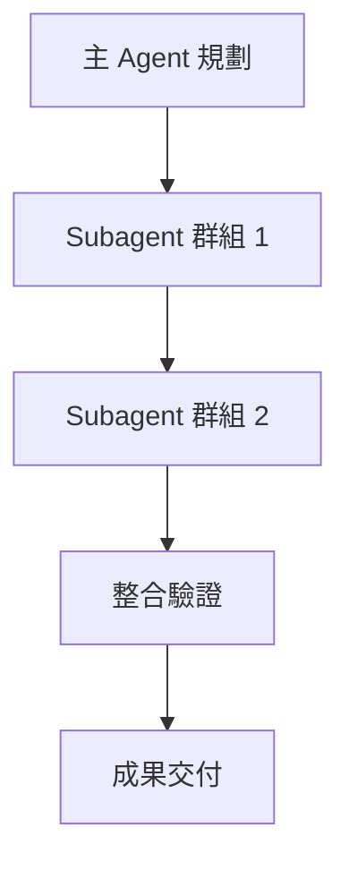

# Decisions 決策記錄中心

此目錄是主 Claude Code Agent 的 **決策中樞**，所有重要的技術決策、規劃方向和任務分配都記錄在這裡。

## 🧠 Context Engineering 核心原理

### 共享記憶體架構 (Shared Memory Architecture)
```
📋 主 Agent (Claude Code)
    ↓ 規劃決策
🗂️ .claude/context/decisions/  ← 決策中樞
    ↓ 讀取決策
🤖 Subagents (7個專業 Agent)
    ↓ 執行任務
📁 .claude/context/{專業領域}/  ← 執行成果
    ↓ 反饋迴圈
🔄 .claude/coordination/  ← 協作交接
```

### 決策生命週期
1. **Decision Planning** - 主 Agent 分析需求，制定執行計畫
2. **Context Distribution** - 決策內容分發給相關 Subagents
3. **Execution Tracking** - Subagents 執行並回報狀態
4. **Feedback Loop** - 收集執行結果，調整後續決策

## 📂 文檔命名規範

### 決策文檔
```
decisions/
├── planning-{YYYY-MM-DD-HHMM}-{project-phase}.md     # 階段規劃
├── task-assignment-{YYYY-MM-DD-HHMM}-{task-name}.md  # 任務分配
├── decision-{YYYY-MM-DD-HHMM}-{decision-topic}.md    # 重要決策
└── context-{YYYY-MM-DD-HHMM}-{context-type}.md       # 上下文更新
```

### 範例檔案名稱
- `planning-2025-09-25-1430-initial-setup.md`
- `task-assignment-2025-09-25-1445-code-quality-review.md`
- `decision-2025-09-25-1500-architecture-choice.md`
- `context-2025-09-25-1515-project-requirements.md`

## 📋 標準決策範本

### 1. 階段規劃範本 (Planning Template)
```markdown
# 階段規劃 - {階段名稱}

## 規劃摘要
- 規劃時間: {timestamp}
- 專案階段: {階段}
- 負責 Agent: Claude Code (主導)
- 預計時程: {時間範圍}

## 目標與範圍
### 主要目標
- [ ] {目標 1}
- [ ] {目標 2}
- [ ] {目標 3}

### 成功標準
- {標準 1}: {具體指標}
- {標準 2}: {具體指標}

## Subagent 任務分配
### 🟡 code-quality-specialist
- **任務**: {具體任務描述}
- **輸入**: {需要的資料/程式碼}
- **期望輸出**: {預期結果}
- **優先級**: {HIGH/MEDIUM/LOW}

### 🟢 test-automation-engineer
- **任務**: {具體任務描述}
- **依賴**: {依賴其他 agent 的成果}
- **期望輸出**: {預期結果}

### 🔴 security-infrastructure-auditor
- **任務**: {具體任務描述}
- **檢查範圍**: {安全檢查重點}
- **期望輸出**: {預期結果}

### ⚡ deployment-operations-engineer
- **任務**: {具體任務描述}
- **部署環境**: {目標環境}
- **期望輸出**: {預期結果}

### 📝 documentation-specialist
- **任務**: {具體任務描述}
- **文檔類型**: {API/架構/使用指南}
- **期望輸出**: {預期結果}

### 🧪 e2e-validation-specialist
- **任務**: {具體任務描述}
- **測試場景**: {關鍵使用者流程}
- **期望輸出**: {預期結果}

### 🎯 workflow-template-manager
- **任務**: {具體任務描述}
- **範本需求**: {VibeCoding 範本應用}
- **期望輸出**: {預期結果}

## 執行順序與依賴


## 風險與應對
### 潛在風險
- **風險 1**: {描述} → **應對**: {策略}
- **風險 2**: {描述} → **應對**: {策略}

## Next Actions
- [ ] 分發任務給對應 Subagents
- [ ] 設定執行監控檢查點
- [ ] 準備階段性驗收標準
```

### 2. 任務分配範本 (Task Assignment Template)
```markdown
# 任務分配 - {任務名稱}

## 分配詳情
- 分配時間: {timestamp}
- 目標 Agent: {agent-name}
- 任務類型: {開發/測試/審查/部署}
- 緊急程度: {HIGH/MEDIUM/LOW}

## 任務背景
### 專案上下文
{當前專案狀態和背景說明}

### 前置依賴
- [ ] {依賴項目 1} - 狀態: {完成/進行中/待開始}
- [ ] {依賴項目 2} - 狀態: {完成/進行中/待開始}

## 具體任務需求
### 主要工作項目
1. **{工作項目 1}**
   - 描述: {詳細說明}
   - 輸入: {需要的資料/檔案}
   - 輸出: {預期成果}
   - 截止時間: {deadline}

2. **{工作項目 2}**
   - 描述: {詳細說明}
   - 品質要求: {具體標準}

### 技術規範
- **程式語言**: {language}
- **框架/工具**: {tools}
- **編碼標準**: 遵循專案既有規範
- **測試要求**: {測試覆蓋率/類型}

## 協作介面
### 接收輸入來源
- **來自 {agent-name}**: {輸入類型和格式}
- **來自決策中樞**: 此任務分配文檔

### 提供輸出目標
- **輸出位置**: `.claude/context/{專業領域}/`
- **格式要求**: {報告/程式碼/文檔格式}
- **後續交接**: 交給 {next-agent} 進行 {next-task}

## 成功標準
- [ ] 功能需求完全實現
- [ ] 符合品質標準
- [ ] 通過相關測試
- [ ] 文檔完整更新
- [ ] 無破壞性變更

## 監控與回報
### 執行狀態追蹤
- [ ] 任務開始 - 時間: {timestamp}
- [ ] 進度檢查 1 (25%) - 時間: {timestamp}
- [ ] 進度檢查 2 (50%) - 時間: {timestamp}
- [ ] 進度檢查 3 (75%) - 時間: {timestamp}
- [ ] 任務完成 - 時間: {timestamp}

### 異常處理
如遇到阻礙或問題：
1. 立即在此文檔中記錄問題
2. 評估是否需要調整任務範圍
3. 通知主 Agent 進行決策調整
```

### 3. 重要決策範本 (Decision Template)
```markdown
# 技術決策記錄 - {決策主題}

## 決策摘要
- 決策時間: {timestamp}
- 決策類型: {架構/技術選型/流程/工具}
- 影響範圍: {影響的模組/功能}
- 決策者: Claude Code (基於 Linus Torvalds 原則)

## 問題陳述
### 核心問題
{需要決策的核心問題描述}

### 背景脈絡
{問題產生的背景和當前狀況}

## 決策分析 (基於 Linus 哲學)
### 1. 真實性評估
**「這是個真問題還是臆想出來的？」**
- 問題實際存在證據: {evidence}
- 用戶實際影響: {user impact}
- **結論**: {真實問題/過度設計}

### 2. 簡潔性分析
**「有更簡單的方法嗎？」**
- 當前複雜度: {current complexity}
- 可能的簡化方案: {simplified alternatives}
- **最簡方案**: {chosen simple approach}

### 3. 相容性檢查
**「會破壞什麼嗎？」**
- 向後相容性影響: {backward compatibility}
- 現有功能影響: {existing features impact}
- **相容性保證**: {compatibility measures}

## 方案比較
### 方案 A: {方案名稱}
- **優點**: {advantages}
- **缺點**: {disadvantages}
- **複雜度**: {LOW/MEDIUM/HIGH}
- **實作成本**: {implementation cost}

### 方案 B: {方案名稱}
- **優點**: {advantages}
- **缺點**: {disadvantages}
- **複雜度**: {LOW/MEDIUM/HIGH}
- **實作成本**: {implementation cost}

## 最終決策
### 選擇方案: {chosen solution}
**決策理由**:
1. {理由 1 - 基於實用主義}
2. {理由 2 - 基於簡潔原則}
3. {理由 3 - 基於相容性}

### Linus 式品味評估
🟢 **好品味**: {為什麼這是優雅的解決方案}
- 消除了哪些特殊情況: {eliminated edge cases}
- 簡化了哪些複雜邏輯: {simplified complexity}

## 實施計畫
### 執行步驟
1. **Phase 1**: {階段 1 內容}
   - 負責 Agent: {responsible agent}
   - 時程: {timeline}

2. **Phase 2**: {階段 2 內容}
   - 負責 Agent: {responsible agent}
   - 依賴: {dependencies}

### 驗證標準
- [ ] 功能正確性驗證
- [ ] 效能影響測試
- [ ] 相容性確認
- [ ] 文檔更新完成

## 影響範圍
### 受影響的 Subagents
- **🟡 code-quality-specialist**: {影響說明}
- **🟢 test-automation-engineer**: {影響說明}
- **🔴 security-infrastructure-auditor**: {影響說明}

### 後續決策依賴
此決策將影響後續的 {related decisions} 決策制定。

## 監控與檢討
### 成功指標
- {指標 1}: {測量方法}
- {指標 2}: {測量方法}

### 檢討時程
- **1週後**: 初步影響評估
- **1月後**: 全面效果檢討
- **1季後**: 長期影響分析
```

## 🤖 Context 同步機制

### Subagent 執行前檢查清單
每個 Subagent 被調用時必須：

1. **讀取最新決策**
   ```bash
   # 檢查是否有相關的最新決策
   ls -t .claude/context/decisions/ | head -5
   ```

2. **理解任務上下文**
   - 閱讀相關的 planning 和 task-assignment 文檔
   - 確認自己的角色和責任範圍
   - 檢查與其他 agent 的協作關係

3. **執行狀態同步**
   - 在 decisions 中更新執行狀態
   - 記錄進度和發現的問題
   - 標記完成狀態和後續建議

## 📊 協作流程監控

### 實時狀態追蹤
```markdown
## 當前專案狀態 Dashboard

### 主要階段進度
- [ ] Phase 1: 需求分析 - 負責: workflow-template-manager
- [x] Phase 2: 架構設計 - 負責: Claude Code + code-quality-specialist
- [ ] Phase 3: 開發實作 - 負責: test-automation-engineer
- [ ] Phase 4: 品質保證 - 負責: security + e2e-validation

### Agent 工作狀態
- 🟡 code-quality-specialist: ACTIVE - 正在分析程式碼品質
- 🟢 test-automation-engineer: WAITING - 等待程式碼完成
- 🔴 security-infrastructure-auditor: IDLE - 待命中
- ⚡ deployment-operations-engineer: IDLE - 待命中
- 📝 documentation-specialist: ACTIVE - 更新 API 文檔
- 🧪 e2e-validation-specialist: WAITING - 等待功能完成
- 🎯 workflow-template-manager: COMPLETED - 已完成初始規劃
```

## 🔄 最佳實踐

### 1. 決策記錄原則
- **及時性**: 重要決策立即記錄
- **完整性**: 包含分析過程和理由
- **可追溯性**: 能夠追蹤決策演變歷史
- **影響性**: 明確說明對各 Agent 的影響

### 2. Context 更新頻率
- **關鍵決策**: 立即更新
- **階段性規劃**: 每日或每階段更新
- **狀態同步**: Agent 執行前後更新
- **完成回報**: 任務完成時立即更新

### 3. 協作效率優化
- 使用標準範本提高一致性
- 建立清晰的責任界線
- 設定明確的交接點和驗收標準
- 定期檢討協作效果

---

**這套 Context Engineering 系統確保所有 Agent 在統一的上下文中協作，最大化整體效率和品質。**