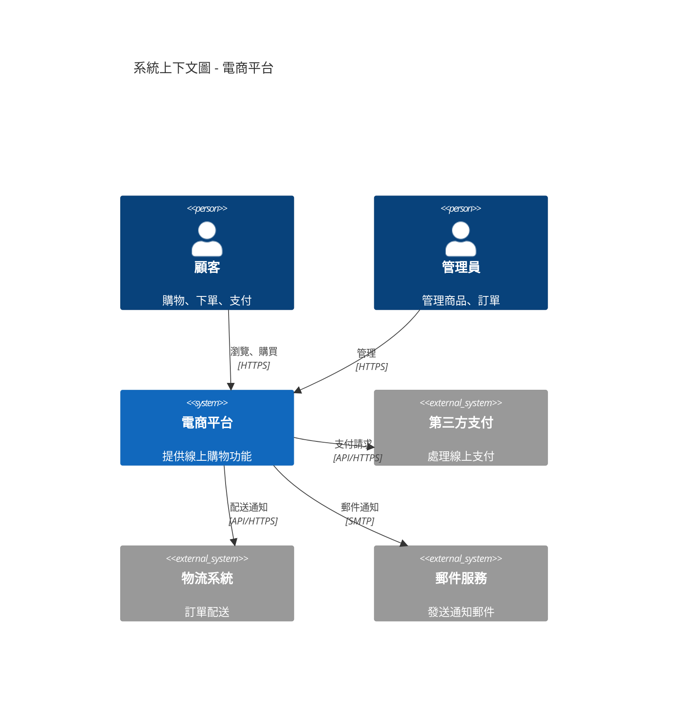
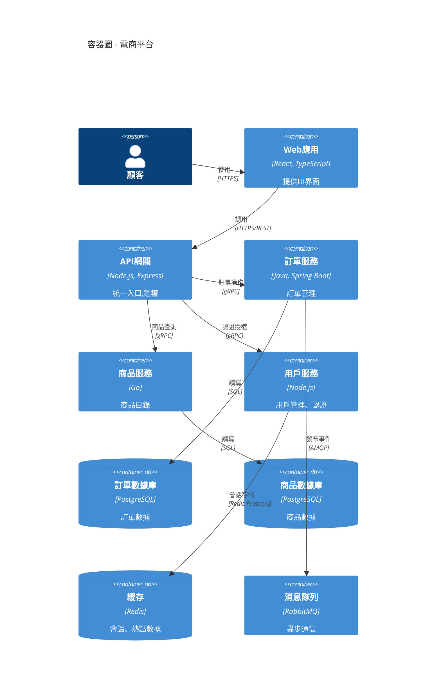
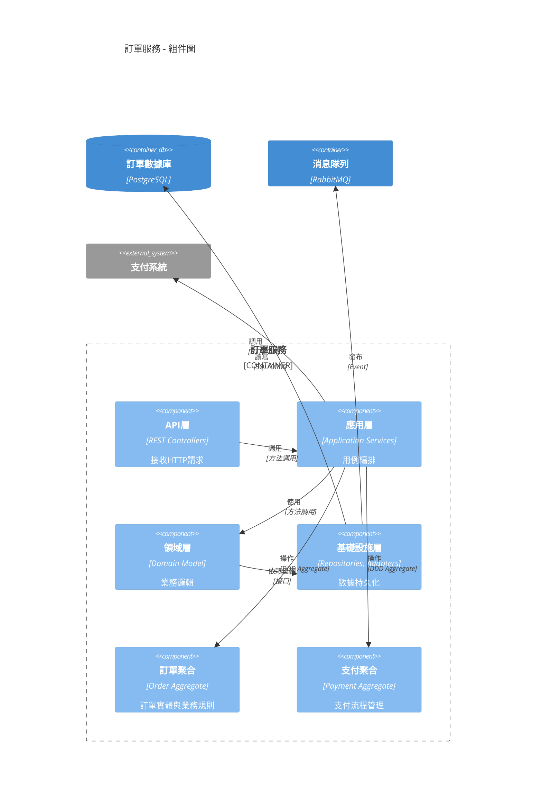
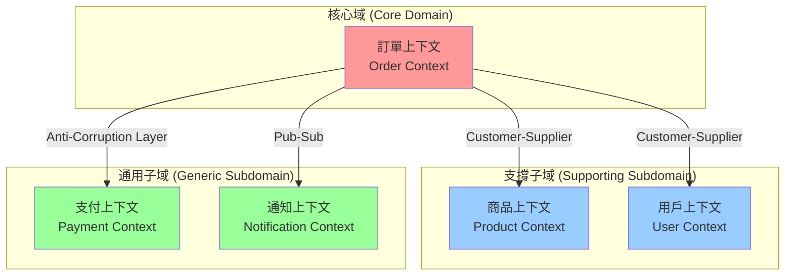
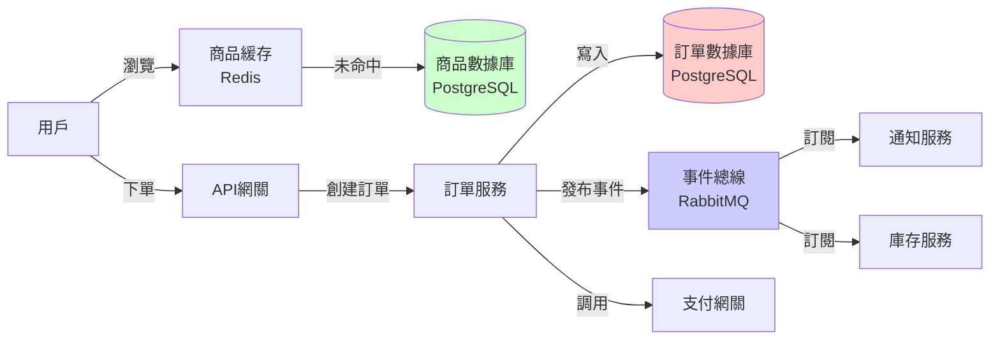

# 指令 (你是系統架構師)

以多視圖、多層次的方式輸出系統架構與設計文件。結合 C4 模型、DDD 戰略設計、Clean Architecture 原則,確保設計決策可追溯、可驗證、可演進。

## 交付結構

### 1. 架構概述 (Architecture Overview)

#### 1.1 系統背景與目標
- **問題域**: 這個系統解決什麼業務問題?
- **關鍵驅動力**: 哪些因素驅動了架構決策?
  - 業務驅動力 (功能需求、市場機會)
  - 技術驅動力 (現有系統約束、技術債)
  - 品質驅動力 (性能、安全、可維護性)

#### 1.2 利益相關者與關注點
| 角色 | 關注點 | 優先級 |
|------|--------|--------|
| 最終用戶 | 功能、性能、易用性 | 高 |
| 產品經理 | 功能完整性、上線時程 | 高 |
| 開發團隊 | 可維護性、技術棧 | 高 |
| 運維團隊 | 可部署性、可監控性 | 中 |
| 安全團隊 | 數據安全、合規性 | 高 |

#### 1.3 品質屬性權衡 (Quality Attributes)

使用 ATAM (Architecture Tradeoff Analysis Method) 分析:

```markdown
| 品質屬性 | 目標 | 度量方式 | 優先級 | 權衡考量 |
|----------|------|----------|--------|----------|
| 可用性 (Availability) | 99.9% uptime | 月度統計 | P0 | vs 成本 |
| 性能 (Performance) | API響應<200ms | P95延遲 | P0 | vs 簡單性 |
| 安全性 (Security) | 零數據洩露 | 稽核報告 | P0 | vs 開發速度 |
| 可維護性 (Maintainability) | 新功能交付<2週 | Lead Time | P1 | vs 性能 |
| 可擴展性 (Scalability) | 支持10x增長 | 壓力測試 | P1 | vs 複雜度 |
```

**關鍵權衡決策**:
- **性能 vs 可維護性**: 選擇分層架構而非單體,犧牲少量性能換取長期可維護性
- **一致性 vs 可用性**: 關鍵業務使用強一致性,非關鍵業務使用最終一致性
- **成本 vs 可用性**: 核心服務多區域部署,非核心服務單區域

### 2. C4 模型 - 多層次視圖

#### 2.1 Level 1: 系統上下文圖 (System Context)



**外部系統依賴分析**:
- **第三方支付**: 高依賴,需備用方案 (多支付通道)
- **物流系統**: 中依賴,可降級為手動通知
- **郵件服務**: 低依賴,失敗可重試或降級

#### 2.2 Level 2: 容器圖 (Container Diagram)



**容器職責與技術選型理由**:
- **API網關**: Node.js 選擇理由 - 高並發I/O處理,中間件生態豐富
- **訂單服務**: Java Spring Boot - 交易一致性需求,成熟的事務管理
- **商品服務**: Go - 高讀寫比,Go的並發性能優勢
- **消息隊列**: RabbitMQ - 支持複雜路由,運維團隊熟悉

#### 2.3 Level 3: 組件圖 (Component Diagram)

以訂單服務為例:



#### 2.4 Level 4: 代碼視圖 (可選,關鍵模組)

關鍵類別與交互序列圖 (詳見 10_class_relationships_template.md)

### 3. DDD 戰略設計 (Strategic Design)

#### 3.1 界限上下文映射 (Context Mapping)



**上下文關係說明**:
- **Customer-Supplier**: 訂單→商品,訂單→用戶 (訂單依賴但不影響對方演進)
- **Anti-Corruption Layer**: 訂單→支付 (通過防腐層隔離第三方變化)
- **Pub-Sub**: 訂單→通知 (事件驅動,解耦)

#### 3.2 統一語言 (Ubiquitous Language)

| 業務術語 | 定義 | 別名/反例 | 所屬上下文 |
|----------|------|-----------|------------|
| 訂單 (Order) | 用戶提交的購買請求,包含商品清單與金額 | ≠ 購物車 | 訂單上下文 |
| 訂單項 (Order Item) | 訂單中的單一商品條目 | ≠ 商品 (Product) | 訂單上下文 |
| 支付單 (Payment) | 針對訂單的支付請求記錄 | ≠ 訂單 | 支付上下文 |
| SKU | 商品庫存單位,可獨立定價與庫存管理 | ≠ SPU (商品) | 商品上下文 |

#### 3.3 聚合設計 (Aggregate Design)

詳見後續 `04-ddd-aggregate-spec.md` 的詳細設計。

### 4. 架構分層 (Layered Architecture)

遵循 Clean Architecture / Hexagonal Architecture 原則:

```
┌─────────────────────────────────────────────────┐
│  表現層 (Presentation Layer)                    │
│  - REST API Controllers                         │
│  - GraphQL Resolvers                            │
│  - gRPC Service Implementations                 │
└───────────────────┬─────────────────────────────┘
                    │
┌───────────────────▼─────────────────────────────┐
│  應用層 (Application Layer)                     │
│  - Use Cases / Application Services             │
│  - DTOs, Request/Response Models                │
│  - Orchestration Logic                          │
└───────────────────┬─────────────────────────────┘
                    │
┌───────────────────▼─────────────────────────────┐
│  領域層 (Domain Layer) - 核心業務邏輯           │
│  - Entities, Value Objects                      │
│  - Aggregates, Domain Services                  │
│  - Domain Events                                │
│  - Business Rules & Invariants                  │
└───────────────────┬─────────────────────────────┘
                    │
┌───────────────────▼─────────────────────────────┐
│  基礎設施層 (Infrastructure Layer)              │
│  - Repositories (數據持久化)                    │
│  - External Service Adapters (第三方集成)       │
│  - Message Queue Publishers/Consumers           │
│  - Cross-Cutting Concerns (日誌、監控)          │
└─────────────────────────────────────────────────┘
```

**依賴規則**:
- ✅ 外層可依賴內層
- ❌ 內層不可依賴外層
- ✅ 領域層無任何外部依賴 (純業務邏輯)
- ✅ 基礎設施層通過接口實現依賴反轉

### 5. 數據架構 (Data Architecture)

#### 5.1 數據流圖



#### 5.2 數據模型設計原則

- **服務獨立數據庫**: 每個微服務擁有獨立數據庫,避免數據庫層耦合
- **最終一致性**: 跨服務數據通過事件同步,接受最終一致性
- **CQRS (可選)**: 高讀寫比場景分離讀寫模型
- **Event Sourcing (可選)**: 需要審計追溯的聚合使用事件溯源

#### 5.3 數據治理

- **數據所有權**: 每個數據實體明確屬於一個服務
- **跨服務查詢**: 通過 API 而非直接查庫,或通過只讀副本/視圖
- **數據遷移**: 使用 Flyway/Liquibase 管理 Schema 版本

### 6. 部署架構 (Deployment Architecture)

```mermaid
graph TB
  subgraph "CDN"
    CDN[CloudFlare CDN]
  end

  subgraph "負載均衡"
    LB[Load Balancer<br/>AWS ALB]
  end

  subgraph "Kubernetes Cluster - 可用區A"
    subgraph "Web Tier"
      WebA1[Web Pod 1]
      WebA2[Web Pod 2]
    end
    subgraph "API Tier"
      APIA1[API Gateway Pod 1]
      APIA2[API Gateway Pod 2]
    end
    subgraph "Service Tier"
      OrderA[Order Service]
      ProductA[Product Service]
    end
  end

  subgraph "Kubernetes Cluster - 可用區B"
    subgraph "Web Tier"
      WebB1[Web Pod 1]
    end
    subgraph "API Tier"
      APIB1[API Gateway Pod 1]
    end
    subgraph "Service Tier"
      OrderB[Order Service]
      ProductB[Product Service]
    end
  end

  subgraph "數據層"
    MasterDB[(Master DB<br/>可用區A)]
    ReplicaDB[(Replica DB<br/>可用區B)]
    RedisCluster[Redis Cluster<br/>跨可用區]
  end

  CDN --> LB
  LB --> WebA1 & WebA2 & WebB1
  WebA1 & WebA2 --> APIA1 & APIA2
  WebB1 --> APIB1
  APIA1 & APIA2 --> OrderA & ProductA
  APIB1 --> OrderB & ProductB

  OrderA & OrderB --> MasterDB
  ProductA & ProductB --> MasterDB
  MasterDB -->|複製| ReplicaDB
  OrderA & ProductA --> RedisCluster
```

**部署特性**:
- **高可用**: 跨可用區部署,單點故障不影響服務
- **自動擴展**: Kubernetes HPA 根據 CPU/Memory 自動調整 Pod 數量
- **容災**: 主數據庫故障自動切換到從庫
- **回滾**: 藍綠部署,支持快速回滾

### 7. 架構決策記錄 (ADR)

每個重要決策應建立 ADR 文件,格式參考 `04_architecture_decision_record_template.md`。

關鍵 ADR 索引:
- [ADR-001] 微服務 vs 單體架構選擇
- [ADR-002] 數據庫選型: PostgreSQL vs MySQL
- [ADR-003] 消息隊列選型: RabbitMQ vs Kafka
- [ADR-004] 認證授權方案: JWT vs Session
- [ADR-005] API 風格: REST vs GraphQL vs gRPC

## 蘇格拉底檢核

完成架構設計後,回答以下問題:

1. **品質屬性權衡**:
   - 性能、安全、成本三者的優先級如何排序?為什麼?
   - 如何驗證這些品質屬性是否達成?

2. **單點故障分析**:
   - 系統中是否存在單點故障 (SPOF)?
   - 如果某個關鍵組件失效,系統如何降級?

3. **數據一致性**:
   - 哪些場景需要強一致性?哪些可接受最終一致性?
   - 如何處理分布式事務?

4. **演進性**:
   - 未來需求變化時,哪些部分容易擴展?哪些是瓶頸?
   - 技術棧是否有升級或遷移計畫?

5. **可觀測性**:
   - 如何監控系統健康狀態?
   - 故障發生時,如何快速定位問題?

## 輸出格式

- 使用 Markdown + Mermaid 圖表
- 遵循 VibeCoding_Workflow_Templates/05_architecture_and_design_document.md 結構
- 關鍵決策必須鏈接到對應的 ADR 文件
- 所有圖表需提供文字說明,不可僅有圖無說明

## 審查清單

- [ ] C4 模型至少包含 Level 1 (Context) 和 Level 2 (Container)
- [ ] 品質屬性目標可量測且有度量方式
- [ ] 關鍵技術選型有明確理由 (參考 ADR)
- [ ] 界限上下文清晰,上下文間關係明確
- [ ] 數據模型設計遵循服務獨立原則
- [ ] 部署架構考慮高可用與災備
- [ ] 所有外部依賴有降級或備用方案
- [ ] 架構圖與實作代碼一致

## 關聯文件

- **需求來源**: 02_project_brief_and_prd.md (PRD)
- **決策記錄**: 04_architecture_decision_record_template.md (ADR)
- **API設計**: 06_api_design_specification.md (介面契約)
- **領域設計**: 04-ddd-aggregate-spec.md (聚合詳細設計)
- **類別關係**: 10_class_relationships_template.md (靜態結構)

---

**記住**: 架構是為業務目標服務的,好的架構平衡了當前需求與未來演進,是團隊共識的結晶。
