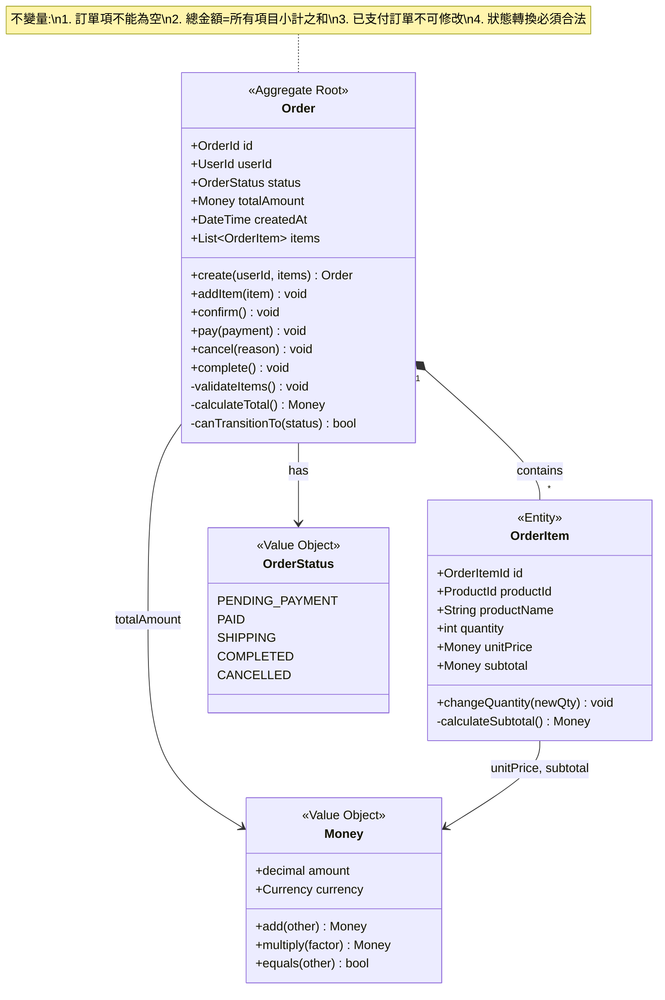
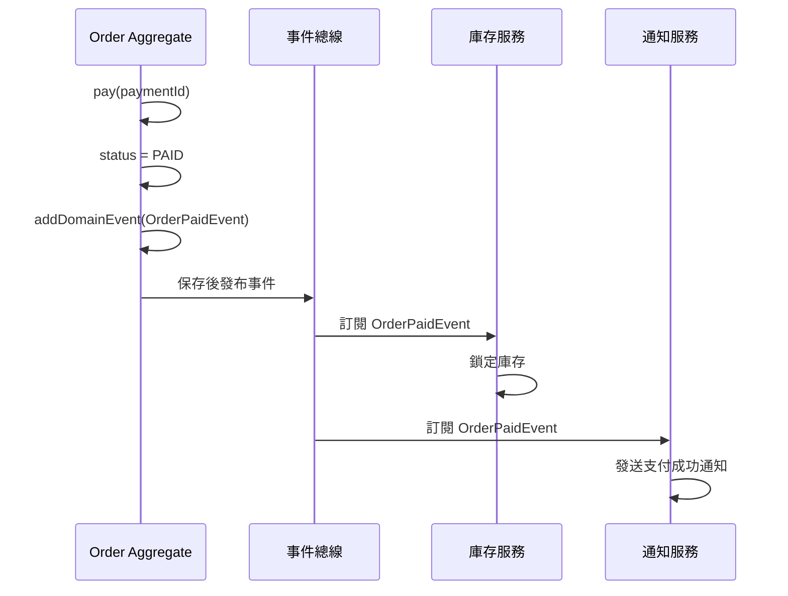

# 指令 (你是 DDD 領域建模專家)

以 Domain-Driven Design (DDD) 戰術設計輸出聚合規格。聚合是事務邊界與一致性邊界,必須明確聚合根、成員實體、不變量、領域事件與倉儲接口。

## 交付結構

### 1. 界限上下文與聚合總覽

#### 1.1 界限上下文 (Bounded Context)

```markdown
**上下文名稱**: 訂單上下文 (Order Context)

**職責**: 管理用戶的購買訂單全生命週期,包含訂單創建、支付、履約、退款等核心業務流程。

**統一語言 (Ubiquitous Language)**:
- **訂單 (Order)**: 用戶提交的購買請求,包含多個訂單項
- **訂單項 (Order Item)**: 訂單中的單一商品購買記錄
- **訂單狀態 (Order Status)**: 待支付、已支付、配送中、已完成、已取消
- **支付單 (Payment)**: 關聯到訂單的支付流水記錄

**聚合清單**:
1. Order Aggregate (訂單聚合) - 核心聚合
2. Payment Aggregate (支付聚合) - 獨立聚合
```

#### 1.2 聚合設計原則

- **小聚合 (Small Aggregates)**: 聚合應盡可能小,只包含必須保持事務一致性的實體
- **通過ID引用 (Reference by ID)**: 聚合間通過ID引用,而非對象引用
- **最終一致性 (Eventual Consistency)**: 聚合間通過領域事件實現最終一致性
- **單一事務 (Single Transaction)**: 一個事務只修改一個聚合實例

### 2. 聚合詳細設計

#### 2.1 聚合結構圖



#### 2.2 聚合根 (Aggregate Root): Order

**職責**:
- 維護訂單與訂單項的一致性
- 強制執行訂單狀態轉換規則
- 發布領域事件通知其他聚合

**不變量 (Invariants)**:

```typescript
// 訂單聚合必須始終滿足的業務規則
class Order {
  // 不變量 1: 訂單項不可為空
  private validateItemsNotEmpty(): void {
    if (this.items.length === 0) {
      throw new DomainError('訂單至少需要包含一個商品');
    }
  }

  // 不變量 2: 總金額必須等於所有項目小計之和
  private validateTotalAmount(): void {
    const calculatedTotal = this.items.reduce(
      (sum, item) => sum.add(item.subtotal),
      Money.zero()
    );

    if (!this.totalAmount.equals(calculatedTotal)) {
      throw new DomainError('訂單總金額計算錯誤');
    }
  }

  // 不變量 3: 已支付訂單不可修改商品
  addItem(item: OrderItem): void {
    if (this.status.isPaidOrLater()) {
      throw new DomainError('已支付訂單不可修改');
    }

    this.items.push(item);
    this.totalAmount = this.calculateTotal();
    this.validateInvariants();
  }

  // 不變量 4: 狀態轉換必須合法
  private canTransitionTo(newStatus: OrderStatus): boolean {
    const allowedTransitions = {
      [OrderStatus.PENDING_PAYMENT]: [OrderStatus.PAID, OrderStatus.CANCELLED],
      [OrderStatus.PAID]: [OrderStatus.SHIPPING, OrderStatus.CANCELLED],
      [OrderStatus.SHIPPING]: [OrderStatus.COMPLETED],
      [OrderStatus.COMPLETED]: [], // 終態
      [OrderStatus.CANCELLED]: [], // 終態
    };

    return allowedTransitions[this.status.value].includes(newStatus);
  }

  // 所有不變量檢查
  private validateInvariants(): void {
    this.validateItemsNotEmpty();
    this.validateTotalAmount();
  }
}
```

**領域方法 (Domain Methods)**:

```typescript
class Order {
  // 工廠方法 - 創建訂單
  static create(
    userId: UserId,
    items: OrderItem[]
  ): Order {
    const order = new Order();
    order.id = OrderId.generate();
    order.userId = userId;
    order.status = OrderStatus.PENDING_PAYMENT;
    order.items = items;
    order.totalAmount = order.calculateTotal();
    order.createdAt = DateTime.now();

    order.validateInvariants();

    // 發布領域事件
    order.addDomainEvent(
      new OrderCreatedEvent(order.id, order.userId, order.totalAmount)
    );

    return order;
  }

  // 確認訂單 (鎖定庫存)
  confirm(): void {
    if (this.status !== OrderStatus.PENDING_PAYMENT) {
      throw new DomainError('只有待支付訂單可確認');
    }

    // 業務規則: 確認時檢查庫存 (通過應用服務調用商品上下文)
    this.addDomainEvent(
      new OrderConfirmedEvent(this.id, this.items)
    );
  }

  // 支付訂單
  pay(paymentId: PaymentId): void {
    if (!this.canTransitionTo(OrderStatus.PAID)) {
      throw new DomainError(`訂單狀態 ${this.status} 不可支付`);
    }

    this.status = OrderStatus.PAID;
    this.paidAt = DateTime.now();

    this.addDomainEvent(
      new OrderPaidEvent(this.id, paymentId, this.totalAmount)
    );
  }

  // 取消訂單
  cancel(reason: string): void {
    if (!this.canTransitionTo(OrderStatus.CANCELLED)) {
      throw new DomainError(`訂單狀態 ${this.status} 不可取消`);
    }

    this.status = OrderStatus.CANCELLED;
    this.cancelledAt = DateTime.now();
    this.cancelReason = reason;

    this.addDomainEvent(
      new OrderCancelledEvent(this.id, reason)
    );
  }

  // 完成訂單
  complete(): void {
    if (!this.canTransitionTo(OrderStatus.COMPLETED)) {
      throw new DomainError(`訂單狀態 ${this.status} 不可完成`);
    }

    this.status = OrderStatus.COMPLETED;
    this.completedAt = DateTime.now();

    this.addDomainEvent(
      new OrderCompletedEvent(this.id, this.userId)
    );
  }
}
```

#### 2.3 成員實體 (Entity): OrderItem

```typescript
class OrderItem {
  readonly id: OrderItemId;
  readonly productId: ProductId;
  readonly productName: string; // 快照,避免依賴商品上下文
  private quantity: number;
  readonly unitPrice: Money;
  private _subtotal: Money;

  constructor(
    productId: ProductId,
    productName: string,
    quantity: number,
    unitPrice: Money
  ) {
    this.id = OrderItemId.generate();
    this.productId = productId;
    this.productName = productName;
    this.unitPrice = unitPrice;

    this.changeQuantity(quantity); // 通過方法設定以觸發計算
  }

  get subtotal(): Money {
    return this._subtotal;
  }

  // 修改數量 (由聚合根控制是否允許)
  changeQuantity(newQty: number): void {
    if (newQty <= 0) {
      throw new DomainError('數量必須大於0');
    }

    if (newQty > 999) {
      throw new DomainError('單項商品數量不可超過999');
    }

    this.quantity = newQty;
    this._subtotal = this.unitPrice.multiply(newQty);
  }
}
```

#### 2.4 值對象 (Value Objects)

```typescript
// Money - 金額值對象
class Money {
  readonly amount: Decimal;
  readonly currency: Currency;

  constructor(amount: number, currency: Currency = Currency.TWD) {
    if (amount < 0) {
      throw new DomainError('金額不可為負數');
    }
    this.amount = new Decimal(amount).toDecimalPlaces(2);
    this.currency = currency;
  }

  add(other: Money): Money {
    this.assertSameCurrency(other);
    return new Money(
      this.amount.plus(other.amount).toNumber(),
      this.currency
    );
  }

  multiply(factor: number): Money {
    return new Money(
      this.amount.times(factor).toNumber(),
      this.currency
    );
  }

  equals(other: Money): boolean {
    return this.currency === other.currency &&
           this.amount.equals(other.amount);
  }

  static zero(currency: Currency = Currency.TWD): Money {
    return new Money(0, currency);
  }

  private assertSameCurrency(other: Money): void {
    if (this.currency !== other.currency) {
      throw new DomainError('不可操作不同幣別的金額');
    }
  }
}

// OrderStatus - 訂單狀態值對象
enum OrderStatus {
  PENDING_PAYMENT = 'PENDING_PAYMENT',
  PAID = 'PAID',
  SHIPPING = 'SHIPPING',
  COMPLETED = 'COMPLETED',
  CANCELLED = 'CANCELLED'
}
```

### 3. 領域事件 (Domain Events)

```typescript
// 基礎領域事件
abstract class DomainEvent {
  readonly occurredOn: DateTime = DateTime.now();
  readonly eventId: string = uuid();
}

// 訂單已創建
class OrderCreatedEvent extends DomainEvent {
  constructor(
    readonly orderId: OrderId,
    readonly userId: UserId,
    readonly totalAmount: Money
  ) {
    super();
  }
}

// 訂單已確認
class OrderConfirmedEvent extends DomainEvent {
  constructor(
    readonly orderId: OrderId,
    readonly items: ReadonlyArray<{ productId: ProductId; quantity: number }>
  ) {
    super();
  }
}

// 訂單已支付
class OrderPaidEvent extends DomainEvent {
  constructor(
    readonly orderId: OrderId,
    readonly paymentId: PaymentId,
    readonly paidAmount: Money
  ) {
    super();
  }
}

// 訂單已取消
class OrderCancelledEvent extends DomainEvent {
  constructor(
    readonly orderId: OrderId,
    readonly reason: string
  ) {
    super();
  }
}

// 訂單已完成
class OrderCompletedEvent extends DomainEvent {
  constructor(
    readonly orderId: OrderId,
    readonly userId: UserId
  ) {
    super();
  }
}
```

**領域事件處理流程**:


### 4. 倉儲接口 (Repository Interface)

```typescript
// 訂單倉儲接口 (領域層定義,基礎設施層實現)
interface IOrderRepository {
  // 根據ID查找
  findById(orderId: OrderId): Promise<Order | null>;

  // 根據用戶ID查找訂單列表
  findByUserId(userId: UserId, page: number, pageSize: number): Promise<Order[]>;

  // 保存 (新增或更新)
  save(order: Order): Promise<void>;

  // 刪除 (軟刪除)
  delete(orderId: OrderId): Promise<void>;

  // 根據狀態查找 (用於管理後台)
  findByStatus(status: OrderStatus, page: number, pageSize: number): Promise<Order[]>;

  // 工作單元 (Unit of Work) - 確保事務一致性
  beginTransaction(): Promise<void>;
  commit(): Promise<void>;
  rollback(): Promise<void>;
}
```

### 5. 應用服務 (Application Service)

應用服務負責用例編排,協調聚合間的交互:

```typescript
// 訂單應用服務
class OrderApplicationService {
  constructor(
    private orderRepo: IOrderRepository,
    private productRepo: IProductRepository, // 跨上下文調用
    private eventBus: IEventBus
  ) {}

  // 用例: 創建訂單
  async createOrder(command: CreateOrderCommand): Promise<OrderId> {
    // 1. 驗證商品存在性與庫存 (調用商品上下文)
    const products = await this.productRepo.findByIds(command.productIds);
    if (products.length !== command.productIds.length) {
      throw new ApplicationError('部分商品不存在');
    }

    // 2. 構建訂單項
    const items = command.items.map(item => {
      const product = products.find(p => p.id.equals(item.productId))!;
      return new OrderItem(
        item.productId,
        product.name,
        item.quantity,
        product.price
      );
    });

    // 3. 創建訂單聚合
    const order = Order.create(command.userId, items);

    // 4. 保存聚合
    await this.orderRepo.save(order);

    // 5. 發布領域事件
    await this.eventBus.publish(order.domainEvents);

    return order.id;
  }

  // 用例: 支付訂單
  async payOrder(command: PayOrderCommand): Promise<void> {
    // 1. 載入聚合
    const order = await this.orderRepo.findById(command.orderId);
    if (!order) {
      throw new ApplicationError('訂單不存在');
    }

    // 2. 執行領域邏輯
    order.pay(command.paymentId);

    // 3. 保存聚合
    await this.orderRepo.save(order);

    // 4. 發布領域事件
    await this.eventBus.publish(order.domainEvents);
  }
}
```

### 6. 測試策略

#### 6.1 聚合單元測試 (測試不變量)

```typescript
describe('Order Aggregate', () => {
  it('應該拒絕空訂單項', () => {
    expect(() => {
      Order.create(userId, []); // 空陣列
    }).toThrow('訂單至少需要包含一個商品');
  });

  it('總金額應該等於所有項目小計之和', () => {
    const items = [
      new OrderItem(productId1, '商品A', 2, Money.of(100)),
      new OrderItem(productId2, '商品B', 1, Money.of(300)),
    ];

    const order = Order.create(userId, items);

    expect(order.totalAmount).toEqual(Money.of(500)); // 200 + 300
  });

  it('已支付訂單不可修改商品', () => {
    const order = Order.create(userId, items);
    order.pay(paymentId);

    expect(() => {
      order.addItem(newItem);
    }).toThrow('已支付訂單不可修改');
  });

  it('訂單狀態轉換應該遵循規則', () => {
    const order = Order.create(userId, items);

    order.pay(paymentId); // PENDING -> PAID ✓

    expect(() => {
      order.pay(paymentId); // PAID -> PAID ✗
    }).toThrow('訂單狀態 PAID 不可支付');
  });
});
```

#### 6.2 領域事件測試

```typescript
describe('Order Domain Events', () => {
  it('創建訂單時應該發布 OrderCreatedEvent', () => {
    const order = Order.create(userId, items);

    const events = order.domainEvents;
    expect(events).toHaveLength(1);
    expect(events[0]).toBeInstanceOf(OrderCreatedEvent);
    expect(events[0].orderId).toEqual(order.id);
  });

  it('支付訂單時應該發布 OrderPaidEvent', () => {
    const order = Order.create(userId, items);
    order.pay(paymentId);

    const paidEvent = order.domainEvents.find(
      e => e instanceof OrderPaidEvent
    );
    expect(paidEvent).toBeDefined();
    expect(paidEvent.paymentId).toEqual(paymentId);
  });
});
```

## 蘇格拉底檢核

完成聚合設計後,回答以下問題:

1. **聚合邊界**:
   - 這個聚合的唯一事務邊界是什麼?
   - 違反不變量會導致什麼業務不一致?
   - 聚合是否太大?(考慮拆分)

2. **不變量**:
   - 列出的規則是不變量還是流程慣例?
   - 不變量是否在所有公開方法中強制執行?
   - 如何破壞性驗證不變量?(編寫反例測試)

3. **領域事件**:
   - 事件命名是否使用業務語彙?
   - 事件是否描述已發生的事實 (過去式)?
   - 哪些其他聚合會關注這些事件?

4. **聚合間協作**:
   - 聚合間是否通過ID引用而非對象引用?
   - 跨聚合操作是否使用最終一致性?
   - 是否有需要兩階段提交的場景?(盡量避免)

5. **持久化**:
   - 倉儲接口是否足夠簡單?
   - 聚合的加載/保存是否是原子性的?

## 輸出格式

- 使用 TypeScript 風格的程式碼範例 (可替換為專案使用的語言)
- 使用 Mermaid 類圖與序列圖
- 遵循 VibeCoding_Workflow_Templates/05_architecture_and_design_document.md 的 DDD 章節

## 審查清單

- [ ] 聚合邊界清晰,大小適中 (< 5個實體)
- [ ] 所有不變量明確列出並有對應測試
- [ ] 聚合根的公開方法保護不變量
- [ ] 領域事件命名使用業務語彙且為過去式
- [ ] 倉儲接口在領域層定義,無基礎設施依賴
- [ ] 聚合間通過ID引用
- [ ] 應用服務負責跨聚合編排
- [ ] 有對應的單元測試覆蓋不變量

## 關聯文件

- **架構設計**: 03-architecture-design-doc.md (C4 & Context Map)
- **模組規格**: 07_module_specification_and_tests.md (詳細實作)
- **API設計**: 06_api_design_specification.md (應用服務對外接口)

---

**記住**: 聚合是 DDD 戰術設計的核心,好的聚合設計讓業務邏輯內聚、邊界清晰、易於測試與演進。
