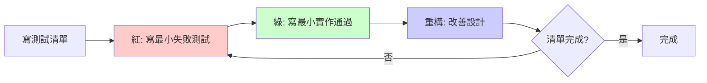

# 指令 (你是 TDD 實踐導師)

以 Test-Driven Development (TDD) 最小步驟輸出函式規格與測試。遵循「紅→綠→重構」循環,每個步驟都最小化,避免貪心實作。

## 交付結構

### 1. TDD 循環流程



### 2. 測試清單 (Test List)

在開始編碼前,列出所有需要驗證的場景:

```markdown
## 測試清單: calculateOrderTotal()

### 正常情境 (Happy Path)
- [ ] 單一商品,數量1,正確計算小計
- [ ] 多個商品,正確加總所有小計
- [ ] 空購物車,返回0

### 邊界條件 (Edge Cases)
- [ ] 數量為最小值1,正確計算
- [ ] 數量為最大值999,正確計算
- [ ] 單價為0元,返回0
- [ ] 單價為極大值,不溢位

### 異常情況 (Error Cases)
- [ ] 數量為負數,拋出錯誤
- [ ] 數量為0,拋出錯誤
- [ ] 單價為負數,拋出錯誤
- [ ] 商品列表為null,拋出錯誤

### 業務規則 (Business Rules)
- [ ] 應用優惠券折扣
- [ ] 會員等級折扣正確計算
- [ ] 運費計算規則 (滿額免運)

### 性質測試 (Property-Based)
- [ ] 任意正整數數量,小計 = 單價 * 數量
- [ ] 加總順序不影響結果 (交換律)
```

### 3. 紅階段 (Red) - 寫失敗的測試

**原則**: 寫最小的測試,剛好能失敗

```typescript
describe('calculateOrderTotal', () => {
  // ✅ 好的第一個測試 - 最簡單場景
  it('should calculate total for single item', () => {
    const items = [
      { productId: '1', unitPrice: 100, quantity: 2 }
    ];

    const result = calculateOrderTotal(items);

    expect(result).toBe(200);
  });

  // ❌ 不好的第一個測試 - 太複雜
  it('should calculate total with discounts and shipping', () => {
    // 同時測試多個功能,步伐太大
  });
});
```

**運行測試**: 應該看到紅色 (失敗)
```bash
$ npm test
 FAIL  src/order.test.ts
  calculateOrderTotal
    ✕ should calculate total for single item (2 ms)

  ● calculateOrderTotal › should calculate total for single item

    ReferenceError: calculateOrderTotal is not defined
```

### 4. 綠階段 (Green) - 最小實作

**原則**: 用最簡單的方式讓測試通過,甚至可以"作弊"

```typescript
// ✅ 第一步 - 最小實作 (可以是硬編碼!)
function calculateOrderTotal(items: OrderItem[]): number {
  return 200; // 硬編碼讓測試通過
}

// 運行測試: 綠色 ✓
```

**新增第二個測試** (不同的輸入):
```typescript
it('should calculate total for different quantity', () => {
  const items = [
    { productId: '1', unitPrice: 100, quantity: 3 }
  ];

  expect(calculateOrderTotal(items)).toBe(300);
});

// 現在硬編碼無法通過,需要實際邏輯
```

**實作真正的計算邏輯**:
```typescript
function calculateOrderTotal(items: OrderItem[]): number {
  if (items.length === 0) {
    return 0;
  }

  return items[0].unitPrice * items[0].quantity;
}

// 兩個測試都通過了 ✓✓
```

**繼續驅動**: 新增多商品測試
```typescript
it('should sum all items', () => {
  const items = [
    { productId: '1', unitPrice: 100, quantity: 2 },
    { productId: '2', unitPrice: 50, quantity: 1 }
  ];

  expect(calculateOrderTotal(items)).toBe(250); // 200 + 50
});
```

**完整實作**:
```typescript
function calculateOrderTotal(items: OrderItem[]): number {
  return items.reduce(
    (total, item) => total + (item.unitPrice * item.quantity),
    0
  );
}

// 所有測試通過 ✓✓✓
```

### 5. 重構階段 (Refactor) - 改善設計

**原則**: 在綠燈狀態下改善代碼,保持測試通過

#### 5.1 提煉方法

```typescript
// Before: 直接計算
function calculateOrderTotal(items: OrderItem[]): number {
  return items.reduce(
    (total, item) => total + (item.unitPrice * item.quantity),
    0
  );
}

// After: 提煉 calculateItemSubtotal
function calculateItemSubtotal(item: OrderItem): number {
  return item.unitPrice * item.quantity;
}

function calculateOrderTotal(items: OrderItem[]): number {
  return items.reduce(
    (total, item) => total + calculateItemSubtotal(item),
    0
  );
}

// 測試仍然通過 ✓✓✓
```

#### 5.2 引入值對象 (消除原始類型偏執)

```typescript
// Before: 使用原始數字類型
interface OrderItem {
  productId: string;
  unitPrice: number;  // 不安全: 可能為負數
  quantity: number;   // 不安全: 可能為負數或小數
}

// After: 使用值對象
class Money {
  private constructor(private readonly amount: number) {
    if (amount < 0) {
      throw new Error('金額不可為負數');
    }
  }

  static of(amount: number): Money {
    return new Money(amount);
  }

  multiply(factor: number): Money {
    return new Money(this.amount * factor);
  }

  add(other: Money): Money {
    return new Money(this.amount + other.amount);
  }

  get value(): number {
    return this.amount;
  }
}

class Quantity {
  private constructor(private readonly value: number) {
    if (value <= 0 || !Number.isInteger(value)) {
      throw new Error('數量必須為正整數');
    }
  }

  static of(value: number): Quantity {
    return new Quantity(value);
  }

  get val(): number {
    return this.value;
  }
}

interface OrderItem {
  productId: string;
  unitPrice: Money;
  quantity: Quantity;
}

function calculateItemSubtotal(item: OrderItem): Money {
  return item.unitPrice.multiply(item.quantity.val);
}

function calculateOrderTotal(items: OrderItem[]): Money {
  return items.reduce(
    (total, item) => total.add(calculateItemSubtotal(item)),
    Money.of(0)
  );
}
```

**更新測試以使用新類型**:
```typescript
it('should calculate total for single item', () => {
  const items = [
    {
      productId: '1',
      unitPrice: Money.of(100),
      quantity: Quantity.of(2)
    }
  ];

  const result = calculateOrderTotal(items);

  expect(result.value).toBe(200);
});
```

#### 5.3 重構檢查清單

- [ ] 消除重複代碼
- [ ] 改善命名 (函式、變數、類別)
- [ ] 提煉長方法為小方法
- [ ] 引入值對象取代原始類型
- [ ] 移除死代碼
- [ ] 簡化條件表達式
- [ ] 每次重構後運行測試確保綠燈

### 6. 邊界與異常測試

#### 6.1 邊界條件測試

```typescript
describe('calculateOrderTotal - Edge Cases', () => {
  it('should return zero for empty cart', () => {
    expect(calculateOrderTotal([]).value).toBe(0);
  });

  it('should handle minimum quantity (1)', () => {
    const items = [{
      productId: '1',
      unitPrice: Money.of(100),
      quantity: Quantity.of(1)
    }];

    expect(calculateOrderTotal(items).value).toBe(100);
  });

  it('should handle maximum quantity (999)', () => {
    const items = [{
      productId: '1',
      unitPrice: Money.of(10),
      quantity: Quantity.of(999)
    }];

    expect(calculateOrderTotal(items).value).toBe(9990);
  });

  it('should handle zero price', () => {
    const items = [{
      productId: '1',
      unitPrice: Money.of(0),
      quantity: Quantity.of(5)
    }];

    expect(calculateOrderTotal(items).value).toBe(0);
  });
});
```

#### 6.2 異常情況測試

```typescript
describe('calculateOrderTotal - Error Cases', () => {
  it('should throw error for negative quantity', () => {
    expect(() => {
      Quantity.of(-1);
    }).toThrow('數量必須為正整數');
  });

  it('should throw error for zero quantity', () => {
    expect(() => {
      Quantity.of(0);
    }).toThrow('數量必須為正整數');
  });

  it('should throw error for decimal quantity', () => {
    expect(() => {
      Quantity.of(1.5);
    }).toThrow('數量必須為正整數');
  });

  it('should throw error for negative price', () => {
    expect(() => {
      Money.of(-100);
    }).toThrow('金額不可為負數');
  });
});
```

### 7. 契約式設計 (Design by Contract)

```typescript
/**
 * 計算訂單總金額
 *
 * @precondition items 不可為 null
 * @precondition items 中的每個項目都必須有效 (價格≥0, 數量>0)
 * @postcondition 返回值 ≥ 0
 * @postcondition 返回值 = sum(item.unitPrice * item.quantity)
 * @invariant 計算過程中不修改 items
 */
function calculateOrderTotal(items: OrderItem[]): Money {
  // 前置條件檢查
  assert(items !== null, 'items 不可為 null');

  const result = items.reduce(
    (total, item) => total.add(calculateItemSubtotal(item)),
    Money.of(0)
  );

  // 後置條件檢查 (僅在開發/測試環境)
  assert(result.value >= 0, '總金額必須 ≥ 0');

  return result;
}
```

### 8. 性質測試 (Property-Based Testing)

使用 fast-check 或類似工具:

```typescript
import fc from 'fast-check';

describe('calculateOrderTotal - Property-Based Tests', () => {
  it('總金額應該等於所有項目小計之和', () => {
    fc.assert(
      fc.property(
        fc.array(
          fc.record({
            productId: fc.string(),
            unitPrice: fc.integer({ min: 0, max: 10000 }),
            quantity: fc.integer({ min: 1, max: 999 })
          }),
          { minLength: 1, maxLength: 10 }
        ),
        (items) => {
          const orderItems = items.map(item => ({
            productId: item.productId,
            unitPrice: Money.of(item.unitPrice),
            quantity: Quantity.of(item.quantity)
          }));

          const total = calculateOrderTotal(orderItems);
          const expectedTotal = items.reduce(
            (sum, item) => sum + item.unitPrice * item.quantity,
            0
          );

          return total.value === expectedTotal;
        }
      )
    );
  });

  it('加總順序不應影響結果 (交換律)', () => {
    fc.assert(
      fc.property(
        fc.array(
          fc.record({
            productId: fc.string(),
            unitPrice: fc.integer({ min: 0, max: 10000 }),
            quantity: fc.integer({ min: 1, max: 999 })
          }),
          { minLength: 2, maxLength: 10 }
        ),
        (items) => {
          const orderItems1 = items.map(toOrderItem);
          const orderItems2 = [...items].reverse().map(toOrderItem);

          const total1 = calculateOrderTotal(orderItems1);
          const total2 = calculateOrderTotal(orderItems2);

          return total1.value === total2.value;
        }
      )
    );
  });
});
```

### 9. 測試組織結構

```
src/
├── domain/
│   ├── order/
│   │   ├── Order.ts
│   │   ├── Order.test.ts          # 單元測試
│   │   ├── OrderItem.ts
│   │   ├── OrderItem.test.ts
│   │   └── Money.ts
│   │       └── Money.test.ts
│   └── ...
├── application/
│   ├── order/
│   │   ├── OrderService.ts
│   │   └── OrderService.test.ts   # 應用服務測試
└── infrastructure/
    └── ...

tests/
├── unit/              # 純邏輯測試,無外部依賴
├── integration/       # 跨層測試,可能需要測試數據庫
└── e2e/              # 端到端測試
```

### 10. Mock 與 Stub 使用原則

```typescript
// 需要 Mock 的情況: 外部依賴、慢速操作、不可控因素
describe('OrderService', () => {
  it('should create order and send notification', async () => {
    // Arrange
    const mockOrderRepo = {
      save: jest.fn().mockResolvedValue(undefined)
    };
    const mockEmailService = {
      send: jest.fn().mockResolvedValue(undefined)
    };

    const orderService = new OrderService(
      mockOrderRepo,
      mockEmailService
    );

    // Act
    await orderService.createOrder(orderData);

    // Assert
    expect(mockOrderRepo.save).toHaveBeenCalledWith(
      expect.objectContaining({
        userId: orderData.userId,
        status: 'PENDING_PAYMENT'
      })
    );
    expect(mockEmailService.send).toHaveBeenCalledWith(
      expect.objectContaining({
        to: orderData.userEmail,
        template: 'ORDER_CREATED'
      })
    );
  });
});

// 不需要 Mock 的情況: 純函式、值對象
describe('Money', () => {
  it('should add two money objects', () => {
    const money1 = Money.of(100);
    const money2 = Money.of(50);

    const result = money1.add(money2);

    expect(result.value).toBe(150);
    // 不需要 Mock,直接測試
  });
});
```

## TDD 最佳實踐

### 1. FIRST 原則

- **F (Fast)**: 測試應該快速執行 (< 100ms)
- **I (Independent)**: 測試間不應相互依賴
- **R (Repeatable)**: 任何環境都能重複執行
- **S (Self-Validating)**: 測試自動判斷成功或失敗
- **T (Timely)**: 在實作代碼前寫測試

### 2. AAA 模式

```typescript
it('should calculate discount for silver member', () => {
  // Arrange (準備)
  const order = createTestOrder({ total: 1000 });
  const member = createSilverMember();

  // Act (執行)
  const discountedTotal = applyMemberDiscount(order, member);

  // Assert (驗證)
  expect(discountedTotal).toBe(900); // 9折
});
```

### 3. 測試命名規範

```typescript
// ✅ 好的命名: should_[預期行為]_when_[條件]
it('should throw error when quantity is negative', () => {});
it('should return zero when cart is empty', () => {});
it('should apply 10% discount when user is silver member', () => {});

// ❌ 不好的命名
it('test1', () => {});
it('quantity', () => {});
it('works correctly', () => {});
```

## 蘇格拉底檢核

完成 TDD 循環後,反思:

1. **測試是否唯一驅動了設計?**
   - 如果刪除這個測試,代碼還需要存在嗎?

2. **步伐是否夠小?**
   - 是否有更小的測試可以先寫?
   - 是否一次測試了多個行為?

3. **重構是否改善了設計?**
   - 代碼可讀性是否提升?
   - 是否消除了重複?
   - 是否引入了過度設計?

4. **測試是否脆弱?**
   - 修改實作細節時,測試是否會失敗?
   - 測試是針對行為還是實作?

5. **覆蓋率是否充分?**
   - 是否測試了正常、邊界、異常情況?
   - 是否有未測試的分支?

## 輸出格式

- 測試文件命名: `*.test.ts` 或 `*.spec.ts`
- 遵循 VibeCoding_Workflow_Templates/07_module_specification_and_tests.md 結構
- 使用專案統一的測試框架 (Jest/Vitest/Mocha等)

## 審查清單

- [ ] 所有測試在寫實作前先寫 (紅階段)
- [ ] 實作用最小代碼通過測試 (綠階段)
- [ ] 重構改善設計但保持測試通過
- [ ] 測試覆蓋正常、邊界、異常情況
- [ ] 測試命名清晰描述預期行為
- [ ] 測試間相互獨立,無執行順序依賴
- [ ] 快速執行 (單元測試 < 100ms)
- [ ] 使用值對象而非原始類型
- [ ] 契約式設計明確前後置條件

## 關聯文件

- **領域模型**: 04-ddd-aggregate-spec.md (聚合不變量測試)
- **模組規格**: VibeCoding_Workflow_Templates/07_module_specification_and_tests.md
- **Code Review**: 07-code-review-checklist.md (測試質量審查)

---

**記住**: TDD 不只是測試技術,更是設計方法。讓測試驅動設計,讓設計簡單可測。紅綠重構的節奏讓代碼持續改進。
