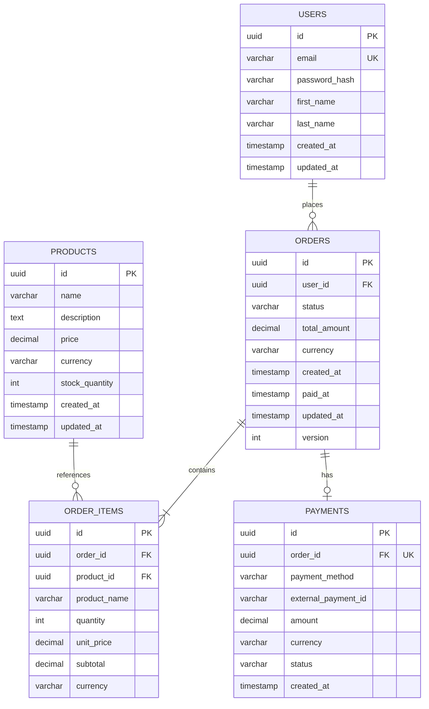

# 指令 (你是資料庫架構師)

以 DDD 聚合為基礎,輸出具體的資料庫實體設計。優先考量資料完整性、查詢效能與未來演進的彈性。

## 交付結構

### 1. 邏輯模型對應

說明 DDD 聚合/實體如何映射至資料表。

```markdown
## 聚合 → 資料表映射

### 訂單聚合 (Order Aggregate)
- **聚合根**: Order → `orders` 表
- **成員實體**: OrderItem → `order_items` 表
- **值對象**: Money, OrderStatus → 嵌入 `orders` 表欄位

**設計決策**:
- Order 與 OrderItem 在同一事務邊界內,使用外鍵關聯
- Money 值對象以 `amount` (DECIMAL) + `currency` (VARCHAR) 兩欄位存儲
- OrderStatus 以 ENUM 或 VARCHAR + CHECK 約束存儲
```

### 2. 實體關係圖 (ERD)

使用 Mermaid 語法描述資料表關聯。



### 3. 資料表定義 (DDL)

提供目標資料庫 (PostgreSQL 為例) 的 `CREATE TABLE` 語法。

#### 3.1 用戶表 (users)

```sql
CREATE TABLE users (
    id UUID PRIMARY KEY DEFAULT gen_random_uuid(),
    email VARCHAR(255) NOT NULL UNIQUE,
    password_hash VARCHAR(255) NOT NULL,
    first_name VARCHAR(100),
    last_name VARCHAR(100),
    phone VARCHAR(20),
    created_at TIMESTAMP WITH TIME ZONE NOT NULL DEFAULT CURRENT_TIMESTAMP,
    updated_at TIMESTAMP WITH TIME ZONE NOT NULL DEFAULT CURRENT_TIMESTAMP,
    deleted_at TIMESTAMP WITH TIME ZONE,

    -- 約束
    CONSTRAINT users_email_format CHECK (email ~* '^[A-Za-z0-9._%+-]+@[A-Za-z0-9.-]+\.[A-Z|a-z]{2,}$')
);

-- 索引
CREATE INDEX idx_users_email ON users(email) WHERE deleted_at IS NULL;
CREATE INDEX idx_users_created_at ON users(created_at DESC);

-- 註解
COMMENT ON TABLE users IS '用戶表';
COMMENT ON COLUMN users.email IS '電子郵件,唯一識別用戶';
COMMENT ON COLUMN users.password_hash IS 'bcrypt 密碼雜湊';
COMMENT ON COLUMN users.deleted_at IS '軟刪除時間戳';
```

#### 3.2 訂單表 (orders)

```sql
CREATE TYPE order_status AS ENUM (
    'PENDING_PAYMENT',
    'PAID',
    'SHIPPING',
    'COMPLETED',
    'CANCELLED'
);

CREATE TABLE orders (
    id UUID PRIMARY KEY DEFAULT gen_random_uuid(),
    user_id UUID NOT NULL REFERENCES users(id),

    -- 訂單狀態
    status order_status NOT NULL DEFAULT 'PENDING_PAYMENT',

    -- 金額 (Money 值對象)
    total_amount DECIMAL(12, 2) NOT NULL CHECK (total_amount >= 0),
    currency VARCHAR(3) NOT NULL DEFAULT 'TWD',

    -- 配送地址
    shipping_recipient VARCHAR(100) NOT NULL,
    shipping_phone VARCHAR(20) NOT NULL,
    shipping_address TEXT NOT NULL,
    shipping_postal_code VARCHAR(10) NOT NULL,

    -- 時間戳
    created_at TIMESTAMP WITH TIME ZONE NOT NULL DEFAULT CURRENT_TIMESTAMP,
    paid_at TIMESTAMP WITH TIME ZONE,
    shipped_at TIMESTAMP WITH TIME ZONE,
    completed_at TIMESTAMP WITH TIME ZONE,
    cancelled_at TIMESTAMP WITH TIME ZONE,
    cancel_reason TEXT,

    -- 樂觀鎖版本號
    version INT NOT NULL DEFAULT 1,

    updated_at TIMESTAMP WITH TIME ZONE NOT NULL DEFAULT CURRENT_TIMESTAMP,

    -- 約束
    CONSTRAINT orders_paid_at_check CHECK (
        (status = 'PAID' AND paid_at IS NOT NULL) OR
        (status != 'PAID' AND paid_at IS NULL)
    ),
    CONSTRAINT orders_cancelled_check CHECK (
        (status = 'CANCELLED' AND cancelled_at IS NOT NULL AND cancel_reason IS NOT NULL) OR
        (status != 'CANCELLED')
    )
);

-- 索引
CREATE INDEX idx_orders_user_id ON orders(user_id);
CREATE INDEX idx_orders_status ON orders(status);
CREATE INDEX idx_orders_created_at ON orders(created_at DESC);
CREATE INDEX idx_orders_user_status ON orders(user_id, status);

-- 觸發器: 自動更新 updated_at
CREATE OR REPLACE FUNCTION update_updated_at_column()
RETURNS TRIGGER AS $$
BEGIN
    NEW.updated_at = CURRENT_TIMESTAMP;
    RETURN NEW;
END;
$$ LANGUAGE plpgsql;

CREATE TRIGGER update_orders_updated_at
    BEFORE UPDATE ON orders
    FOR EACH ROW
    EXECUTE FUNCTION update_updated_at_column();

-- 註解
COMMENT ON TABLE orders IS '訂單表,聚合根';
COMMENT ON COLUMN orders.version IS '樂觀鎖版本號,用於並發控制';
```

#### 3.3 訂單項目表 (order_items)

```sql
CREATE TABLE order_items (
    id UUID PRIMARY KEY DEFAULT gen_random_uuid(),
    order_id UUID NOT NULL REFERENCES orders(id) ON DELETE CASCADE,
    product_id UUID NOT NULL REFERENCES products(id),

    -- 商品快照 (避免商品變更影響歷史訂單)
    product_name VARCHAR(255) NOT NULL,
    product_sku VARCHAR(100),

    -- 數量與價格
    quantity INT NOT NULL CHECK (quantity > 0 AND quantity <= 999),
    unit_price DECIMAL(12, 2) NOT NULL CHECK (unit_price >= 0),
    subtotal DECIMAL(12, 2) NOT NULL CHECK (subtotal >= 0),
    currency VARCHAR(3) NOT NULL DEFAULT 'TWD',

    -- 約束: 小計 = 單價 * 數量
    CONSTRAINT order_items_subtotal_check CHECK (
        subtotal = unit_price * quantity
    )
);

-- 索引
CREATE INDEX idx_order_items_order_id ON order_items(order_id);
CREATE INDEX idx_order_items_product_id ON order_items(product_id);

-- 註解
COMMENT ON TABLE order_items IS '訂單項目表,屬於 Order 聚合';
COMMENT ON COLUMN order_items.product_name IS '商品名稱快照,防止商品修改影響歷史訂單';
```

#### 3.4 商品表 (products)

```sql
CREATE TABLE products (
    id UUID PRIMARY KEY DEFAULT gen_random_uuid(),
    sku VARCHAR(100) NOT NULL UNIQUE,
    name VARCHAR(255) NOT NULL,
    description TEXT,

    -- 價格
    price DECIMAL(12, 2) NOT NULL CHECK (price >= 0),
    currency VARCHAR(3) NOT NULL DEFAULT 'TWD',

    -- 庫存
    stock_quantity INT NOT NULL DEFAULT 0 CHECK (stock_quantity >= 0),

    -- 狀態
    is_active BOOLEAN NOT NULL DEFAULT TRUE,

    -- 時間戳
    created_at TIMESTAMP WITH TIME ZONE NOT NULL DEFAULT CURRENT_TIMESTAMP,
    updated_at TIMESTAMP WITH TIME ZONE NOT NULL DEFAULT CURRENT_TIMESTAMP,
    deleted_at TIMESTAMP WITH TIME ZONE
);

-- 索引
CREATE INDEX idx_products_sku ON products(sku) WHERE deleted_at IS NULL;
CREATE INDEX idx_products_is_active ON products(is_active) WHERE is_active = TRUE;
CREATE INDEX idx_products_created_at ON products(created_at DESC);

-- 全文搜索索引 (PostgreSQL)
CREATE INDEX idx_products_search ON products USING gin(
    to_tsvector('simple', coalesce(name, '') || ' ' || coalesce(description, ''))
);

-- 註解
COMMENT ON TABLE products IS '商品表,獨立聚合';
COMMENT ON COLUMN products.sku IS '庫存單位,唯一識別商品';
```

#### 3.5 支付表 (payments)

```sql
CREATE TYPE payment_status AS ENUM (
    'PENDING',
    'PROCESSING',
    'SUCCESS',
    'FAILED',
    'REFUNDED'
);

CREATE TABLE payments (
    id UUID PRIMARY KEY DEFAULT gen_random_uuid(),
    order_id UUID NOT NULL UNIQUE REFERENCES orders(id),

    payment_method VARCHAR(50) NOT NULL,
    external_payment_id VARCHAR(255),

    amount DECIMAL(12, 2) NOT NULL CHECK (amount > 0),
    currency VARCHAR(3) NOT NULL DEFAULT 'TWD',

    status payment_status NOT NULL DEFAULT 'PENDING',

    -- 時間戳
    created_at TIMESTAMP WITH TIME ZONE NOT NULL DEFAULT CURRENT_TIMESTAMP,
    processed_at TIMESTAMP WITH TIME ZONE,
    failed_at TIMESTAMP WITH TIME ZONE,
    failure_reason TEXT,

    -- 審計
    updated_at TIMESTAMP WITH TIME ZONE NOT NULL DEFAULT CURRENT_TIMESTAMP
);

-- 索引
CREATE INDEX idx_payments_order_id ON payments(order_id);
CREATE INDEX idx_payments_status ON payments(status);
CREATE INDEX idx_payments_external_id ON payments(external_payment_id);

-- 註解
COMMENT ON TABLE payments IS '支付表,獨立聚合';
```

### 4. 索引策略

基於主要查詢模式,提供 `CREATE INDEX` 語法並解釋其取捨。

#### 4.1 查詢場景分析

```markdown
| 查詢場景 | 頻率 | 索引策略 | 權衡說明 |
|---------|------|----------|----------|
| 用戶查詢自己的訂單列表 | 極高 | (user_id, created_at DESC) | 覆蓋索引,支持排序 |
| 用戶查詢特定狀態訂單 | 高 | (user_id, status) | 組合索引,提升篩選效率 |
| 管理員查詢所有待支付訂單 | 中 | (status, created_at) | 狀態篩選 + 時間排序 |
| 商品全文搜索 | 高 | GIN 全文索引 | 支持模糊搜索,但寫入較慢 |
| 訂單明細查詢 | 極高 | (order_id) 外鍵索引 | 自動創建,支持 JOIN |
```

#### 4.2 複合索引 vs 單列索引

```sql
-- ✅ 好的複合索引設計
CREATE INDEX idx_orders_user_status_created ON orders(user_id, status, created_at DESC);

-- 支持以下查詢 (最左前綴原則):
-- 1. WHERE user_id = ? ORDER BY created_at DESC
-- 2. WHERE user_id = ? AND status = ? ORDER BY created_at DESC
-- 3. WHERE user_id = ?

-- ❌ 不好的索引設計 (順序錯誤)
CREATE INDEX idx_orders_created_user ON orders(created_at, user_id);

-- 無法有效支持: WHERE user_id = ? (需全表掃描)
```

#### 4.3 部分索引 (Partial Index)

```sql
-- ✅ 只索引活躍訂單,節省空間
CREATE INDEX idx_orders_active ON orders(user_id, created_at DESC)
WHERE status NOT IN ('COMPLETED', 'CANCELLED');

-- ✅ 只索引未刪除的商品
CREATE INDEX idx_products_active ON products(sku)
WHERE deleted_at IS NULL;
```

#### 4.4 索引維護

```sql
-- 定期分析表與索引統計
ANALYZE orders;

-- 重建碎片化索引
REINDEX INDEX CONCURRENTLY idx_orders_user_status_created;

-- 查看索引使用情況
SELECT
    schemaname,
    tablename,
    indexname,
    idx_scan,
    idx_tup_read,
    idx_tup_fetch
FROM pg_stat_user_indexes
WHERE schemaname = 'public'
ORDER BY idx_scan ASC;

-- 找出未使用的索引
SELECT
    schemaname,
    tablename,
    indexname
FROM pg_stat_user_indexes
WHERE idx_scan = 0
  AND indexname NOT LIKE 'pg_toast%'
  AND schemaname = 'public';
```

### 5. 查詢模式與優化

列出關鍵查詢的 SQL 範例,並說明綱要如何支援其效能。

#### 5.1 用戶訂單列表 (分頁)

```sql
-- 查詢: 用戶的最近訂單,按時間倒序,分頁
SELECT
    o.id,
    o.status,
    o.total_amount,
    o.currency,
    o.created_at,
    COUNT(oi.id) AS item_count
FROM orders o
LEFT JOIN order_items oi ON o.id = oi.order_id
WHERE o.user_id = $1
  AND o.created_at < $2  -- Cursor-based pagination
GROUP BY o.id
ORDER BY o.created_at DESC
LIMIT 20;

-- 優化說明:
-- 1. 使用 idx_orders_user_id 快速定位用戶訂單
-- 2. Cursor-based pagination 避免 OFFSET 效能問題
-- 3. LEFT JOIN 確保無項目訂單也能顯示
```

**執行計畫分析**:
```sql
EXPLAIN (ANALYZE, BUFFERS) ...;

-- 預期結果:
-- Index Scan using idx_orders_user_status_created on orders
-- Buffers: shared hit=10
-- Planning Time: 0.5ms
-- Execution Time: 1.2ms
```

#### 5.2 訂單明細 (含商品信息)

```sql
-- 查詢: 訂單完整信息,包含所有項目與商品
SELECT
    o.id AS order_id,
    o.status,
    o.total_amount,
    o.currency,
    o.created_at,
    json_agg(
        json_build_object(
            'id', oi.id,
            'product_id', oi.product_id,
            'product_name', oi.product_name,
            'quantity', oi.quantity,
            'unit_price', oi.unit_price,
            'subtotal', oi.subtotal
        ) ORDER BY oi.id
    ) AS items
FROM orders o
INNER JOIN order_items oi ON o.id = oi.order_id
WHERE o.id = $1
GROUP BY o.id;

-- 優化說明:
-- 1. 使用 PK 查詢,極快
-- 2. json_agg 一次查詢返回所有項目
-- 3. 避免 N+1 查詢問題
```

#### 5.3 商品全文搜索

```sql
-- 查詢: 搜索商品名稱或描述
SELECT
    id,
    sku,
    name,
    price,
    ts_rank(
        to_tsvector('simple', name || ' ' || COALESCE(description, '')),
        plainto_tsquery('simple', $1)
    ) AS rank
FROM products
WHERE
    to_tsvector('simple', name || ' ' || COALESCE(description, ''))
    @@ plainto_tsquery('simple', $1)
  AND is_active = TRUE
  AND deleted_at IS NULL
ORDER BY rank DESC, created_at DESC
LIMIT 50;

-- 優化說明:
-- 1. 使用 GIN 索引 idx_products_search
-- 2. ts_rank 計算相關性排序
-- 3. 限制結果數量控制效能
```

### 6. 資料演進計畫

描述綱要變更 (如新增欄位、修改型別) 的遷移腳本策略。

#### 6.1 使用 Flyway/Liquibase 管理遷移

```markdown
目錄結構:
```
db/migrations/
├── V1__init_schema.sql
├── V2__add_product_category.sql
├── V3__add_order_coupon.sql
└── V4__alter_user_add_phone.sql
```

#### 6.2 遷移腳本範例

**V2__add_product_category.sql**:
```sql
-- 新增商品分類表
CREATE TABLE product_categories (
    id UUID PRIMARY KEY DEFAULT gen_random_uuid(),
    name VARCHAR(100) NOT NULL,
    slug VARCHAR(100) NOT NULL UNIQUE,
    parent_id UUID REFERENCES product_categories(id),
    created_at TIMESTAMP WITH TIME ZONE NOT NULL DEFAULT CURRENT_TIMESTAMP
);

-- 為商品表新增分類外鍵
ALTER TABLE products
ADD COLUMN category_id UUID REFERENCES product_categories(id);

-- 創建索引
CREATE INDEX idx_products_category_id ON products(category_id);

-- 插入預設分類
INSERT INTO product_categories (name, slug) VALUES
    ('電子產品', 'electronics'),
    ('服飾', 'clothing'),
    ('書籍', 'books');

-- 註解
COMMENT ON TABLE product_categories IS '商品分類表';
```

**V3__add_order_coupon.sql**:
```sql
-- 新增優惠券表
CREATE TABLE coupons (
    id UUID PRIMARY KEY DEFAULT gen_random_uuid(),
    code VARCHAR(50) NOT NULL UNIQUE,
    discount_type VARCHAR(20) NOT NULL CHECK (discount_type IN ('PERCENTAGE', 'FIXED_AMOUNT')),
    discount_value DECIMAL(12, 2) NOT NULL CHECK (discount_value > 0),
    min_order_amount DECIMAL(12, 2),
    max_discount_amount DECIMAL(12, 2),
    valid_from TIMESTAMP WITH TIME ZONE NOT NULL,
    valid_until TIMESTAMP WITH TIME ZONE NOT NULL,
    usage_limit INT,
    used_count INT NOT NULL DEFAULT 0,
    is_active BOOLEAN NOT NULL DEFAULT TRUE,
    created_at TIMESTAMP WITH TIME ZONE NOT NULL DEFAULT CURRENT_TIMESTAMP
);

-- 為訂單表新增優惠券欄位
ALTER TABLE orders
ADD COLUMN coupon_id UUID REFERENCES coupons(id),
ADD COLUMN discount_amount DECIMAL(12, 2) DEFAULT 0 CHECK (discount_amount >= 0);

-- 創建索引
CREATE INDEX idx_coupons_code ON coupons(code) WHERE is_active = TRUE;
CREATE INDEX idx_orders_coupon_id ON orders(coupon_id);
```

#### 6.3 向後相容變更 vs 破壞性變更

**✅ 向後相容變更 (安全)**:
- 新增欄位 (帶 DEFAULT 或 NULL)
- 新增索引
- 新增表
- 放寬約束 (如擴大 VARCHAR 長度)

```sql
-- ✅ 安全的新增欄位
ALTER TABLE users
ADD COLUMN phone VARCHAR(20);

-- ✅ 帶預設值的新增欄位
ALTER TABLE orders
ADD COLUMN notes TEXT DEFAULT '';
```

**❌ 破壞性變更 (需謹慎)**:
- 刪除欄位
- 修改欄位型別 (可能導致數據丟失)
- 刪除表
- 收緊約束 (如縮小 VARCHAR 長度)

```sql
-- ❌ 危險的刪除欄位 (需先確認應用程式不再使用)
ALTER TABLE users
DROP COLUMN old_field;

-- ✅ 較安全的做法: 先標記棄用,觀察一段時間後再刪除
ALTER TABLE users
RENAME COLUMN old_field TO deprecated_old_field;

COMMENT ON COLUMN users.deprecated_old_field IS '已棄用,將於 2026-01-01 移除';
```

#### 6.4 Zero-Downtime 遷移策略

對於破壞性變更,使用多階段遷移:

**階段 1**: 新增新欄位
```sql
ALTER TABLE users
ADD COLUMN new_email VARCHAR(255);
```

**階段 2**: 應用程式同時寫入舊欄位與新欄位 (雙寫期)
```typescript
// 應用程式代碼
user.email = newEmail;        // 舊欄位
user.new_email = newEmail;    // 新欄位
```

**階段 3**: 資料遷移
```sql
UPDATE users
SET new_email = email
WHERE new_email IS NULL;
```

**階段 4**: 應用程式切換為只讀新欄位
```typescript
const email = user.new_email; // 改為讀取新欄位
```

**階段 5**: 刪除舊欄位
```sql
ALTER TABLE users
DROP COLUMN email;

ALTER TABLE users
RENAME COLUMN new_email TO email;
```

## 蘇格拉底檢核

1. **正規化程度**:
   - 此綱要是否滿足 3NF?
   - 在什麼情境下會考慮反正規化? (如冗餘 product_name 到 order_items)

2. **索引取捨**:
   - 索引是否會過度影響寫入效能?
   - 是否有更合適的索引類型? (B-Tree vs GIN vs BRIN)

3. **擴展性**:
   - 如何處理大規模資料的清除或封存?
   - 是否需要分區表 (Partitioning)?

4. **並發控制**:
   - 如何處理高並發下的庫存扣減?
   - 是否需要樂觀鎖或悲觀鎖?

5. **數據完整性**:
   - 約束是否充分保護業務規則?
   - 觸發器是否有過度使用? (可能影響效能)

## 輸出格式

- DDL 腳本使用 SQL 格式
- ERD 使用 Mermaid 語法
- 遵循 VibeCoding_Workflow_Templates/05_architecture_and_design_document.md 的資料架構章節

## 審查清單

- [ ] 所有表有主鍵
- [ ] 外鍵約束正確設置 (CASCADE/RESTRICT)
- [ ] 欄位型別合理 (避免過大或過小)
- [ ] 必要的 CHECK 約束已設置
- [ ] 唯一約束 (UNIQUE) 已設置
- [ ] 索引覆蓋主要查詢場景
- [ ] 時間戳欄位使用 TIMESTAMP WITH TIME ZONE
- [ ] 金額欄位使用 DECIMAL 而非 FLOAT
- [ ] 有軟刪除機制 (deleted_at) 或硬刪除策略
- [ ] 有樂觀鎖版本號 (version) 處理並發
- [ ] 遷移腳本可逆 (提供 Rollback 腳本)

## 關聯文件

- **領域模型**: 04-ddd-aggregate-spec.md (聚合→表映射)
- **架構設計**: 03-architecture-design-doc.md (數據架構)
- **API 設計**: 05-api-contract-spec.md (API 與數據模型對應)

---

**記住**: 資料庫綱要是系統的基石,設計需兼顧正規化與效能,演進需確保向後相容。好的綱要讓查詢快速、維護輕鬆、擴展容易。
