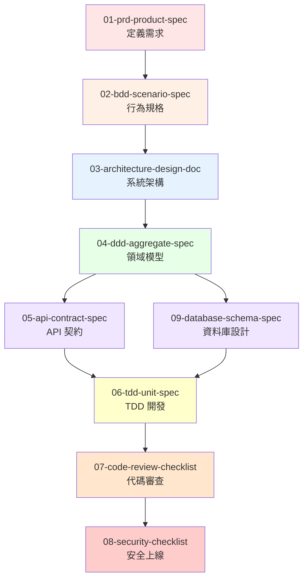
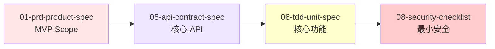

# Claude Code Output Styles 使用指南

> **版本**: v1.0
> **最後更新**: 2025-10-13
> **適用專案**: VibeCoding 工作流程模板

---

## 📚 總覽

本目錄包含 9 個精心設計的 Output Styles,涵蓋從需求規劃到安全上線的完整軟體開發流程。這些樣式整合了業界最佳實踐 (IEEE 1016, DDD, TDD, BDD, OWASP) 與 Claude Code 的 AI 協作能力。

## 🎯 快速開始

### 1. 切換 Output Style

```bash
# 在 Claude Code 中執行
/output-style 01-prd-product-spec

# Claude 會以 PRD 模式回應,產出產品需求文件
```

### 2. 查看當前樣式

```bash
# 查看當前使用的 Output Style
cat .claude/settings.local.json | grep outputStyle
```

### 3. 恢復預設模式

```bash
# 取消當前 Output Style
/output-style default
```

---

## 📋 Output Styles 清單

### 🎨 階段一:規劃與需求 (Planning)

#### 01-prd-product-spec
**用途**: 產出結構化的產品需求文件 (PRD)
**適用時機**: 專案啟動,定義問題、用戶、範圍與成功指標
**產出重點**:
- 執行摘要與價值主張
- 用戶畫像與用戶旅程
- 功能需求 (Must/Should/Could)
- 非功能需求 (性能、安全、合規)
- 風險評估與里程碑

**使用範例**:
```bash
/output-style 01-prd-product-spec

# 然後詢問:
"我想開發一個線上預約系統,目標用戶是診所與病患,請幫我產出 PRD"
```

**關聯模板**: `VibeCoding_Workflow_Templates/02_project_brief_and_prd.md`

---

#### 02-bdd-scenario-spec
**用途**: 將需求轉化為可執行的 Gherkin 規格
**適用時機**: PRD 完成後,需將業務需求轉為精確的行為場景
**產出重點**:
- Feature 檔案 (Given-When-Then)
- Scenario Outline (參數化場景)
- 步驟定義骨架
- 正常流程、邊界條件、異常流程

**使用範例**:
```bash
/output-style 02-bdd-scenario-spec

# 然後詢問:
"根據 PRD 中的預約功能,產出 BDD Feature 檔案"
```

**關聯模板**: `VibeCoding_Workflow_Templates/03_behavior_driven_development_guide.md`

---

### 🏗️ 階段二:架構與設計 (Architecture & Design)

#### 03-architecture-design-doc
**用途**: 輸出系統架構與設計文件 (SAD/SDD)
**適用時機**: 需求明確後,設計系統架構與技術方案
**產出重點**:
- C4 模型 (Context, Container, Component)
- DDD 界限上下文映射
- 品質屬性權衡 (ATAM)
- 架構決策記錄 (ADR)
- 部署架構與數據流

**使用範例**:
```bash
/output-style 03-architecture-design-doc

# 然後詢問:
"設計線上預約系統的架構,需支持高並發與多租戶"
```

**關聯模板**: `VibeCoding_Workflow_Templates/05_architecture_and_design_document.md`

---

#### 04-ddd-aggregate-spec
**用途**: DDD 戰術設計 - 聚合、不變量、領域事件
**適用時機**: 架構確定後,設計核心領域模型
**產出重點**:
- 界限上下文與統一語言
- 聚合根與成員實體
- 不變量與交易邊界
- 領域事件
- 倉儲接口
- 應用服務

**使用範例**:
```bash
/output-style 04-ddd-aggregate-spec

# 然後詢問:
"設計預約聚合,包含時段鎖定、衝突檢查等業務規則"
```

**關聯模板**: `VibeCoding_Workflow_Templates/05_architecture_and_design_document.md` (DDD 章節)

---

#### 05-api-contract-spec
**用途**: API 契約設計 (OpenAPI 3.0)
**適用時機**: 架構設計完成,需定義前後端介面契約
**產出重點**:
- OpenAPI 3.0 規範
- 請求/響應 Schema
- 錯誤處理策略
- 版本控制規則
- 安全認證方案
- 合約測試範例

**使用範例**:
```bash
/output-style 05-api-contract-spec

# 然後詢問:
"設計預約系統的 RESTful API,包含預約創建、查詢、取消等端點"
```

**關聯模板**: `VibeCoding_Workflow_Templates/06_api_design_specification.md`

---

#### 09-database-schema-spec
**用途**: 資料庫實體設計 (ERD、DDL、索引)
**適用時機**: 領域模型確定後,設計實體資料庫綱要
**產出重點**:
- 聚合→表映射
- ERD (Mermaid 語法)
- DDL (CREATE TABLE, 含約束)
- 索引策略
- 查詢優化
- 資料遷移腳本

**使用範例**:
```bash
/output-style 09-database-schema-spec

# 然後詢問:
"根據預約聚合,設計 PostgreSQL 資料庫綱要"
```

**關聯模板**: `VibeCoding_Workflow_Templates/05_architecture_and_design_document.md` (數據架構章節)

---

### 💻 階段三:開發與測試 (Development & Testing)

#### 06-tdd-unit-spec
**用途**: TDD 單元測試驅動開發
**適用時機**: 實作函式或類別時,遵循紅綠重構循環
**產出重點**:
- 測試清單 (Test List)
- 紅階段 (失敗的測試)
- 綠階段 (最小實作)
- 重構階段 (改善設計)
- 契約式設計 (前後置條件)
- 性質測試 (Property-Based Testing)

**使用範例**:
```bash
/output-style 06-tdd-unit-spec

# 然後詢問:
"用 TDD 實作預約衝突檢查函式"
```

**關聯模板**: `VibeCoding_Workflow_Templates/07_module_specification_and_tests.md`

---

### ✅ 階段四:品質保證 (Quality Assurance)

#### 07-code-review-checklist
**用途**: 結構化 Code Review 檢查清單
**適用時機**: Pull Request 審查、代碼質量檢查
**產出重點**:
- 架構與設計審查
- 代碼可讀性檢查
- 錯誤處理審查
- 性能考量
- 安全性檢查
- 測試完整性評估

**使用範例**:
```bash
/output-style 07-code-review-checklist

# 然後詢問:
"審查這個 PR 的預約服務實作 (提供代碼或 PR 連結)"
```

**關聯模板**: `VibeCoding_Workflow_Templates/11_code_review_and_refactoring_guide.md`

---

### 🔒 階段五:安全與上線 (Security & Deployment)

#### 08-security-checklist
**用途**: 安全與上線檢查清單 (OWASP Top 10)
**適用時機**: 上線前安全審查、合規檢查
**產出重點**:
- OWASP Top 10 檢查
- 認證授權審查
- 加密與敏感資訊保護
- 注入攻擊防護
- 隱私合規 (GDPR/CCPA)
- 生產環境就緒檢查

**使用範例**:
```bash
/output-style 08-security-checklist

# 然後詢問:
"進行預約系統的安全審查,重點關注用戶數據保護與 API 安全"
```

**關聯模板**: `VibeCoding_Workflow_Templates/13_security_and_readiness_checklists.md`

---

## 🔄 推薦工作流程

### 完整流程 (Full Process)



### MVP 快速迭代



---

## 💡 使用技巧

### 1. 樣式組合使用

某些樣式適合組合使用:

```bash
# 先定義領域模型
/output-style 04-ddd-aggregate-spec
"設計訂單聚合"

# 再基於領域模型設計資料庫
/output-style 09-database-schema-spec
"根據剛才的訂單聚合,設計資料庫綱要"

# 最後設計 API
/output-style 05-api-contract-spec
"基於訂單聚合與資料庫設計,設計訂單管理 API"
```

### 2. 迭代改進

```bash
# 第一輪: 產出初稿
/output-style 03-architecture-design-doc
"設計電商系統架構"

# 第二輪: 針對性改進
/output-style 03-architecture-design-doc
"優化剛才的架構設計,增加緩存層以提升性能"
```

### 3. 結合 Hooks 自動化

在 `.claude/hooks-config.json` 中配置:

```json
{
  "PostToolUse": [
    {
      "matcher": "Write",
      "hooks": [
        {
          "type": "command",
          "command": "bash .claude/hooks/post-write.sh '{{args.file_path}}'",
          "timeout": 20
        }
      ]
    }
  ]
}
```

自動格式化產出的代碼、自動運行測試等。

---

## 📖 學習路徑

### 新手 (第一次使用)

1. **閱讀**: `VibeCoding_Workflow_Templates/00_workflow_manual.md`
2. **實踐**: 從 `01-prd-product-spec` 開始,完成一個小功能的完整流程
3. **參考**: 對照 `VibeCoding_Workflow_Templates` 中的對應模板

### 進階 (熟悉基本流程)

1. **組合使用**: 嘗試 `04-ddd-aggregate-spec` + `09-database-schema-spec` 組合
2. **客製化**: 修改 Output Style 以適應團隊特定需求
3. **自動化**: 結合 Hooks 建立團隊專屬的自動化工作流

### 專家 (團隊推廣)

1. **定製樣式**: 新增團隊專屬的 Output Styles
2. **流程標準化**: 制定團隊的強制使用規範
3. **持續改進**: 收集反饋,迭代優化樣式內容

---

## 🛠️ 維護與更新

### 版本控制

Output Styles 使用語義化版本:
- **Major**: 結構性變更,不向後相容
- **Minor**: 新增章節或檢查項目
- **Patch**: 修正錯誤、改善說明

### 更新記錄

| 版本 | 日期 | 變更內容 |
|------|------|----------|
| v1.0 | 2025-10-13 | 初始版本,9 個核心樣式 |

### 反饋與改進

如有改進建議,請:
1. 在專案中創建 Issue
2. 提交 Pull Request
3. 聯繫架構團隊

---

## 📚 參考資源

### 官方文檔
- [Claude Code Output Styles 官方文檔](https://docs.claude.com/en/docs/claude-code/output-styles)
- [Claude Code Hooks 指南](https://docs.claude.com/en/docs/claude-code/hooks-guide)
- [Claude Code 最佳實踐](https://www.anthropic.com/engineering/claude-code-best-practices)

### 方法論參考
- [IEEE Std 1016-2009 (SDD)](https://standards.ieee.org/ieee/1016/4502/)
- [Domain-Driven Design Reference (Eric Evans)](https://www.domainlanguage.com/ddd/reference/)
- [Test Driven Development (Martin Fowler)](https://martinfowler.com/bliki/TestDrivenDevelopment.html)
- [Gherkin Reference (Cucumber)](https://cucumber.io/docs/gherkin/reference/)
- [OWASP Top 10 (2021)](https://owasp.org/Top10/)

---

## ❓ 常見問題

### Q: Output Style 會影響 Claude 的其他功能嗎?
A: 不會。Output Style 只影響產出格式與觀點,不影響代碼執行、工具調用等功能。

### Q: 可以同時使用多個 Output Style 嗎?
A: 一次只能啟用一個 Output Style。但可以在對話中切換,組合使用不同樣式的產出。

### Q: 如何客製化 Output Style?
A: 直接編輯 `.claude/output-styles/` 中的 `.md` 文件,修改「指令」與「交付結構」章節。

### Q: Output Style 會被記錄到 Git 嗎?
A: `.claude/output-styles/` 目錄應納入版本控制,讓團隊共享。`.claude/settings.local.json` 中的當前樣式設定則是個人偏好,可選擇性納入。

### Q: 如何為團隊建立標準流程?
A: 在團隊 Wiki 中定義「何時使用哪個 Output Style」,並在 Code Review 時檢查是否遵循。

---

## 🎓 最佳實踐

1. **專案初期使用 01-prd-product-spec**,確保需求明確
2. **關鍵決策使用 03-architecture-design-doc**,記錄 ADR
3. **核心業務邏輯使用 04-ddd-aggregate-spec**,明確聚合邊界
4. **對外 API 使用 05-api-contract-spec**,確保契約穩定
5. **上線前必用 08-security-checklist**,消除安全隱患
6. **TDD 開發使用 06-tdd-unit-spec**,保持紅綠重構節奏
7. **Code Review 使用 07-code-review-checklist**,結構化審查

---

**記住**: Output Styles 是你的 AI 協作夥伴的「專業模式切換器」。善用它們,讓 Claude Code 成為你的產品經理、架構師、測試工程師與安全專家!

**開始使用**: `/output-style 01-prd-product-spec` 🚀
