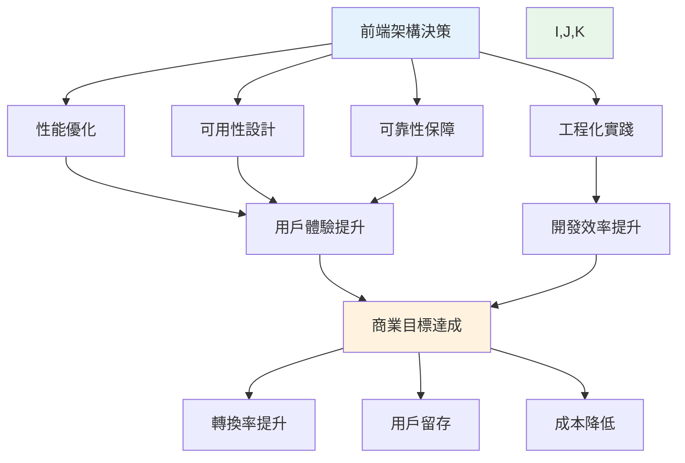
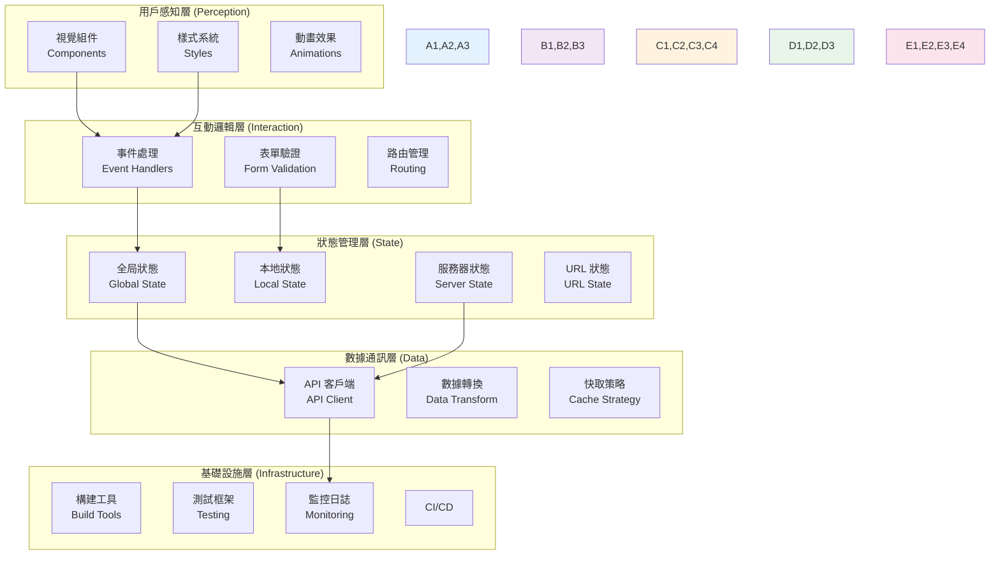
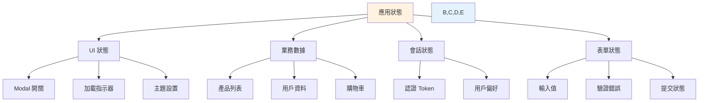
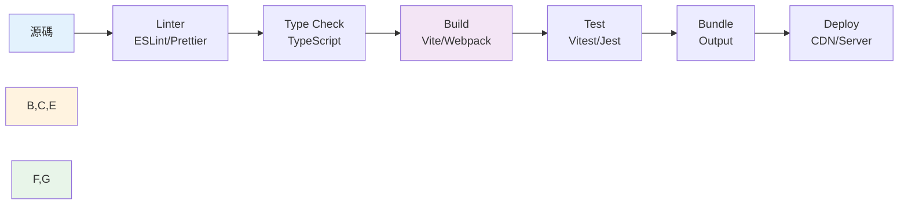
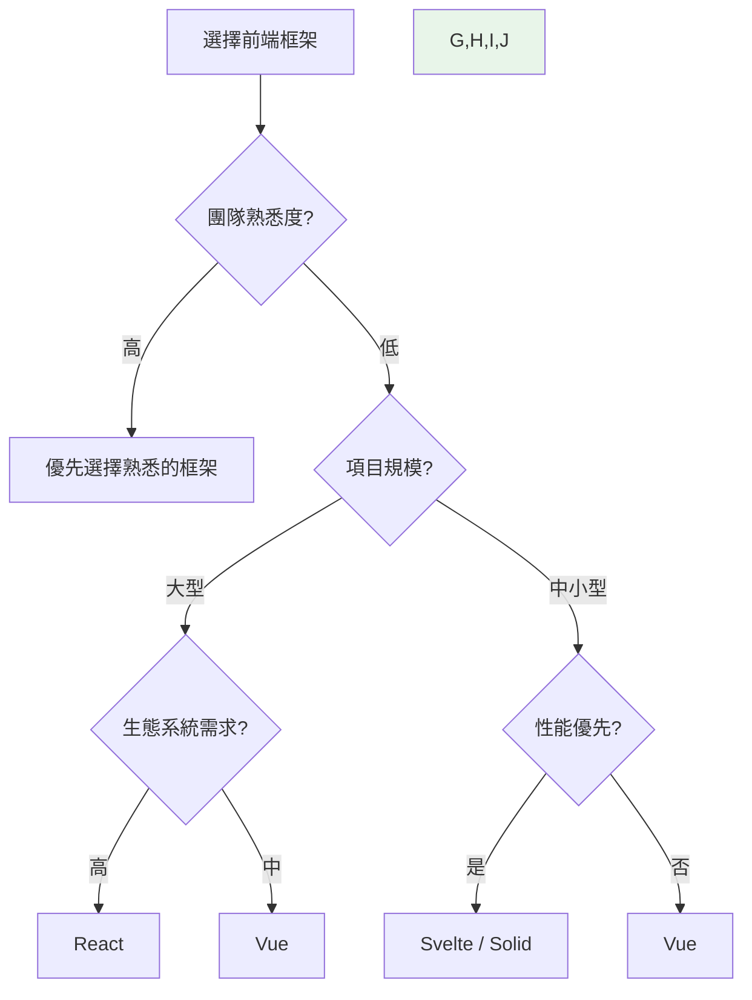

# 前端架構與開發規範 (Frontend Architecture Specification) - [專案名稱]

---

**文件版本 (Document Version):** `v1.0`  
**最後更新 (Last Updated):** `YYYY-MM-DD`  
**主要作者 (Lead Author):** `[前端架構師, 前端技術負責人]`  
**審核者 (Reviewers):** `[UX 設計師, 後端技術負責人, 架構委員會]`  
**狀態 (Status):** `[草稿 (Draft), 審核中 (In Review), 已批准 (Approved)]`

**相關文檔 (Related Documents):**
- 專案 PRD: `[連結到 01_project_brief_and_prd.md]`
- 系統架構文檔: `[連結到 03_architecture_and_design_document.md]`
- API 設計規範: `[連結到 04_api_design_specification.md]`
- BDD 情境: `[連結到 02_behavior_driven_development_guide.md]`

---

## 目錄 (Table of Contents)

- [第一部分：前端架構的第一性原理](#第一部分前端架構的第一性原理)
  - [1.1 根本目的：超越介面實現](#11-根本目的超越介面實現)
  - [1.2 前端架構的終極目標](#12-前端架構的終極目標)
  - [1.3 前端決策的因果鏈](#13-前端決策的因果鏈)
- [第二部分：前端架構的系統化分層](#第二部分前端架構的系統化分層)
  - [2.1 用戶感知層 (Perception Layer)](#21-用戶感知層-perception-layer)
  - [2.2 互動邏輯層 (Interaction Layer)](#22-互動邏輯層-interaction-layer)
  - [2.3 狀態管理層 (State Management Layer)](#23-狀態管理層-state-management-layer)
  - [2.4 數據通訊層 (Data Communication Layer)](#24-數據通訊層-data-communication-layer)
  - [2.5 基礎設施層 (Infrastructure Layer)](#25-基礎設施層-infrastructure-layer)
- [第三部分：前端設計系統 (Design System)](#第三部分前端設計系統-design-system)
  - [3.1 設計原則 (Design Principles)](#31-設計原則-design-principles)
  - [3.2 視覺語言系統](#32-視覺語言系統)
  - [3.3 組件庫架構](#33-組件庫架構)
  - [3.4 設計令牌 (Design Tokens)](#34-設計令牌-design-tokens)
- [第四部分：技術選型與架構決策](#第四部分技術選型與架構決策)
  - [4.1 前端框架選擇](#41-前端框架選擇)
  - [4.2 狀態管理方案](#42-狀態管理方案)
  - [4.3 構建與工具鏈](#43-構建與工具鏈)
  - [4.4 樣式方案選擇](#44-樣式方案選擇)
- [第五部分：效能與優化策略](#第五部分效能與優化策略)
  - [5.1 核心網頁指標 (Core Web Vitals)](#51-核心網頁指標-core-web-vitals)
  - [5.2 載入效能優化](#52-載入效能優化)
  - [5.3 運行時效能優化](#53-運行時效能優化)
  - [5.4 資源優化策略](#54-資源優化策略)
- [第六部分：可用性與無障礙設計](#第六部分可用性與無障礙設計)
  - [6.1 響應式設計策略](#61-響應式設計策略)
  - [6.2 無障礙性 (Accessibility, A11y)](#62-無障礙性-accessibility-a11y)
  - [6.3 國際化 (i18n) 與本地化 (l10n)](#63-國際化-i18n-與本地化-l10n)
- [第七部分：前端工程化實踐](#第七部分前端工程化實踐)
  - [7.1 項目結構與代碼組織](#71-項目結構與代碼組織)
  - [7.2 代碼質量保證](#72-代碼質量保證)
  - [7.3 測試策略](#73-測試策略)
  - [7.4 CI/CD 集成](#74-cicd-集成)
- [第八部分：前後端協作契約](#第八部分前後端協作契約)
  - [8.1 API 通訊規範](#81-api-通訊規範)
  - [8.2 錯誤處理策略](#82-錯誤處理策略)
  - [8.3 認證與授權](#83-認證與授權)
- [第九部分：監控、日誌與安全](#第九部分監控日誌與安全)
  - [9.1 前端監控策略](#91-前端監控策略)
  - [9.2 錯誤追蹤與報告](#92-錯誤追蹤與報告)
  - [9.3 前端安全實踐](#93-前端安全實踐)
- [第十部分：前端開發檢查清單](#第十部分前端開發檢查清單)
- [附錄](#附錄)

---

## 第一部分：前端架構的第一性原理

> **核心理念：** 前端架構不是技術框架的堆砌，而是一個以用戶價值與商業目標為導向的、可衡量的系統工程。

### 1.1 根本目的：超越介面實現

現代前端已不再是「美化 HTML」的工作，而是一個直接影響商業轉換率、用戶滿意度與品牌認知的戰略性系統 [[memory:來自網站設計理論文檔]]。

**前端架構的根本目的分類：**

| 目的類別 | 核心目標 | 可衡量指標 (KPIs) | 典型場景 |
|:---------|:---------|:------------------|:---------|
| **商業轉換 (Conversion)** | 最大化用戶完成目標行為的比率 | 轉換率、購物車放棄率、表單完成率 | 電商、SaaS 註冊、表單填寫 |
| **內容消費 (Engagement)** | 增加用戶停留時間與內容互動 | 平均會話時長、頁面深度、跳出率 | 媒體網站、部落格、知識平台 |
| **工具效率 (Productivity)** | 提升用戶完成任務的效率 | 任務完成時間、操作步驟數、錯誤率 | 管理後台、協作工具、數據儀表板 |
| **品牌體驗 (Brand)** | 強化品牌認知與情感連結 | 品牌回想率、NPS、情感評分 | 品牌官網、產品展示、藝術作品集 |

**因果邏輯：**
```
明確的商業目標 → 設計與技術決策 → 用戶體驗指標 → 商業成果 (營收/用戶增長)
```

### 1.2 前端架構的終極目標

前端架構的成功衡量標準可被定義為四個核心維度的最佳平衡：

#### 1.2.1 性能 (Performance)
- **定義：** 應用載入速度與響應速度
- **衡量：** Core Web Vitals (LCP, FID, CLS), TTI, FCP
- **商業影響：** 載入時間每增加 1 秒，轉換率下降 7%

#### 1.2.2 可用性 (Usability)
- **定義：** 用戶完成目標的難易度
- **衡量：** 任務成功率、完成時間、錯誤率、SUS 分數
- **商業影響：** 良好的可用性直接降低客服成本並提升用戶留存

#### 1.2.3 可維護性 (Maintainability)
- **定義：** 開發團隊迭代功能的效率與質量
- **衡量：** 代碼複雜度、測試覆蓋率、技術債務、開發速度
- **商業影響：** 決定產品的長期競爭力與迭代速度

#### 1.2.4 可靠性 (Reliability)
- **定義：** 系統在各種環境下穩定運行的能力
- **衡量：** 錯誤率、崩潰率、可用性 SLA、Mean Time Between Failures
- **商業影響：** 系統不穩定直接導致用戶流失與負面口碑



### 1.3 前端決策的因果鏈

每一個前端技術決策都應能追溯到其對商業目標的貢獻。以下是關鍵決策的因果鏈範例：

#### 範例 1：選擇 React 而非 Vue
```
決策：採用 React
↓
原因：更大的生態系統、更多可用組件庫、團隊熟悉度高
↓
結果：開發速度提升 30%、招聘更容易、社區支持豐富
↓
商業影響：產品上線時間縮短 2 個月、開發成本降低、團隊穩定性提升
```

#### 範例 2：實施 Code Splitting
```
決策：實施路由級與組件級的代碼分割
↓
原因：減少初始載入包大小
↓
結果：FCP 從 3.2s 降至 1.4s、LCP 從 4.5s 降至 2.1s
↓
商業影響：跳出率下降 25%、轉換率提升 12%、移動端體驗顯著改善
```

#### 範例 3：建立設計系統
```
決策：投資 2 個月建立完整設計系統
↓
原因：消除設計與開發不一致、提升組件複用性
↓
結果：新功能開發時間減少 40%、視覺一致性提升、UI bug 減少 60%
↓
商業影響：產品迭代速度加快、品牌一致性強化、開發成本降低
```

---

## 第二部分：前端架構的系統化分層

> **設計原則：** 將前端系統解構為清晰的職責層次，確保關注點分離與依賴倒置。

前端架構可被解構為五個清晰的層次，每一層都有其特定的職責與技術選型考量。



### 2.1 用戶感知層 (Perception Layer)

#### 職責範圍
- 渲染 UI 組件並呈現給用戶
- 應用視覺設計系統（顏色、字體、間距）
- 實現動畫與過渡效果
- 確保視覺一致性與品牌識別

#### 核心原則
1. **組件化 (Componentization):** 所有 UI 元素應被拆解為可複用的組件
2. **單一職責:** 每個組件只負責一個明確的 UI 功能
3. **無狀態優先:** 盡可能將組件設計為純展示型 (Presentational)，狀態由上層注入

#### 技術選型考量
| 方案類別 | 技術選項 | 適用場景 | 優勢 | 劣勢 |
|:---------|:---------|:---------|:-----|:-----|
| **組件框架** | React, Vue, Svelte, Solid | 需要高度互動的應用 | 聲明式、組件化、生態豐富 | 學習曲線、打包體積 |
| **樣式方案** | CSS Modules, Styled-Components, Tailwind, CSS-in-JS | 取決於團隊偏好與規模 | 作用域隔離、動態樣式 | 運行時開銷、學習成本 |
| **動畫庫** | Framer Motion, GSAP, React Spring | 需要複雜動畫效果 | 豐富的 API、流暢效果 | 包體積、學習曲線 |

#### 設計模式
**原子設計 (Atomic Design)**
```
原子 (Atoms) → 分子 (Molecules) → 組織 (Organisms) → 模板 (Templates) → 頁面 (Pages)
```

**範例：按鈕組件的原子化拆解**
```jsx
// 原子：基礎按鈕
const Button = ({ children, variant, size, ...props }) => (
  <button className={cx('btn', `btn--${variant}`, `btn--${size}`)} {...props}>
    {children}
  </button>
);

// 分子：帶圖標的按鈕
const IconButton = ({ icon, children, ...props }) => (
  <Button {...props}>
    <Icon name={icon} />
    {children}
  </Button>
);

// 組織：CTA 區塊
const CTASection = ({ primary, secondary }) => (
  <div className="cta-section">
    <IconButton icon="check" variant="primary">{primary}</IconButton>
    <IconButton icon="info" variant="secondary">{secondary}</IconButton>
  </div>
);
```

### 2.2 互動邏輯層 (Interaction Layer)

#### 職責範圍
- 處理用戶輸入（點擊、輸入、滾動等）
- 執行客戶端驗證與業務邏輯
- 管理路由導航與頁面切換
- 實現拖放、快捷鍵等高級互動

#### 核心原則
1. **事件委派 (Event Delegation):** 減少事件監聽器數量以優化性能
2. **防抖與節流 (Debounce & Throttle):** 控制高頻事件的觸發頻率
3. **可訪問性優先 (A11y First):** 確保鍵盤導航、焦點管理與 ARIA 屬性正確

#### 關鍵實踐

**表單驗證策略**
```javascript
// 多層驗證：客戶端驗證作為 UX 優化，服務器驗證作為安全保障
const validateForm = (data) => {
  const errors = {};
  
  // 客戶端驗證：即時反饋
  if (!data.email || !isValidEmail(data.email)) {
    errors.email = '請輸入有效的電子郵件地址';
  }
  
  if (data.password && data.password.length < 8) {
    errors.password = '密碼至少需要 8 個字符';
  }
  
  return {
    isValid: Object.keys(errors).length === 0,
    errors
  };
};

// 配合異步服務器驗證
const checkEmailAvailability = debounce(async (email) => {
  const response = await api.post('/auth/check-email', { email });
  return response.available;
}, 500);
```

**路由設計模式**
```javascript
// 路由配置應反映信息架構 (IA)
const routes = [
  {
    path: '/',
    component: HomePage,
    meta: { title: '首頁', requiresAuth: false }
  },
  {
    path: '/products',
    component: ProductsLayout,
    children: [
      {
        path: ':category',
        component: CategoryPage,
        meta: { breadcrumb: '產品分類' }
      },
      {
        path: ':category/:id',
        component: ProductDetailPage,
        meta: { breadcrumb: '產品詳情' }
      }
    ]
  }
];
```

### 2.3 狀態管理層 (State Management Layer)

#### 職責範圍
- 管理應用的全局與局部狀態
- 協調組件間的數據共享
- 實現狀態的持久化與同步
- 處理異步操作與副作用

#### 狀態分類架構



**狀態存儲決策樹**

| 狀態類型 | 存儲位置 | 持久化 | 適用技術 |
|:---------|:---------|:-------|:---------|
| **組件內部 UI 狀態** | 組件 Local State | 否 | useState, Svelte stores |
| **跨組件共享狀態** | Context / Global Store | 選擇性 | React Context, Zustand, Pinia |
| **服務器數據** | 查詢緩存 | 選擇性 | React Query, SWR, Apollo |
| **表單狀態** | 表單庫 | 否 | React Hook Form, Formik |
| **URL 狀態** | URL 參數 | 自動 | React Router, Next.js Router |
| **持久化狀態** | LocalStorage / IndexedDB | 是 | Redux Persist, localForage |

#### 狀態管理模式選擇

**小型應用 (< 10 頁面)**
```javascript
// Context + Hooks 模式
const AppContext = createContext();

function AppProvider({ children }) {
  const [user, setUser] = useState(null);
  const [cart, setCart] = useState([]);
  
  const value = {
    user,
    cart,
    addToCart: (item) => setCart([...cart, item]),
    login: (userData) => setUser(userData)
  };
  
  return <AppContext.Provider value={value}>{children}</AppContext.Provider>;
}
```

**中大型應用 (> 10 頁面)**
```javascript
// 使用 Zustand 進行輕量級狀態管理
import { create } from 'zustand';
import { persist } from 'zustand/middleware';

const useStore = create(
  persist(
    (set) => ({
      user: null,
      cart: [],
      addToCart: (item) => set((state) => ({ 
        cart: [...state.cart, item] 
      })),
      login: (userData) => set({ user: userData }),
      logout: () => set({ user: null, cart: [] })
    }),
    {
      name: 'app-storage',
      partialize: (state) => ({ user: state.user }) // 僅持久化用戶數據
    }
  )
);
```

### 2.4 數據通訊層 (Data Communication Layer)

#### 職責範圍
- 與後端 API 進行通訊
- 處理數據的請求、轉換與錯誤
- 實現請求快取與重試策略
- 管理 WebSocket 或 Server-Sent Events 連接

#### API 客戶端架構

**分層設計**
```
API 配置層 → HTTP 客戶端層 → 業務請求層 → React Query / SWR 層
```

**實現範例：API 客戶端設計**
```typescript
// 1. HTTP 客戶端封裝
import axios from 'axios';

const apiClient = axios.create({
  baseURL: import.meta.env.VITE_API_BASE_URL,
  timeout: 10000,
  headers: {
    'Content-Type': 'application/json'
  }
});

// 請求攔截器：添加認證 Token
apiClient.interceptors.request.use((config) => {
  const token = localStorage.getItem('authToken');
  if (token) {
    config.headers.Authorization = `Bearer ${token}`;
  }
  return config;
});

// 響應攔截器：統一錯誤處理
apiClient.interceptors.response.use(
  (response) => response.data,
  (error) => {
    if (error.response?.status === 401) {
      // 處理未授權：重定向到登錄頁
      window.location.href = '/login';
    }
    return Promise.reject(error);
  }
);

// 2. 業務 API 封裝
export const productAPI = {
  getList: (params) => apiClient.get('/products', { params }),
  getById: (id) => apiClient.get(`/products/${id}`),
  create: (data) => apiClient.post('/products', data),
  update: (id, data) => apiClient.put(`/products/${id}`, data),
  delete: (id) => apiClient.delete(`/products/${id}`)
};

// 3. React Query 整合
import { useQuery, useMutation, useQueryClient } from '@tanstack/react-query';

export function useProducts(filters) {
  return useQuery({
    queryKey: ['products', filters],
    queryFn: () => productAPI.getList(filters),
    staleTime: 5 * 60 * 1000, // 5 分鐘內數據視為新鮮
    cacheTime: 10 * 60 * 1000 // 緩存保留 10 分鐘
  });
}

export function useCreateProduct() {
  const queryClient = useQueryClient();
  
  return useMutation({
    mutationFn: productAPI.create,
    onSuccess: () => {
      // 創建成功後刷新產品列表
      queryClient.invalidateQueries({ queryKey: ['products'] });
    }
  });
}
```

#### 錯誤處理策略

**錯誤分類與處理**
| 錯誤類型 | HTTP 狀態碼 | 用戶提示策略 | 技術處理 |
|:---------|:------------|:-------------|:---------|
| **網絡錯誤** | - | 顯示「網絡連接失敗」提示 + 重試按鈕 | 自動重試 3 次，指數退避 |
| **客戶端錯誤** | 400, 422 | 顯示表單字段級錯誤 | 解析 API 錯誤響應並映射到表單 |
| **未授權** | 401 | 重定向到登錄頁 | 清除本地 Token，跳轉登錄 |
| **權限不足** | 403 | 顯示「無權限」提示 + 返回按鈕 | 記錄日誌，提供替代路徑 |
| **資源不存在** | 404 | 顯示 404 頁面 | 提供返回首頁或搜索功能 |
| **服務器錯誤** | 500, 503 | 顯示「服務暫時不可用」+ 稍後再試 | 發送錯誤報告到監控系統 |

### 2.5 基礎設施層 (Infrastructure Layer)

#### 職責範圍
- 前端構建與打包流程
- 代碼質量保證工具鏈
- 測試自動化框架
- CI/CD 集成與部署
- 性能監控與錯誤追蹤

**前端工程化工具鏈**



---

## 第三部分：前端設計系統 (Design System)

> **核心理念：** 設計系統是設計與開發之間的共享語言，是確保視覺一致性、提升開發效率的基礎設施投資。

### 3.1 設計原則 (Design Principles)

設計原則是設計系統的哲學基礎，指導所有設計與開發決策。

**範例：建立設計原則框架**
| 原則名稱 | 定義 | 實踐指南 | 可衡量指標 |
|:---------|:-----|:---------|:-----------|
| **清晰優於炫技** | 功能性與可理解性優先於視覺複雜度 | - 避免不必要的動畫<br/>- 使用標準 UI 模式<br/>- 確保高對比度 | - 任務完成時間<br/>- 用戶錯誤率 |
| **一致性** | 相同功能在不同上下文中表現一致 | - 統一按鈕樣式<br/>- 統一圖標語言<br/>- 統一交互模式 | - 視覺審計通過率<br/>- 組件複用率 |
| **可訪問性** | 所有用戶，無論能力如何，都能使用產品 | - WCAG 2.1 AA 合規<br/>- 鍵盤導航支持<br/>- 屏幕閱讀器兼容 | - A11y 審計得分<br/>- 無障礙性測試通過率 |
| **性能優先** | 速度是功能的一部分 | - 圖片優化<br/>- 代碼分割<br/>- 延遲加載 | - Core Web Vitals<br/>- 打包體積 |

### 3.2 視覺語言系統

#### 3.2.1 色彩系統

**語義化色彩架構**
```scss
// 基礎色板 (Brand Colors)
$color-primary: #1976d2;
$color-secondary: #dc004e;
$color-tertiary: #f57c00;

// 語義色彩 (Semantic Colors)
$color-success: #4caf50;
$color-warning: #ff9800;
$color-error: #f44336;
$color-info: #2196f3;

// 中性色 (Neutral Colors)
$color-text-primary: rgba(0, 0, 0, 0.87);
$color-text-secondary: rgba(0, 0, 0, 0.60);
$color-text-disabled: rgba(0, 0, 0, 0.38);
$color-divider: rgba(0, 0, 0, 0.12);
$color-background: #fafafa;
$color-surface: #ffffff;

// 色彩變體 (Variants) - 使用函數生成
@function lighten-color($color, $percentage) {
  @return mix(white, $color, $percentage);
}

@function darken-color($color, $percentage) {
  @return mix(black, $color, $percentage);
}

// 生成色彩等級
$primary-50: lighten-color($color-primary, 95%);
$primary-100: lighten-color($color-primary, 85%);
// ... 至 $primary-900
```

**對比度檢查清單**
- [ ] 正常文字與背景對比度 ≥ 4.5:1 (WCAG AA)
- [ ] 大號文字與背景對比度 ≥ 3:1 (WCAG AA)
- [ ] 互動元素（按鈕、鏈接）對比度 ≥ 3:1
- [ ] 使用工具自動檢測：[Contrast Checker](https://webaim.org/resources/contrastchecker/)

#### 3.2.2 字體排印系統

**字體階層定義**
```css
/* 字體家族 */
:root {
  --font-family-base: -apple-system, BlinkMacSystemFont, 'Segoe UI', 
                       'Roboto', 'Helvetica Neue', Arial, sans-serif;
  --font-family-monospace: 'Fira Code', 'Consolas', 'Monaco', monospace;
  --font-family-heading: 'Inter', var(--font-family-base);
}

/* 字體大小 - 使用模塊化比例 (1.250 Major Third) */
:root {
  --font-size-xs: 0.64rem;    /* 10.24px */
  --font-size-sm: 0.8rem;     /* 12.8px */
  --font-size-base: 1rem;     /* 16px */
  --font-size-md: 1.25rem;    /* 20px */
  --font-size-lg: 1.563rem;   /* 25px */
  --font-size-xl: 1.953rem;   /* 31.25px */
  --font-size-2xl: 2.441rem;  /* 39.06px */
  --font-size-3xl: 3.052rem;  /* 48.83px */
}

/* 行高 */
:root {
  --line-height-tight: 1.2;
  --line-height-normal: 1.5;
  --line-height-relaxed: 1.75;
}

/* 字重 */
:root {
  --font-weight-light: 300;
  --font-weight-normal: 400;
  --font-weight-medium: 500;
  --font-weight-semibold: 600;
  --font-weight-bold: 700;
}
```

**字體排印檢查清單**
- [ ] 限制字體家族數量 ≤ 3 種
- [ ] 確保字體已優化（woff2 格式、子集化）
- [ ] 實施 `font-display: swap` 以避免 FOIT
- [ ] 為中文字體提供回退方案

#### 3.2.3 間距系統

**8pt 網格系統**
```css
:root {
  --spacing-0: 0;
  --spacing-1: 0.25rem;  /* 4px */
  --spacing-2: 0.5rem;   /* 8px */
  --spacing-3: 0.75rem;  /* 12px */
  --spacing-4: 1rem;     /* 16px */
  --spacing-5: 1.25rem;  /* 20px */
  --spacing-6: 1.5rem;   /* 24px */
  --spacing-8: 2rem;     /* 32px */
  --spacing-10: 2.5rem;  /* 40px */
  --spacing-12: 3rem;    /* 48px */
  --spacing-16: 4rem;    /* 64px */
  --spacing-20: 5rem;    /* 80px */
}
```

### 3.3 組件庫架構

#### 組件分類與命名規範

**組件層級架構**
```
components/
├── atoms/              # 原子組件：最小UI單元
│   ├── Button/
│   ├── Input/
│   ├── Icon/
│   └── Badge/
├── molecules/          # 分子組件：原子組合
│   ├── FormField/      # Input + Label + Error
│   ├── SearchBox/      # Input + Button + Icon
│   └── Card/
├── organisms/          # 組織組件：複雜組合
│   ├── Header/
│   ├── Footer/
│   ├── ProductCard/
│   └── DataTable/
├── templates/          # 模板：頁面布局
│   ├── DashboardLayout/
│   ├── AuthLayout/
│   └── MarketingLayout/
└── pages/              # 頁面：完整視圖
    ├── HomePage/
    ├── ProductPage/
    └── CheckoutPage/
```

**組件設計檢查清單**
- [ ] **單一職責：** 每個組件只做一件事
- [ ] **可組合性：** 組件可被組合成更複雜的組件
- [ ] **Props 接口清晰：** 使用 TypeScript 定義嚴格的 Props 類型
- [ ] **可訪問性：** 包含必要的 ARIA 屬性
- [ ] **文檔完整：** 包含 Storybook 文檔與使用範例
- [ ] **測試覆蓋：** 至少包含單元測試與快照測試

### 3.4 設計令牌 (Design Tokens)

設計令牌是設計系統的原子單位，是設計與代碼之間的橋樑。

**令牌架構**
```json
{
  "color": {
    "brand": {
      "primary": { "value": "#1976d2" },
      "secondary": { "value": "#dc004e" }
    },
    "semantic": {
      "success": { "value": "#4caf50" },
      "error": { "value": "#f44336" }
    }
  },
  "spacing": {
    "scale": {
      "0": { "value": "0" },
      "1": { "value": "0.25rem" },
      "2": { "value": "0.5rem" }
    }
  },
  "typography": {
    "fontFamily": {
      "base": { "value": "Inter, system-ui, sans-serif" }
    },
    "fontSize": {
      "base": { "value": "1rem" },
      "lg": { "value": "1.25rem" }
    }
  }
}
```

**令牌轉換流程**
```
設計工具 (Figma) → Tokens Studio Plugin → JSON → Style Dictionary → CSS/SCSS/JS
```

---

## 第四部分：技術選型與架構決策

> **決策原則：** 每一個技術選型都應基於項目需求、團隊能力與長期維護性的綜合考量。

### 4.1 前端框架選擇

**框架對比矩陣**

| 框架 | 學習曲線 | 生態系統 | 性能 | 適用場景 | 團隊規模 | 招聘難度 |
|:-----|:---------|:---------|:-----|:---------|:---------|:---------|
| **React** | 中等 | ⭐⭐⭐⭐⭐ | ⭐⭐⭐⭐ | 中大型應用、SPA | 任意 | 低 |
| **Vue** | 低 | ⭐⭐⭐⭐ | ⭐⭐⭐⭐ | 中小型應用、漸進式增強 | 小中 | 中 |
| **Svelte** | 低 | ⭐⭐⭐ | ⭐⭐⭐⭐⭐ | 對性能要求極高的應用 | 小 | 高 |
| **Solid** | 中高 | ⭐⭐ | ⭐⭐⭐⭐⭐ | 性能關鍵型應用 | 小 | 高 |

**決策樹**


### 4.2 狀態管理方案

**方案選擇指南**

| 狀態管理方案 | 複雜度 | 適用場景 | 優勢 | 劣勢 |
|:-------------|:-------|:---------|:-----|:-----|
| **Local State (useState)** | 低 | 組件內部狀態 | 簡單、原生支持 | 無法跨組件共享 |
| **Context API** | 中 | 跨層級傳遞少量數據 | React 原生、無需額外庫 | 性能問題（Provider 重渲染） |
| **Zustand** | 中 | 中小型應用全局狀態 | 輕量、簡潔 API | 生態較小 |
| **Redux Toolkit** | 中高 | 大型應用、需要時間旅行調試 | 成熟、工具豐富、可預測 | 樣板代碼較多 |
| **Jotai / Recoil** | 中 | 原子化狀態管理需求 | 細粒度更新、性能優 | 學習曲線 |
| **React Query / SWR** | 中 | 服務器狀態管理 | 自動緩存、重試、重新驗證 | 僅適用於服務器數據 |

**推薦組合**
```
本地 UI 狀態 → useState / useReducer
全局 UI 狀態 → Zustand / Context
服務器數據 → React Query / SWR
表單狀態 → React Hook Form
URL 狀態 → React Router
```

### 4.3 構建與工具鏈

**構建工具對比**

| 工具 | 開發體驗 | 構建速度 | 配置複雜度 | 適用場景 |
|:-----|:---------|:---------|:-----------|:---------|
| **Vite** | ⭐⭐⭐⭐⭐ | ⭐⭐⭐⭐⭐ | 低 | 現代前端項目首選 |
| **Webpack** | ⭐⭐⭐ | ⭐⭐⭐ | 高 | 需要高度定制化配置 |
| **Rollup** | ⭐⭐⭐⭐ | ⭐⭐⭐⭐ | 中 | 庫開發 |
| **Turbopack (Next.js)** | ⭐⭐⭐⭐ | ⭐⭐⭐⭐⭐ | 低 | Next.js 項目 |

**推薦工具鏈配置**
```json
{
  "構建工具": "Vite",
  "包管理器": "pnpm",
  "代碼檢查": "ESLint + Prettier",
  "類型檢查": "TypeScript",
  "測試框架": "Vitest + Testing Library",
  "E2E 測試": "Playwright",
  "Git Hooks": "Husky + lint-staged",
  "提交規範": "Commitlint (Conventional Commits)"
}
```

### 4.4 樣式方案選擇

**方案對比**

| 方案 | 學習曲線 | 性能 | 動態樣式 | 類型安全 | 適用場景 |
|:-----|:---------|:-----|:---------|:---------|:---------|
| **CSS Modules** | 低 | ⭐⭐⭐⭐⭐ | ❌ | ❌ | 中小型項目、需要作用域隔離 |
| **Tailwind CSS** | 中 | ⭐⭐⭐⭐ | ✅ | ❌ | 快速原型、實用優先 |
| **Styled-Components** | 中 | ⭐⭐⭐ | ✅ | ✅ | 需要動態主題、組件化強 |
| **Emotion** | 中 | ⭐⭐⭐⭐ | ✅ | ✅ | 性能要求較高的 CSS-in-JS |
| **Vanilla Extract** | 中 | ⭐⭐⭐⭐⭐ | ✅ | ✅ | 需要類型安全與零運行時 |

**推薦組合**
```
基礎樣式層 → Tailwind CSS (實用類)
組件樣式層 → CSS Modules / Vanilla Extract (複雜組件)
動畫層 → Framer Motion / GSAP
```

---

## 第五部分：效能與優化策略

> **核心指標：** 性能不是優化後的副產品，而是設計的內在要求。

### 5.1 核心網頁指標 (Core Web Vitals)

**三大核心指標**

| 指標 | 全名 | 衡量內容 | 優秀標準 | 優化重點 |
|:-----|:-----|:---------|:---------|:---------|
| **LCP** | Largest Contentful Paint | 最大內容繪製時間 | < 2.5s | 服務器響應、資源優化、渲染阻塞 |
| **FID** | First Input Delay | 首次輸入延遲 | < 100ms | JavaScript 執行時間、長任務拆分 |
| **CLS** | Cumulative Layout Shift | 累積布局偏移 | < 0.1 | 圖片尺寸預留、字體加載策略 |

**新增指標 (2024)**
- **INP (Interaction to Next Paint):** 取代 FID，衡量整體互動響應性
- **TTFB (Time to First Byte):** 服務器響應速度

### 5.2 載入效能優化

#### 5.2.1 代碼分割策略

**路由級分割**
```javascript
// React 示例
import { lazy, Suspense } from 'react';
import { BrowserRouter, Routes, Route } from 'react-router-dom';

// 延遲加載路由組件
const HomePage = lazy(() => import('./pages/HomePage'));
const ProductPage = lazy(() => import('./pages/ProductPage'));
const CheckoutPage = lazy(() => import('./pages/CheckoutPage'));

function App() {
  return (
    <BrowserRouter>
      <Suspense fallback={<LoadingSpinner />}>
        <Routes>
          <Route path="/" element={<HomePage />} />
          <Route path="/products/:id" element={<ProductPage />} />
          <Route path="/checkout" element={<CheckoutPage />} />
        </Routes>
      </Suspense>
    </BrowserRouter>
  );
}
```

**組件級分割**
```javascript
// 僅在需要時加載沉重的組件
const HeavyChart = lazy(() => import('./components/HeavyChart'));

function Dashboard() {
  const [showChart, setShowChart] = useState(false);
  
  return (
    <div>
      <button onClick={() => setShowChart(true)}>顯示圖表</button>
      {showChart && (
        <Suspense fallback={<div>加載中...</div>}>
          <HeavyChart />
        </Suspense>
      )}
    </div>
  );
}
```

#### 5.2.2 資源優化清單

**圖片優化**
- [ ] 使用現代格式（WebP, AVIF）並提供回退
- [ ] 實施響應式圖片（srcset, sizes）
- [ ] 懶加載（loading="lazy"）非關鍵圖片
- [ ] 使用 CDN 並啟用圖片優化服務

**字體優化**
- [ ] 使用 woff2 格式
- [ ] 實施字體子集化（僅包含使用的字符）
- [ ] 使用 `font-display: swap` 避免 FOIT
- [ ] 預加載關鍵字體 (`<link rel="preload">`)

**JavaScript 優化**
- [ ] Tree-shaking（移除未使用代碼）
- [ ] 壓縮與混淆
- [ ] 使用現代語法並提供 polyfill
- [ ] 延遲加載第三方腳本

### 5.3 運行時效能優化

#### React 性能優化清單

**避免不必要的重渲染**
```javascript
// 1. 使用 React.memo 包裹純展示組件
const ProductCard = React.memo(({ product }) => {
  return <div>{product.name}</div>;
});

// 2. 使用 useMemo 緩存計算結果
function ProductList({ products, filter }) {
  const filteredProducts = useMemo(() => {
    return products.filter(p => p.category === filter);
  }, [products, filter]);
  
  return <div>{filteredProducts.map(/*...*/)}</div>;
}

// 3. 使用 useCallback 穩定函數引用
function Parent() {
  const [count, setCount] = useState(0);
  
  const handleClick = useCallback(() => {
    console.log('clicked');
  }, []); // 依賴為空，函數引用穩定
  
  return <Child onClick={handleClick} />;
}
```

**虛擬化長列表**
```javascript
import { FixedSizeList } from 'react-window';

function VirtualizedList({ items }) {
  const Row = ({ index, style }) => (
    <div style={style}>
      {items[index].name}
    </div>
  );
  
  return (
    <FixedSizeList
      height={600}
      itemCount={items.length}
      itemSize={50}
      width="100%"
    >
      {Row}
    </FixedSizeList>
  );
}
```

### 5.4 資源優化策略

**預加載關鍵資源**
```html
<!-- 預連接到關鍵域名 -->
<link rel="preconnect" href="https://api.example.com">
<link rel="dns-prefetch" href="https://cdn.example.com">

<!-- 預加載關鍵資源 -->
<link rel="preload" href="/fonts/main.woff2" as="font" type="font/woff2" crossorigin>
<link rel="preload" href="/hero-image.jpg" as="image">

<!-- 預取下一頁面資源 -->
<link rel="prefetch" href="/next-page.js">
```

**Service Worker 緩存策略**
```javascript
// Cache-First 策略：適用於靜態資源
self.addEventListener('fetch', (event) => {
  if (event.request.url.includes('/static/')) {
    event.respondWith(
      caches.match(event.request).then((response) => {
        return response || fetch(event.request);
      })
    );
  }
});

// Network-First 策略：適用於 API 請求
self.addEventListener('fetch', (event) => {
  if (event.request.url.includes('/api/')) {
    event.respondWith(
      fetch(event.request)
        .then((response) => {
          const clone = response.clone();
          caches.open('api-cache').then((cache) => {
            cache.put(event.request, clone);
          });
          return response;
        })
        .catch(() => caches.match(event.request))
    );
  }
});
```

---

## 第六部分：可用性與無障礙設計

### 6.1 響應式設計策略

**斷點系統**
```css
:root {
  --breakpoint-xs: 0px;      /* 手機 */
  --breakpoint-sm: 640px;    /* 大手機 */
  --breakpoint-md: 768px;    /* 平板 */
  --breakpoint-lg: 1024px;   /* 筆電 */
  --breakpoint-xl: 1280px;   /* 桌面 */
  --breakpoint-2xl: 1536px;  /* 大桌面 */
}

/* 移動優先的媒體查詢 */
.container {
  padding: 1rem;
}

@media (min-width: 768px) {
  .container {
    padding: 2rem;
  }
}

@media (min-width: 1024px) {
  .container {
    padding: 3rem;
  }
}
```

### 6.2 無障礙性 (Accessibility, A11y)

**WCAG 2.1 合規檢查清單**

**Level A (必須)**
- [ ] 所有非文本內容提供替代文本（alt 屬性）
- [ ] 顏色不是傳達資訊的唯一方式
- [ ] 所有功能可透過鍵盤操作
- [ ] 無任何閃爍內容（避免癲癇觸發）

**Level AA (推薦)**
- [ ] 文本對比度 ≥ 4.5:1（正常文本）、≥ 3:1（大文本）
- [ ] 頁面標題準確描述內容
- [ ] 焦點順序符合邏輯
- [ ] 提供跳過重複內容的機制

**ARIA 屬性使用指南**
```jsx
// 語義化 HTML 優先
<button onClick={handleClick}>提交</button>

// 僅在必要時使用 ARIA
<div 
  role="button" 
  tabIndex={0}
  aria-label="關閉對話框"
  onClick={handleClose}
  onKeyDown={(e) => e.key === 'Enter' && handleClose()}
>
  <CloseIcon />
</div>

// 動態內容的無障礙處理
<div role="alert" aria-live="polite" aria-atomic="true">
  {errorMessage}
</div>
```

### 6.3 國際化 (i18n) 與本地化 (l10n)

**架構設計**
```javascript
// 使用 i18next 示例
import i18n from 'i18next';
import { initReactI18next } from 'react-i18next';

i18n
  .use(initReactI18next)
  .init({
    resources: {
      'zh-TW': {
        translation: {
          welcome: '歡迎',
          login: '登入'
        }
      },
      'en': {
        translation: {
          welcome: 'Welcome',
          login: 'Login'
        }
      }
    },
    lng: 'zh-TW',
    fallbackLng: 'en',
    interpolation: {
      escapeValue: false
    }
  });

// 組件中使用
function WelcomeMessage() {
  const { t, i18n } = useTranslation();
  
  return (
    <div>
      <h1>{t('welcome')}</h1>
      <button onClick={() => i18n.changeLanguage('en')}>
        Switch to English
      </button>
    </div>
  );
}
```

---

## 第七部分：前端工程化實踐

### 7.1 項目結構與代碼組織

**推薦項目結構**
```
project-root/
├── public/                    # 靜態資源
│   ├── favicon.ico
│   └── robots.txt
├── src/
│   ├── assets/               # 需要處理的資源（圖片、字體）
│   │   ├── images/
│   │   └── fonts/
│   ├── components/           # 組件庫
│   │   ├── atoms/
│   │   ├── molecules/
│   │   └── organisms/
│   ├── features/             # 功能模塊（按業務領域組織）
│   │   ├── auth/
│   │   │   ├── components/
│   │   │   ├── hooks/
│   │   │   ├── api/
│   │   │   └── types/
│   │   └── products/
│   ├── layouts/              # 布局組件
│   ├── pages/                # 頁面組件
│   ├── hooks/                # 共享自定義 Hooks
│   ├── utils/                # 工具函數
│   ├── services/             # API 服務層
│   ├── stores/               # 狀態管理
│   ├── styles/               # 全局樣式
│   ├── types/                # TypeScript 類型定義
│   ├── config/               # 配置文件
│   ├── App.tsx
│   └── main.tsx
├── tests/                    # 測試文件
│   ├── unit/
│   ├── integration/
│   └── e2e/
├── .env.example              # 環境變數範本
├── .eslintrc.js              # ESLint 配置
├── .prettierrc               # Prettier 配置
├── tsconfig.json             # TypeScript 配置
├── vite.config.ts            # Vite 配置
└── package.json
```

### 7.2 代碼質量保證

**ESLint 配置範例**
```javascript
// .eslintrc.js
module.exports = {
  extends: [
    'eslint:recommended',
    'plugin:react/recommended',
    'plugin:react-hooks/recommended',
    'plugin:@typescript-eslint/recommended',
    'plugin:jsx-a11y/recommended',
    'prettier'
  ],
  rules: {
    'react/react-in-jsx-scope': 'off', // React 17+
    'react-hooks/exhaustive-deps': 'warn',
    '@typescript-eslint/no-unused-vars': ['error', { argsIgnorePattern: '^_' }],
    'no-console': ['warn', { allow: ['warn', 'error'] }]
  }
};
```

**Git Hooks 自動化**
```json
// package.json
{
  "scripts": {
    "lint": "eslint src --ext .ts,.tsx",
    "lint:fix": "eslint src --ext .ts,.tsx --fix",
    "format": "prettier --write \"src/**/*.{ts,tsx,css}\"",
    "type-check": "tsc --noEmit"
  },
  "lint-staged": {
    "*.{ts,tsx}": [
      "eslint --fix",
      "prettier --write"
    ],
    "*.{css,scss}": [
      "prettier --write"
    ]
  },
  "husky": {
    "hooks": {
      "pre-commit": "lint-staged",
      "commit-msg": "commitlint -E HUSKY_GIT_PARAMS"
    }
  }
}
```

### 7.3 測試策略

**測試金字塔**
```
       /\
      /E2E\          10% - 端到端測試
     /------\
    /Integration\    20% - 集成測試
   /------------\
  /  Unit Tests  \   70% - 單元測試
 /----------------\
```

**測試覆蓋目標**
| 測試類型 | 覆蓋率目標 | 工具 | 重點 |
|:---------|:-----------|:-----|:-----|
| **單元測試** | 80%+ | Vitest, Jest | 工具函數、Hooks、業務邏輯 |
| **組件測試** | 70%+ | Testing Library | 組件渲染、用戶互動 |
| **集成測試** | 50%+ | Testing Library + MSW | API 集成、數據流 |
| **E2E 測試** | 關鍵路徑 | Playwright, Cypress | 關鍵用戶流程 |

**測試範例**
```typescript
// 單元測試：工具函數
import { describe, it, expect } from 'vitest';
import { formatCurrency } from './utils';

describe('formatCurrency', () => {
  it('should format number to currency string', () => {
    expect(formatCurrency(1234.56)).toBe('NT$ 1,235');
  });
  
  it('should handle zero', () => {
    expect(formatCurrency(0)).toBe('NT$ 0');
  });
});

// 組件測試：React Testing Library
import { render, screen, fireEvent } from '@testing-library/react';
import { Button } from './Button';

describe('Button', () => {
  it('should render with children', () => {
    render(<Button>Click Me</Button>);
    expect(screen.getByText('Click Me')).toBeInTheDocument();
  });
  
  it('should call onClick when clicked', () => {
    const handleClick = vi.fn();
    render(<Button onClick={handleClick}>Click</Button>);
    
    fireEvent.click(screen.getByText('Click'));
    expect(handleClick).toHaveBeenCalledTimes(1);
  });
});
```

### 7.4 CI/CD 集成

**GitHub Actions 範例**
```yaml
# .github/workflows/ci.yml
name: CI

on:
  push:
    branches: [main, develop]
  pull_request:
    branches: [main, develop]

jobs:
  test:
    runs-on: ubuntu-latest
    
    steps:
      - uses: actions/checkout@v3
      
      - name: Setup Node.js
        uses: actions/setup-node@v3
        with:
          node-version: '18'
          cache: 'pnpm'
      
      - name: Install pnpm
        run: npm install -g pnpm
      
      - name: Install dependencies
        run: pnpm install
      
      - name: Lint
        run: pnpm lint
      
      - name: Type check
        run: pnpm type-check
      
      - name: Test
        run: pnpm test:ci
      
      - name: Build
        run: pnpm build
      
      - name: Upload coverage
        uses: codecov/codecov-action@v3
        with:
          files: ./coverage/coverage-final.json

  deploy:
    needs: test
    runs-on: ubuntu-latest
    if: github.ref == 'refs/heads/main'
    
    steps:
      - uses: actions/checkout@v3
      - name: Deploy to Production
        run: |
          # 部署腳本
```

---

## 第八部分：前後端協作契約

### 8.1 API 通訊規範

**TypeScript 類型定義**
```typescript
// 請求與響應類型定義
export interface ApiResponse<T> {
  success: boolean;
  data: T;
  message?: string;
  errors?: ApiError[];
}

export interface ApiError {
  field?: string;
  code: string;
  message: string;
}

// 業務模型
export interface Product {
  id: string;
  name: string;
  price: number;
  category: string;
  images: string[];
  createdAt: string;
}

// API 客戶端
export const productApi = {
  getList: (params: ListParams): Promise<ApiResponse<Product[]>> => {
    return apiClient.get('/products', { params });
  },
  
  getById: (id: string): Promise<ApiResponse<Product>> => {
    return apiClient.get(`/products/${id}`);
  }
};
```

### 8.2 錯誤處理策略

**統一錯誤處理**
```typescript
// 錯誤類型枚舉
export enum ErrorCode {
  NETWORK_ERROR = 'NETWORK_ERROR',
  VALIDATION_ERROR = 'VALIDATION_ERROR',
  UNAUTHORIZED = 'UNAUTHORIZED',
  FORBIDDEN = 'FORBIDDEN',
  NOT_FOUND = 'NOT_FOUND',
  SERVER_ERROR = 'SERVER_ERROR'
}

// 錯誤處理器
export function handleApiError(error: unknown): AppError {
  if (axios.isAxiosError(error)) {
    const status = error.response?.status;
    
    switch (status) {
      case 400:
      case 422:
        return {
          code: ErrorCode.VALIDATION_ERROR,
          message: '輸入資料有誤，請檢查後重試',
          details: error.response?.data?.errors
        };
      case 401:
        return {
          code: ErrorCode.UNAUTHORIZED,
          message: '請重新登入',
          action: 'redirect_login'
        };
      case 403:
        return {
          code: ErrorCode.FORBIDDEN,
          message: '您沒有權限執行此操作'
        };
      case 404:
        return {
          code: ErrorCode.NOT_FOUND,
          message: '找不到請求的資源'
        };
      default:
        return {
          code: ErrorCode.SERVER_ERROR,
          message: '伺服器發生錯誤，請稍後再試'
        };
    }
  }
  
  return {
    code: ErrorCode.NETWORK_ERROR,
    message: '網絡連接失敗，請檢查您的網絡設定'
  };
}
```

### 8.3 認證與授權

**JWT 認證流程**
```typescript
// Token 管理
export const tokenService = {
  getAccessToken: () => localStorage.getItem('accessToken'),
  getRefreshToken: () => localStorage.getItem('refreshToken'),
  
  setTokens: (accessToken: string, refreshToken: string) => {
    localStorage.setItem('accessToken', accessToken);
    localStorage.setItem('refreshToken', refreshToken);
  },
  
  clearTokens: () => {
    localStorage.removeItem('accessToken');
    localStorage.removeItem('refreshToken');
  }
};

// 請求攔截器：自動添加 Token
apiClient.interceptors.request.use((config) => {
  const token = tokenService.getAccessToken();
  if (token) {
    config.headers.Authorization = `Bearer ${token}`;
  }
  return config;
});

// 響應攔截器：自動刷新 Token
apiClient.interceptors.response.use(
  (response) => response,
  async (error) => {
    const originalRequest = error.config;
    
    if (error.response?.status === 401 && !originalRequest._retry) {
      originalRequest._retry = true;
      
      try {
        const refreshToken = tokenService.getRefreshToken();
        const response = await axios.post('/auth/refresh', { refreshToken });
        
        const { accessToken, refreshToken: newRefreshToken } = response.data;
        tokenService.setTokens(accessToken, newRefreshToken);
        
        originalRequest.headers.Authorization = `Bearer ${accessToken}`;
        return apiClient(originalRequest);
      } catch (refreshError) {
        tokenService.clearTokens();
        window.location.href = '/login';
        return Promise.reject(refreshError);
      }
    }
    
    return Promise.reject(error);
  }
);
```

---

## 第九部分：監控、日誌與安全

### 9.1 前端監控策略

**監控指標分類**

| 指標類別 | 具體指標 | 採集方式 | 工具 |
|:---------|:---------|:---------|:-----|
| **性能指標** | LCP, FID, CLS, TTFB | Performance API, Web Vitals | Google Analytics, Sentry |
| **錯誤指標** | JS 錯誤率、API 錯誤率 | window.onerror, try-catch | Sentry, LogRocket |
| **業務指標** | 轉換率、頁面停留時間 | 自定義埋點 | Google Analytics, Mixpanel |
| **資源指標** | 資源載入時間、失敗率 | Resource Timing API | Custom Dashboard |

**性能監控實現**
```typescript
import { onCLS, onFID, onLCP } from 'web-vitals';

function sendToAnalytics(metric: Metric) {
  // 發送到分析服務
  const body = JSON.stringify(metric);
  
  // 使用 navigator.sendBeacon 確保數據發送
  if (navigator.sendBeacon) {
    navigator.sendBeacon('/analytics', body);
  } else {
    fetch('/analytics', { body, method: 'POST', keepalive: true });
  }
}

// 採集 Core Web Vitals
onCLS(sendToAnalytics);
onFID(sendToAnalytics);
onLCP(sendToAnalytics);
```

### 9.2 錯誤追蹤與報告

**Sentry 集成**
```typescript
import * as Sentry from '@sentry/react';

Sentry.init({
  dsn: import.meta.env.VITE_SENTRY_DSN,
  environment: import.meta.env.MODE,
  integrations: [
    new Sentry.BrowserTracing(),
    new Sentry.Replay()
  ],
  tracesSampleRate: 0.1, // 10% 的請求追蹤
  replaysSessionSampleRate: 0.1,
  replaysOnErrorSampleRate: 1.0,
  
  beforeSend(event, hint) {
    // 過濾不重要的錯誤
    if (event.exception?.values?.[0]?.type === 'ChunkLoadError') {
      // 記錄但不發送到 Sentry
      console.warn('Chunk load error detected');
      return null;
    }
    return event;
  }
});

// 在組件中使用 Error Boundary
function App() {
  return (
    <Sentry.ErrorBoundary fallback={<ErrorFallback />}>
      <Router />
    </Sentry.ErrorBoundary>
  );
}
```

### 9.3 前端安全實踐

**安全檢查清單**

**XSS 防護**
- [ ] 使用框架的內建轉義機制（React 默認轉義）
- [ ] 避免使用 `dangerouslySetInnerHTML`，必要時使用 DOMPurify 清理
- [ ] 設置 Content Security Policy (CSP) Headers

**CSRF 防護**
- [ ] API 使用 CSRF Token 或 SameSite Cookies
- [ ] 敏感操作需要二次確認

**數據安全**
- [ ] 敏感數據不存儲在 localStorage（使用 httpOnly cookies）
- [ ] 傳輸敏感數據時使用 HTTPS
- [ ] 前端不暴露 API Keys（使用環境變數 + 代理）

**依賴安全**
- [ ] 定期運行 `npm audit` 或 `pnpm audit`
- [ ] 使用 Dependabot 自動更新依賴
- [ ] 審查第三方庫的安全性與維護狀態

**實施 CSP 範例**
```html
<meta 
  http-equiv="Content-Security-Policy" 
  content="
    default-src 'self';
    script-src 'self' 'unsafe-inline' https://cdn.example.com;
    style-src 'self' 'unsafe-inline';
    img-src 'self' data: https:;
    font-src 'self' data:;
    connect-src 'self' https://api.example.com;
  "
>
```

---

## 第十部分：前端開發檢查清單

### 開發階段

**設計與規劃**
- [ ] 已審查並理解 PRD 與設計稿
- [ ] 已定義組件層級與複用策略
- [ ] 已規劃狀態管理方案
- [ ] 已與後端確認 API 契約

**代碼實現**
- [ ] 組件符合單一職責原則
- [ ] 所有 Props 使用 TypeScript 嚴格類型
- [ ] 實施適當的錯誤邊界 (Error Boundaries)
- [ ] 複雜邏輯提取為自定義 Hooks
- [ ] 避免過度優化（先正確，後快速）

**樣式與設計**
- [ ] 使用設計令牌而非硬編碼數值
- [ ] 響應式設計在三種斷點測試（手機、平板、桌面）
- [ ] 暗黑模式支持（如適用）
- [ ] 動畫流暢且不影響性能

### 測試階段

**功能測試**
- [ ] 所有用戶流程端到端可走通
- [ ] 表單驗證正確（前端 + 後端）
- [ ] 錯誤狀態正確展示
- [ ] 載入狀態有適當指示器

**兼容性測試**
- [ ] 在主流瀏覽器測試（Chrome, Firefox, Safari, Edge）
- [ ] 手機與平板真機測試
- [ ] 鍵盤導航可用
- [ ] 屏幕閱讀器基本可用

**性能測試**
- [ ] Lighthouse 分數 > 90（性能、可訪問性、最佳實踐）
- [ ] LCP < 2.5s, FID < 100ms, CLS < 0.1
- [ ] 包體積控制在合理範圍（< 200KB gzipped）
- [ ] 圖片已優化且使用現代格式

### 上線前

**代碼審查**
- [ ] 通過 ESLint 與 TypeScript 檢查
- [ ] 代碼已由至少一名同事審查
- [ ] 無 console.log 或 debugger 殘留
- [ ] 提交信息符合 Conventional Commits

**文檔與部署**
- [ ] README 或 Storybook 文檔已更新
- [ ] 環境變數文檔已更新
- [ ] CI/CD 流程測試通過
- [ ] 已建立回滾計劃

**安全與監控**
- [ ] API Keys 不在代碼中硬編碼
- [ ] 已設置前端錯誤監控（Sentry）
- [ ] 已設置性能監控（Web Vitals）
- [ ] 已通過安全掃描（npm audit）

---

## 附錄

### A. 相關 ADR 索引
- `ADR-001`: 選擇 React 作為主要前端框架
- `ADR-002`: 採用 Zustand 進行狀態管理
- `ADR-003`: 使用 Tailwind CSS 作為樣式方案
- `ADR-004`: 選擇 Vite 作為構建工具

### B. 設計系統資源
- Figma 設計文件: `[連結]`
- Storybook 組件庫: `[連結]`
- 設計令牌庫: `[連結]`

### C. 參考資料
1. [React 官方文檔](https://react.dev)
2. [Web.dev - Core Web Vitals](https://web.dev/vitals/)
3. [WCAG 2.1 Guidelines](https://www.w3.org/WAI/WCAG21/quickref/)
4. [MDN Web Docs](https://developer.mozilla.org/)

### D. 術語表

| 術語 | 英文 | 定義 |
|:-----|:-----|:-----|
| **組件化** | Componentization | 將 UI 拆解為可複用的獨立單元 |
| **響應式設計** | Responsive Design | UI 自動適應不同螢幕尺寸 |
| **狀態管理** | State Management | 管理應用數據與 UI 狀態的系統 |
| **代碼分割** | Code Splitting | 將打包產物拆分成多個小塊以按需加載 |
| **設計令牌** | Design Tokens | 設計系統的最小視覺元素（顏色、間距等） |
| **無障礙性** | Accessibility (A11y) | 確保所有人都能使用產品的設計實踐 |

---

**文件審核記錄 (Review History):**

| 日期       | 審核人     | 版本 | 變更摘要/主要反饋 |
| :--------- | :--------- | :--- | :---------------- |
| YYYY-MM-DD | [前端團隊] | v1.0 | 初稿完成，待審核  |
| YYYY-MM-DD | [UX 團隊]  | v1.1 | 補充無障礙性章節  |

---

**最後更新：** YYYY-MM-DD  
**維護者：** 前端架構團隊  
**問題回報：** [Issue Tracker 連結]

