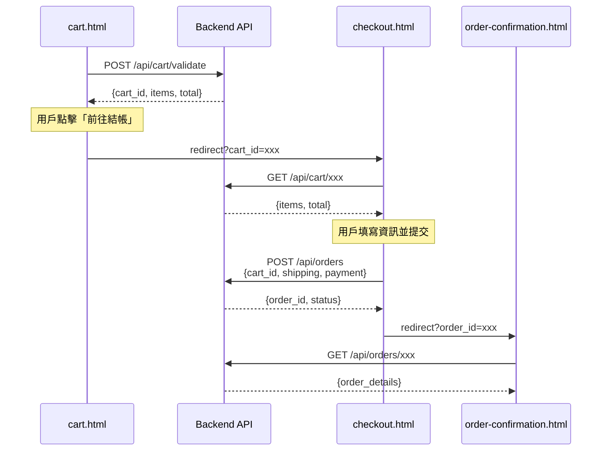

# 前端信息架構規範模板 (Frontend Information Architecture Template)

---

**文件版本 (Document Version):** `v1.0`  
**最後更新 (Last Updated):** `YYYY-MM-DD`  
**主要作者 (Lead Author):** `[UX/UI Team, Frontend Architecture Team]`  
**審核者 (Reviewers):** `[PM, Technical Lead, Product Designer]`  
**狀態 (Status):** `[草稿 (Draft), 審核中 (In Review), 已批准 (Approved)]`  
**相關文檔:** `[PRD](../02_project_brief_and_prd.md)`, `[Frontend Architecture](./12_frontend_architecture_specification.md)`

---

## 📖 模板使用說明 (Template Usage Guide)

> **本模板適用於：** 需要定義清晰信息架構的前端 Web 應用專案  
> **使用方式：** 複製本模板，替換所有 `[佔位符]` 為專案實際內容  
> **建議階段：** 在架構設計階段（PRD 完成後、開發開始前）使用

**模板約定：**
- `[必填項]`：必須提供的內容
- `[可選項]`：根據專案需求決定是否填寫
- `{變數}`：需要替換的動態值
- `範例內容`：以灰色標註，使用時請刪除

---

## 目錄 (Table of Contents)

- [1. 文檔目的與範圍](#1-文檔目的與範圍)
- [2. 核心設計原則](#2-核心設計原則)
- [3. 資訊架構總覽](#3-資訊架構總覽)
- [4. 核心用戶旅程](#4-核心用戶旅程)
- [5. 網站地圖與導航結構](#5-網站地圖與導航結構)
- [6. 頁面詳細規格](#6-頁面詳細規格)
- [7. 組件連結與導航系統](#7-組件連結與導航系統)
- [8. 數據流與狀態管理](#8-數據流與狀態管理)
- [9. URL 結構與路由規範](#9-url-結構與路由規範)
- [10. 實施檢查清單與驗收標準](#10-實施檢查清單與驗收標準)
- [11. 附錄](#11-附錄)

---

## 1. 文檔目的與範圍

### 1.1 目的 (Purpose)

> [必填項] 描述本文檔的核心目的

本文檔旨在提供 `[專案名稱]` 前端的完整信息架構規範，作為前端開發、設計與測試的**單一事實來源 (SSOT)**。

**核心目標：**
- ✅ [目標1：例如，定義清晰的用戶旅程與頁面職責]
- ✅ [目標2：例如，規範導航結構與URL設計]
- ✅ [目標3：例如，統一前端數據流與狀態管理策略]
- ✅ [目標4：例如，提供可執行的實施檢查清單]

### 1.2 適用範圍 (Scope)

| 適用範圍 | 說明 |
|:---|:---|
| **包含 (In Scope)** | [必填項] <br/>- 所有前端頁面的信息架構<br/>- 用戶旅程與導航設計<br/>- URL結構與路由規範<br/>- 頁面間數據傳遞<br/>- [其他項目] |
| **不包含 (Out of Scope)** | [必填項] <br/>- 視覺設計細節（參考 UI/UX Spec）<br/>- 組件級別實現（參考 Component Library）<br/>- 後端 API 設計（參考 API Design Spec）<br/>- [其他排除項目] |

### 1.3 角色與職責 (RACI)

> [必填項] 定義各角色在本文檔生命週期中的責任

| 角色 | 職責 | 責任類型 |
|:---|:---|:---|
| **PM** | [例如：定義用戶需求與核心旅程] | R/A |
| **UX Designer** | [例如：設計信息架構與導航流程] | R/A |
| **Frontend Lead** | [例如：審核技術可行性與實現方案] | A |
| **Frontend DEV** | [例如：實現頁面與導航邏輯] | R |
| **QA** | [例如：驗證用戶流程與導航正確性] | C |
| **[其他角色]** | [職責描述] | [R/A/C/I] |

---

## 2. 核心設計原則

### 2.1 設計哲學

> [必填項] 定義專案的核心價值主張與設計理念

**核心價值主張：**
> 「[一句話描述專案為用戶提供的核心價值]」

**範例：**
> 「幫助用戶在3分鐘內找到最合適的產品，並完成下單」

**第一性原理推演：**
```
商業目標：[例如：提升轉換率]
    ↓
用戶需求：[例如：快速決策]
    ↓
設計策略：[例如：簡化購買流程]
    ↓
架構決策：[例如：N頁精簡流程]
```

### 2.2 資訊架構原則

> [必填項] 闡述指導整個IA設計的核心原則

#### 2.2.1 簡化原則 (Simplification)

- ✅ **保留**：[列出必須保留的核心功能]
- ❌ **移除**：[列出刻意排除的功能]
- 🎯 **專注**：[描述核心聚焦點]

**範例：**
- ✅ 保留：商品瀏覽、購物車、結帳流程
- ❌ 移除：社交分享、評論系統（Phase 2）
- 🎯 專注：流暢的購買體驗

#### 2.2.2 認知負荷優化

> [可選項] 基於認知心理學原理的設計考量

基於 **Hick's Law** 和 **認知負荷理論**：
- **決策點數量**：[例如：從 X 個減少到 Y 個]
- **每頁專注度**：[例如：每個頁面只有 1 個主要目標]
- **資訊分層**：[例如：先總覽再深入]

#### 2.2.3 架構模式

> [必填項] 選擇的架構模式及理由

- [ ] **扁平化架構**：適合簡單流程、少量頁面
- [ ] **層級化架構**：適合複雜系統、多層導航
- [ ] **中心輻射架構**：適合工具型應用
- [ ] **混合架構**：[描述混合方式]

**選擇理由：** [說明為何選擇此架構模式]

---

## 3. 資訊架構總覽

### 3.1 系統層次結構

> [必填項] 使用 Mermaid 圖表展示系統的整體結構

```mermaid
graph TB
    subgraph "Layer 0: [層級名稱]"
        A[頁面A<br/>簡短描述]
    end
    
    subgraph "Layer 1: [層級名稱]"
        B[頁面B<br/>簡短描述]
    end
    
    subgraph "Layer 2: [層級名稱]"
        C[頁面C<br/>簡短描述]
    end
    
    subgraph "Layer 3: [層級名稱]"
        D[頁面D<br/>簡短描述]
    end
    
    A -->|主要路徑| B
    B -->|下一步| C
    C -->|完成| D
    
    style A fill:#[顏色],color:#fff
    style B fill:#[顏色],color:#fff
    style C fill:#[顏色],color:#fff
    style D fill:#[顏色],color:#fff
```

**範例（電商網站）：**
```
Layer 0: 入口層（首頁）
Layer 1: 探索層（商品列表）
Layer 2: 決策層（商品詳情）
Layer 3: 轉換層（購物車、結帳）
Layer 4: 確認層（訂單確認）
```

### 3.2 頁面總覽矩陣

> [必填項] 列出所有核心頁面的基本資訊

| # | 頁面檔名 | 頁面名稱 | 主要職責 | 用戶目標 | 預期停留時間 | 導航深度 |
|:--|:---------|:---------|:---------|:---------|:-------------|:---------|
| 0 | `[檔名.html]` | [頁面名稱] | [職責描述] | [用戶目標] | [時間] | Level 0 |
| 1 | `[檔名.html]` | [頁面名稱] | [職責描述] | [用戶目標] | [時間] | Level 1 |
| 2 | `[檔名.html]` | [頁面名稱] | [職責描述] | [用戶目標] | [時間] | Level 2 |
| ... | ... | ... | ... | ... | ... | ... |

**範例（SaaS應用）：**
| # | 頁面檔名 | 頁面名稱 | 主要職責 | 用戶目標 | 預期停留時間 | 導航深度 |
|:--|:---------|:---------|:---------|:---------|:-------------|:---------|
| 0 | `index.html` | 首頁 | 展示價值主張 | 了解產品 | 30秒 | Level 0 |
| 1 | `pricing.html` | 定價頁 | 展示方案 | 選擇方案 | 1分鐘 | Level 1 |
| 2 | `signup.html` | 註冊頁 | 收集用戶資訊 | 建立帳號 | 2分鐘 | Level 2 |
| 3 | `dashboard.html` | 儀表板 | 展示核心數據 | 使用產品 | 持續 | Level 3 |

**總計：** [N] 頁

---

## 4. 核心用戶旅程

### 4.1 線性旅程設計

> [必填項] 使用 Mermaid 圖表展示主要用戶旅程

```mermaid
graph LR
    A[階段1<br/>[頁面名稱]<br/>[時間]] --> B[階段2<br/>[頁面名稱]<br/>[時間]]
    B --> C[階段3<br/>[頁面名稱]<br/>[時間]]
    C --> D[階段4<br/>[頁面名稱]<br/>[時間]]
    D --> E[階段5<br/>[頁面名稱]<br/>[時間]<br/>可選]
    
    style A fill:#[顏色],color:#fff
    style B fill:#[顏色],color:#fff
    style C fill:#[顏色],color:#fff
    style D fill:#[顏色],color:#fff
    style E fill:#[顏色],color:#000
```

### 4.2 用戶旅程映射表

> [必填項] 詳細描述每個階段的用戶狀態與設計目標

| 階段 | 頁面 | 用戶心理狀態 | 設計目標 | 主要CTA | 預期停留時間 | 轉換率目標 |
|:-----|:-----|:-------------|:---------|:--------|:-------------|:-----------|
| **[階段名稱]** | [頁面名稱] | [心理描述] | [設計目標] | [CTA文字] | [時間] | [百分比] |
| **[階段名稱]** | [頁面名稱] | [心理描述] | [設計目標] | [CTA文字] | [時間] | [百分比] |
| ... | ... | ... | ... | ... | ... | ... |

**範例（電商購物旅程）：**
| 階段 | 頁面 | 用戶心理狀態 | 設計目標 | 主要CTA | 預期停留時間 | 轉換率目標 |
|:-----|:-----|:-------------|:---------|:--------|:-------------|:-----------|
| **發現** | 商品列表 | 探索、比較 | 展示選擇、建立興趣 | 「查看詳情」 | 1-2分鐘 | 70% |
| **評估** | 商品詳情 | 猶豫、求證 | 提供資訊、消除疑慮 | 「加入購物車」 | 2-3分鐘 | 40% |
| **決策** | 購物車 | 確認、計算 | 確認選擇、優化總價 | 「前往結帳」 | 1分鐘 | 80% |
| **轉換** | 結帳頁 | 緊張、謹慎 | 簡化流程、建立信任 | 「完成訂單」 | 2-3分鐘 | 90% |
| **確認** | 訂單確認 | 滿足、期待 | 確認成功、設定預期 | 「查看訂單」 | 30秒 | N/A |

### 4.3 決策點分析

> [可選項] 識別並分析用戶的主要決策點

**用戶在整個流程中的 [N] 個主要決策點：**

```mermaid
graph TD
    Start([用戶訪問]) --> A{決策點1<br/>[決策描述]?}
    
    A -->|是 [預期%]| B[下一步]
    A -->|否 [預期%]| Exit1([離開])
    
    B --> C{決策點2<br/>[決策描述]?}
    C -->|是 [預期%]| D[下一步]
    C -->|否 [預期%]| A
    
    D --> E{決策點3<br/>[決策描述]?}
    E -->|選項A [預期%]| F[路徑A]
    E -->|選項B [預期%]| G[路徑B]
    
    style Start fill:#10B981,color:#fff
    style Exit1 fill:#EF4444,color:#fff
    style A fill:#F59E0B,color:#fff
    style C fill:#F59E0B,color:#fff
    style E fill:#F59E0B,color:#fff
```

**總決策點：** [N] 個

---

## 5. 網站地圖與導航結構

### 5.1 完整網站地圖

> [必填項] 使用樹狀結構或縮排展示完整的頁面層級

```
[網站名稱] (/)
│
├─ 0. [頁面A.html] [層級名稱]
│  └─ → [主要出口頁面]
│
├─ 1. [頁面B.html] [層級名稱]
│  ├─ #[錨點1] (錨點：[說明])
│  ├─ #[錨點2] (錨點：[說明])
│  └─ → [主要出口頁面]
│
├─ 2. [頁面C.html] [層級名稱]
│  ├─ Query Params: ?[參數名]={值} ([必須/可選])
│  ├─ → [出口1]
│  ├─ → [出口2]
│  └─ ← [返回路徑]
│
└─ [繼續列出所有頁面...]
```

**範例（內容管理系統）：**
```
內容管理系統 (/)
│
├─ 0. dashboard.html [儀表板層]
│  └─ → posts.html (主要入口)
│
├─ 1. posts.html [內容列表層]
│  ├─ #all (錨點：所有文章)
│  ├─ #published (錨點：已發布)
│  ├─ #draft (錨點：草稿)
│  └─ → post-edit.html?id={postId} (編輯)
│
├─ 2. post-edit.html [編輯層]
│  ├─ Query Params: ?id={postId} (可選，新建時為空)
│  ├─ → posts.html (返回列表)
│  ├─ → [預覽對話框] (預覽)
│  └─ → posts.html (發布後)
│
└─ 3. settings.html [設定層]
   ├─ #profile (錨點：個人資料)
   ├─ #security (錨點：安全設定)
   └─ ← dashboard.html (返回)
```

### 5.2 導航連結矩陣

> [必填項] 以表格形式展示頁面間的連結關係

| 來源頁面 \ 目標頁面 | [頁面A] | [頁面B] | [頁面C] | [頁面D] | [頁面E] |
|:-------------------|:--------|:--------|:--------|:--------|:--------|
| **[頁面A]** | - | ✅ [連結類型] | ⚠️ [連結類型] | ❌ | ❌ |
| **[頁面B]** | ✅ [連結類型] | - | ✅ [連結類型] | ❌ | ❌ |
| **[頁面C]** | ❌ | ✅ [連結類型] | - | ✅ [連結類型] | ⚠️ [連結類型] |
| **[頁面D]** | ❌ | ❌ | ✅ [連結類型] | - | ✅ [連結類型] |
| **[頁面E]** | ✅ [連結類型] | ❌ | ❌ | ✅ [連結類型] | - |

**圖例：**
- ✅ 推薦路徑（直接可達）
- ⚠️ 需確認路徑（有對話框或驗證）
- ❌ 不存在路徑（不應該連結）

**範例（論壇系統）：**
| 來源 \ 目標 | 首頁 | 討論列表 | 討論詳情 | 發表討論 | 個人資料 |
|:----------|:-----|:---------|:---------|:---------|:---------|
| **首頁** | - | ✅ 主要 | ❌ | ⚠️ 需登入 | ✅ 次要 |
| **討論列表** | ✅ 返回 | - | ✅ 查看 | ✅ 新建 | ✅ 個人 |
| **討論詳情** | ✅ 返回 | ✅ 返回 | - | ⚠️ 回覆需登入 | ✅ 個人 |
| **發表討論** | ✅ 取消 | ✅ 提交後 | ❌ | - | ✅ 個人 |
| **個人資料** | ✅ 返回 | ✅ 我的討論 | ⚠️ 點擊特定項 | ✅ 發表 | - |

---

## 6. 頁面詳細規格

> [必填項] 為每個核心頁面提供詳細規格  
> **使用方式：** 為每個頁面複製以下模板

### 6.X [頁面名稱]

#### 基本信息

| 屬性 | 值 |
|:-----|:---|
| **檔名** | `[filename.html]` |
| **URL** | `[/path/to/page.html]` |
| **URL參數** | `[參數1]=[說明]`（[必須/可選]）<br/>`[參數2]=[說明]`（[必須/可選]） |
| **頁面類型** | [例如：營銷頁、功能頁、表單頁、儀表板等] |
| **導航深度** | Level [N] |
| **SEO優先級** | ⭐⭐⭐⭐⭐ [高/中/低] |

#### 職責與目標

| 項目 | 內容 |
|:-----|:-----|
| **主要任務** | [此頁面的首要職責] |
| **次要任務** | [次要職責] |
| **用戶目標** | [用戶訪問此頁面想達成什麼] |
| **轉換目標** | [預期的用戶行為與轉換率] |

**範例（產品頁）：**
| 項目 | 內容 |
|:-----|:-----|
| **主要任務** | 展示產品詳情，促成購買決策 |
| **次要任務** | 提供規格資訊、用戶評價 |
| **用戶目標** | 了解產品是否符合需求 |
| **轉換目標** | 40% 加入購物車 |

#### [可選項] 設計模型/原理應用

> 如果頁面設計基於特定理論或模型，可在此說明

| 模型/原理 | 應用方式 | 預期效果 |
|:---------|:---------|:---------|
| [例如：AIDA模型] | [如何應用] | [預期達成的效果] |
| [例如：F型視覺模式] | [如何應用] | [預期達成的效果] |

#### 關鍵組件結構

> [必填項] 使用 HTML 偽代碼定義頁面結構

```html
<page-structure>
  <!-- 1. [區塊名稱] -->
  <section class="[class-name]">
    <component>
      <label>[標籤]</label>
      <value>[內容]</value>
    </component>
  </section>

  <!-- 2. [區塊名稱] -->
  <section class="[class-name]">
    <!-- 組件定義 -->
  </section>

  <!-- 繼續列出所有主要區塊... -->
</page-structure>
```

**範例（註冊頁）：**
```html
<page-structure>
  <!-- 1. 頁面標題 -->
  <header class="page-header">
    <logo>品牌Logo</logo>
    <title>建立您的帳號</title>
    <subtitle>只需要一分鐘</subtitle>
  </header>

  <!-- 2. 註冊表單 -->
  <section class="registration-form">
    <form-group>
      <label>電子郵件</label>
      <input type="email" required />
    </form-group>
    <form-group>
      <label>密碼</label>
      <input type="password" required />
      <hint>至少8個字元</hint>
    </form-group>
    <button class="btn-primary">註冊</button>
  </section>

  <!-- 3. 社交登入選項 -->
  <section class="social-login">
    <button class="btn-google">使用Google註冊</button>
    <button class="btn-facebook">使用Facebook註冊</button>
  </section>

  <!-- 4. 登入連結 -->
  <footer class="page-footer">
    <text>已有帳號？</text>
    <link href="login.html">立即登入</link>
  </footer>
</page-structure>
```

#### [可選項] 互動邏輯

> 如果頁面有複雜的互動邏輯，可使用偽代碼說明

```javascript
class [PageName]Logic {
  constructor() {
    // 初始化
  }

  // 關鍵方法1
  method1() {
    // 邏輯描述
  }

  // 關鍵方法2
  method2() {
    // 邏輯描述
  }
}
```

**範例（搜尋頁邏輯）：**
```javascript
class SearchPageLogic {
  constructor() {
    this.searchQuery = '';
    this.filters = {};
    this.results = [];
  }

  // 執行搜尋
  async performSearch() {
    if (this.searchQuery.length < 2) {
      return; // 至少2個字元
    }
    
    const response = await fetch(`/api/search?q=${this.searchQuery}`);
    this.results = await response.json();
    this.renderResults();
  }

  // 應用篩選器
  applyFilters(filterKey, filterValue) {
    this.filters[filterKey] = filterValue;
    this.performSearch(); // 重新搜尋
  }
}
```

#### 導航出口

> [必填項] 定義從此頁面可以到達的所有目標頁面

```javascript
{
  primary: '[主要目標頁面.html]',
  secondary: '[次要目標頁面.html]',
  back: '[返回頁面.html]',
  [其他出口]: '[說明]'
}
```

**範例（產品詳情頁）：**
```javascript
{
  primary: 'cart.html?action=add&product_id={id}',
  secondary: 'wishlist.html?action=add&product_id={id}',
  back: 'products.html',
  share: '觸發分享對話框',
  compare: 'compare.html?add={id}'
}
```

#### 關鍵指標 (KPIs)

> [必填項] 定義如何衡量此頁面的成功

| 指標 | 目標值 | 衡量方式 |
|:-----|:-------|:---------|
| **[指標名稱]** | [目標值] | [如何衡量] |
| **[指標名稱]** | [目標值] | [如何衡量] |
| **[指標名稱]** | [目標值] | [如何衡量] |

**範例（登入頁）：**
| 指標 | 目標值 | 衡量方式 |
|:-----|:-------|:---------|
| **登入成功率** | ≥ 95% | (成功登入數 / 嘗試登入數) × 100% |
| **平均登入時間** | < 30秒 | 從進入頁面到登入成功的時間 |
| **錯誤率** | < 5% | 顯示錯誤提示的次數 |
| **忘記密碼點擊率** | < 10% | 點擊「忘記密碼」的比例 |

#### 驗收標準 (Definition of Done)

> [必填項] 明確定義「完成」的標準

- [ ] [功能完整性標準1]
- [ ] [功能完整性標準2]
- [ ] [視覺設計標準1]
- [ ] [互動體驗標準1]
- [ ] [性能標準1]
- [ ] [無障礙性標準1]
- [ ] [測試覆蓋標準1]

**範例（結帳頁）：**
- [ ] 支付表單所有欄位驗證正確
- [ ] 信用卡資訊加密傳輸
- [ ] 訂單摘要正確顯示
- [ ] 提交按鈕防重複點擊
- [ ] 頁面載入時間 < 2秒
- [ ] 錯誤提示清晰友好
- [ ] 支持鍵盤操作完成結帳
- [ ] 覆蓋成功/失敗流程測試

---

## 7. 組件連結與導航系統

### 7.1 [可選項] 數據傳遞鏈

> 如果頁面間需要傳遞複雜數據（如 Session、Token等），使用序列圖說明


**範例（電商結帳流程）：**


### 7.2 導航系統實現

#### 7.2.1 全局導航管理器

> [必填項] 提供導航管理的基礎代碼結構

```javascript
class NavigationManager {
  constructor() {
    this.history = [];
    this.currentPage = this.getCurrentPage();
    // [其他初始化屬性]
  }
  
  // 獲取當前頁面
  getCurrentPage() {
    const path = window.location.pathname;
    return path.split('/').pop().replace('.html', '');
  }
  
  // [必填項] 驗證方法（根據專案需求自定義）
  validate[Something](value) {
    // 驗證邏輯
    return true/false;
  }
  
  // [必填項] 記錄導航歷史
  recordNavigation(from, to, data = {}) {
    this.history.push({
      from,
      to,
      timestamp: Date.now(),
      data
    });
    localStorage.setItem('nav_history', JSON.stringify(this.history));
  }
  
  // [必填項] 安全導航（帶驗證）
  safeNavigate(targetPage, requiredData = {}) {
    // 檢查必要數據
    // 執行導航
    // 記錄歷史
  }
  
  // [可選項] 智能返回
  goBack() {
    // 返回邏輯
  }
}

// 全局實例
const navManager = new NavigationManager();
```

#### 7.2.2 [可選項] 錨點平滑滾動

```javascript
// 平滑滾動到頁面內區塊
const anchorLinks = document.querySelectorAll('a[href^="#"]');

anchorLinks.forEach(link => {
  link.addEventListener('click', (e) => {
    e.preventDefault();
    const targetId = link.getAttribute('href').substring(1);
    const targetElement = document.getElementById(targetId);
    
    if (targetElement) {
      targetElement.scrollIntoView({
        behavior: 'smooth',
        block: 'start'
      });
      history.pushState(null, null, `#${targetId}`);
    }
  });
});
```

#### 7.2.3 [可選項] 麵包屑導航

```javascript
class BreadcrumbNavigation {
  constructor(containerId) {
    this.container = document.getElementById(containerId);
  }
  
  render(path) {
    // path 格式: ['首頁', '分類', '商品']
    const breadcrumbHTML = path.map((item, index) => {
      if (index === path.length - 1) {
        return `<span class="current">${item}</span>`;
      } else {
        const href = this.getHref(index);
        return `<a href="${href}">${item}</a><separator>></separator>`;
      }
    }).join('');
    
    this.container.innerHTML = breadcrumbHTML;
  }
  
  getHref(index) {
    // 根據專案定義URL映射
  }
}
```

---

## 8. 數據流與狀態管理

### 8.1 數據流向圖

> [必填項] 使用 Mermaid 展示前端、後端、存儲之間的數據流

```mermaid
graph TB
    subgraph "Frontend"
        A[頁面A]
        B[本地存儲]
        C[頁面B]
        D[頁面C]
    end
    
    subgraph "Backend API"
        E[/api/endpoint1]
        F[/api/endpoint2]
        G[/api/endpoint3]
    end
    
    subgraph "Data Storage"
        H[數據庫]
        I[檔案存儲]
        J[快取層]
    end
    
    A -->|POST| E
    E -->|返回數據| A
    A -->|暫存| B
    A -->|GET| F
    
    C -->|GET| G
    G -->|讀取| H
    G -->|返回| C
    
    E -->|寫入| H
    F -->|讀取| J
    
    style A fill:#[顏色],color:#fff
    style C fill:#[顏色],color:#fff
```

### 8.2 狀態持久化策略

> [必填項] 定義如何管理和持久化應用狀態

```javascript
class StateManager {
  constructor() {
    this.storageKey = '[storage_key]';
    this.maxAge = [時間毫秒]; // [說明：例如 7天]
  }
  
  // 保存狀態
  saveState(state) {
    const stateWithTimestamp = {
      ...state,
      savedAt: Date.now()
    };
    localStorage.setItem(this.storageKey, JSON.stringify(stateWithTimestamp));
  }
  
  // 載入狀態
  loadState() {
    const savedData = localStorage.getItem(this.storageKey);
    if (!savedData) return null;
    
    const state = JSON.parse(savedData);
    
    // 檢查是否過期
    if (Date.now() - state.savedAt > this.maxAge) {
      this.clearState();
      return null;
    }
    
    return state;
  }
  
  // 清除狀態
  clearState() {
    localStorage.removeItem(this.storageKey);
  }
}

// 全局狀態管理器
const stateManager = new StateManager();
```

**範例（購物車狀態）：**
```javascript
class CartStateManager {
  constructor() {
    this.storageKey = 'shopping_cart';
    this.maxAge = 7 * 24 * 60 * 60 * 1000; // 7天
  }
  
  // 添加商品
  addItem(productId, quantity) {
    const cart = this.loadState() || { items: [] };
    const existingItem = cart.items.find(item => item.id === productId);
    
    if (existingItem) {
      existingItem.quantity += quantity;
    } else {
      cart.items.push({ id: productId, quantity });
    }
    
    this.saveState(cart);
  }
  
  // 獲取購物車總數
  getTotalItems() {
    const cart = this.loadState();
    if (!cart) return 0;
    
    return cart.items.reduce((sum, item) => sum + item.quantity, 0);
  }
}
```

---

## 9. URL 結構與路由規範

### 9.1 完整URL清單

> [必填項] 列出所有核心頁面的URL結構

```
站點根目錄: [https://example.com/]

核心頁面 URL:
├── /[path1]                           [頁面用途說明]
├── /[path2].html                      [頁面用途說明]
├── /[path3]?[param]={value}           [頁面用途說明] *參數必須/可選
└── /[path4]?[param1]={value1}&[param2]={value2} [頁面用途說明]

錨點導航 URL:
├── /[page].html#[anchor1]             [錨點用途說明]
├── /[page].html#[anchor2]             [錨點用途說明]
└── /[page].html#[anchor3]             [錨點用途說明]

API 端點:
├── [METHOD] /api/[endpoint1]          [API用途說明]
├── [METHOD] /api/[endpoint2]          [API用途說明]
└── [METHOD] /api/[endpoint3]          [API用途說明]
```

**範例（部落格系統）：**
```
站點根目錄: https://blog.example.com/

核心頁面 URL:
├── /                                  [首頁]
├── /posts.html                        [文章列表]
├── /post.html?id={postId}             [文章詳情] *id必須
├── /category.html?cat={categoryName}  [分類頁] *cat必須
├── /author.html?id={authorId}         [作者頁] *id必須
└── /search.html?q={query}             [搜尋結果] *q必須

錨點導航 URL:
├── /posts.html#featured               [精選文章]
├── /posts.html#recent                 [最新文章]
└── /post.html#comments                [留言區]

API 端點:
├── GET  /api/posts                    [獲取文章列表]
├── GET  /api/posts/{id}               [獲取單篇文章]
├── POST /api/comments                 [提交留言]
└── GET  /api/search?q={query}         [搜尋API]
```

### 9.2 URL驗證與錯誤處理

> [必填項] 定義URL驗證邏輯與錯誤處理策略

```javascript
class URLValidator {
  // 驗證[特定類型]URL
  static validate[Type]URL() {
    const params = new URLSearchParams(window.location.search);
    const [paramName] = params.get('[param_name]');
    
    if (![paramName]) {
      this.handleMissing[Param]();
      return false;
    }
    
    if (!this.validate[ParamFormat]([paramName])) {
      this.handleInvalid[Param]();
      return false;
    }
    
    return true;
  }
  
  // 處理缺少參數
  static handleMissing[Param]() {
    // 顯示提示
    // 重定向
  }
  
  // 處理無效參數
  static handleInvalid[Param]() {
    // 顯示提示
    // 重定向
  }
}
```

**範例（文章詳情頁驗證）：**
```javascript
class URLValidator {
  // 驗證文章ID
  static validatePostURL() {
    const params = new URLSearchParams(window.location.search);
    const postId = params.get('id');
    
    if (!postId) {
      this.handleMissingPostId();
      return false;
    }
    
    // 檢查ID格式（假設為數字）
    if (!/^\d+$/.test(postId)) {
      this.handleInvalidPostId();
      return false;
    }
    
    return true;
  }
  
  // 處理缺少文章ID
  static handleMissingPostId() {
    showToast({
      type: 'error',
      message: '缺少文章ID，將返回文章列表'
    });
    setTimeout(() => {
      window.location.href = '/posts.html';
    }, 2000);
  }
  
  // 處理無效文章ID
  static handleInvalidPostId() {
    showToast({
      type: 'warning',
      message: '無效的文章ID'
    });
    setTimeout(() => {
      window.location.href = '/posts.html';
    }, 2000);
  }
}

// 在文章詳情頁使用
if (window.location.pathname.includes('post.html')) {
  if (!URLValidator.validatePostURL()) {
    // 驗證失敗，已自動處理
  }
}
```

### 9.3 [可選項] URL參數規範

> 如果專案有特殊的URL參數格式要求

```javascript
// [參數類型] 格式定義
const [PARAM_TYPE]_FORMAT = /[正則表達式]/;

// [參數類型] 生成
function generate[ParamType]() {
  // 生成邏輯
}

// 範例: "1704268800000_a1b2c3d4"
```

**範例（訂單號格式）：**
```javascript
// 訂單號格式：年月日 + 6位流水號
const ORDER_NUMBER_FORMAT = /^\d{8}-\d{6}$/;

// 訂單號生成
function generateOrderNumber() {
  const date = new Date();
  const dateStr = date.toISOString().slice(0, 10).replace(/-/g, '');
  const sequence = String(Math.floor(Math.random() * 1000000)).padStart(6, '0');
  return `${dateStr}-${sequence}`;
}

// 範例: "20251003-123456"
```

---

## 10. 實施檢查清單與驗收標準

### 10.1 開發階段檢查清單

> [必填項] 按週或階段組織開發任務

#### Phase 1: [階段名稱]（Week 1-N）

| 任務 | 負責人 | 狀態 | 驗收標準 |
|:-----|:-------|:-----|:---------|
| **頁面A開發** | [角色] | ⬜ | - [ ] [標準1]<br/>- [ ] [標準2] |
| **頁面B開發** | [角色] | ⬜ | - [ ] [標準1]<br/>- [ ] [標準2] |
| **[其他任務]** | [角色] | ⬜ | - [ ] [標準1] |

#### Phase 2: [階段名稱]（Week N-M）

| 任務 | 負責人 | 狀態 | 驗收標準 |
|:-----|:-------|:-----|:---------|
| **[任務名稱]** | [角色] | ⬜ | - [ ] [標準1]<br/>- [ ] [標準2] |

**範例（電商網站4週計劃）：**

#### Phase 1: 頁面結構開發（Week 1-2）

| 任務 | 負責人 | 狀態 | 驗收標準 |
|:-----|:-------|:-----|:---------|
| **首頁開發** | Frontend DEV | ⬜ | - [ ] 英雄區塊完整<br/>- [ ] 精選商品輪播<br/>- [ ] CTA按鈕功能 |
| **商品列表頁** | Frontend DEV | ⬜ | - [ ] 篩選器正常<br/>- [ ] 分頁功能<br/>- [ ] 排序功能 |
| **商品詳情頁** | Frontend DEV | ⬜ | - [ ] 圖片輪播<br/>- [ ] 規格選擇<br/>- [ ] 加入購物車 |
| **購物車頁** | Frontend DEV | ⬜ | - [ ] 商品列表<br/>- [ ] 數量調整<br/>- [ ] 總價計算 |

#### Phase 2: 整合與優化（Week 3-4）

| 任務 | 負責人 | 狀態 | 驗收標準 |
|:-----|:-------|:-----|:---------|
| **API整合** | Frontend DEV | ⬜ | - [ ] 所有API調用正常<br/>- [ ] 錯誤處理完善 |
| **響應式優化** | Frontend DEV | ⬜ | - [ ] Mobile/Tablet/Desktop測試通過 |
| **性能優化** | Frontend DEV | ⬜ | - [ ] Lighthouse分數 > 90 |

### 10.2 質量檢查清單

#### 用戶體驗 (UX)

- [ ] [核心流程]可在[N]分鐘內完成
- [ ] 所有導航路徑清晰無歧義
- [ ] 無死鏈或404錯誤
- [ ] 錯誤提示友好且可操作
- [ ] 載入狀態明確可見
- [ ] 移動端體驗流暢
- [ ] [其他UX標準]

#### 技術規範 (Technical)

- [ ] 所有URL符合規範
- [ ] [特定驗證]邏輯正確
- [ ] 狀態持久化功能正常
- [ ] API調用錯誤處理完善
- [ ] 無Console錯誤或警告
- [ ] 代碼符合[Linter]規範
- [ ] [其他技術標準]

#### 內容完整性 (Content)

- [ ] 所有頁面內容完整
- [ ] 文案無錯別字
- [ ] 圖片和圖標正常顯示
- [ ] [特定視覺化]渲染正確
- [ ] [特定功能]完整準確
- [ ] [其他內容標準]

#### 性能指標 (Performance)

- [ ] LCP < 2.5s
- [ ] FID < 100ms
- [ ] CLS < 0.1
- [ ] 頁面體積 < [N]MB
- [ ] API響應時間 < [N]ms
- [ ] [其他性能標準]

#### SEO與無障礙性 (SEO & A11y)

- [ ] 所有頁面有完整meta tags
- [ ] 圖片有alt屬性
- [ ] 語義化HTML
- [ ] 鍵盤導航支持
- [ ] 螢幕閱讀器兼容
- [ ] [其他SEO/A11y標準]

### 10.3 測試矩陣

| 測試類型 | 測試範圍 | 工具/方法 | 負責人 | 完成標準 |
|:---------|:---------|:----------|:-------|:---------|
| **單元測試** | [範圍說明] | [工具名稱] | [角色] | 覆蓋率 > [N]% |
| **整合測試** | [範圍說明] | [工具名稱] | [角色] | [標準] |
| **E2E測試** | [範圍說明] | [工具名稱] | [角色] | [標準] |
| **性能測試** | [範圍說明] | [工具名稱] | [角色] | [標準] |
| **無障礙測試** | [範圍說明] | [工具名稱] | [角色] | [標準] |
| **跨瀏覽器** | [範圍說明] | [工具名稱] | [角色] | [標準] |
| **響應式測試** | [範圍說明] | [工具名稱] | [角色] | [標準] |

**範例：**
| 測試類型 | 測試範圍 | 工具/方法 | 負責人 | 完成標準 |
|:---------|:---------|:----------|:-------|:---------|
| **單元測試** | 核心函數（驗證、計算等） | Jest | DEV | 覆蓋率 > 80% |
| **整合測試** | API調用與數據流 | Cypress | QA | 核心流程通過 |
| **E2E測試** | 完整購物流程 | Playwright | QA | 結帳流程通過 |
| **性能測試** | 頁面載入與交互 | Lighthouse | DEV | 所有指標 > 90 |
| **無障礙測試** | WCAG 2.1 AA | axe DevTools | QA | 無嚴重問題 |
| **跨瀏覽器** | Chrome, Firefox, Safari, Edge | BrowserStack | QA | 一致性 > 95% |
| **響應式測試** | Mobile, Tablet, Desktop | Chrome DevTools | QA | 三種尺寸正常 |

### 10.4 上線前最終檢查 (Go/No-Go Checklist)

#### Gate 準入條件

- [ ] 所有P0功能已完成並測試通過
- [ ] 無阻斷性Bug
- [ ] 性能指標達標
- [ ] 安全掃描通過
- [ ] [其他準入條件]

#### Gate 準出條件

- [ ] PM 確認功能完整性
- [ ] [Frontend Lead] 確認代碼品質
- [ ] QA 確認測試覆蓋
- [ ] [SRE/Ops] 確認部署就緒
- [ ] [其他準出條件]

#### 角色簽核 (RACI)

| 角色 | 責任 | 簽核狀態 | 日期 |
|:-----|:-----|:---------|:-----|
| **PM** | 確認產品需求滿足 | ⬜ | |
| **[Frontend Lead]** | 確認技術實現品質 | ⬜ | |
| **QA Lead** | 確認測試覆蓋與結果 | ⬜ | |
| **[SRE/Ops]** | 確認監控與部署準備 | ⬜ | |
| **[其他角色]** | [責任描述] | ⬜ | |

---

## 11. 附錄

### 11.1 術語表

| 術語 | 英文 | 定義 |
|:-----|:-----|:-----|
| **信息架構** | Information Architecture (IA) | 組織、結構化和標記內容的藝術與科學 |
| **用戶旅程** | User Journey | 用戶與系統互動的完整路徑 |
| **認知負荷** | Cognitive Load | 用戶在執行任務時所需的心智努力 |
| **[專案特定術語]** | [英文] | [定義] |

### 11.2 相關文檔連結

| 文檔類型 | 檔名 | 路徑 |
|:---------|:-----|:-----|
| **PRD** | [檔名] | [相對路徑] |
| **前端架構** | [檔名] | [相對路徑] |
| **API設計** | [檔名] | [相對路徑] |
| **UI/UX規範** | [檔名] | [相對路徑] |
| **[其他文檔]** | [檔名] | [相對路徑] |

### 11.3 變更記錄

| 日期 | 版本 | 作者 | 變更摘要 |
|:-----|:-----|:-----|:---------|
| YYYY-MM-DD | v1.0 | [作者] | 初版發布 |
| YYYY-MM-DD | v1.1 | [作者] | [變更說明] |

### 11.4 審核記錄

| 角色 | 姓名 | 日期 | 簽名/狀態 |
|:-----|:-----|:-----|:---------|
| **PM** | | | ⬜ |
| **Frontend Lead** | | | ⬜ |
| **UX Designer** | | | ⬜ |
| **[其他角色]** | | | ⬜ |

---

## 📌 模板使用檢查清單

在完成本文檔填寫後，請確認：

- [ ] 所有 `[必填項]` 已填寫
- [ ] 所有 `[佔位符]` 已替換為實際內容
- [ ] 範例內容已刪除或替換
- [ ] Mermaid圖表已更新為專案實際內容
- [ ] 代碼範例已根據專案技術棧調整
- [ ] 所有頁面都有詳細規格（第6節）
- [ ] 驗收標準明確且可執行
- [ ] KPIs可衡量
- [ ] 相關文檔連結正確
- [ ] 已獲得RACI定義的角色審核

---

**END OF TEMPLATE**

---

## 💡 延伸閱讀與參考資源

**信息架構理論：**
- [Information Architecture for the World Wide Web](https://www.oreilly.com/library/view/information-architecture-for/0596527349/)
- [Don't Make Me Think by Steve Krug](https://www.sensible.com/dont-make-me-think/)

**用戶體驗設計：**
- [The Elements of User Experience by Jesse James Garrett](https://www.jjg.net/elements/)
- [NN/g Nielsen Norman Group](https://www.nngroup.com/)

**前端架構最佳實踐：**
- [Web.dev](https://web.dev/)
- [MDN Web Docs](https://developer.mozilla.org/)

**可視化工具：**
- [Mermaid Documentation](https://mermaid.js.org/)
- [C4 Model](https://c4model.com/)

