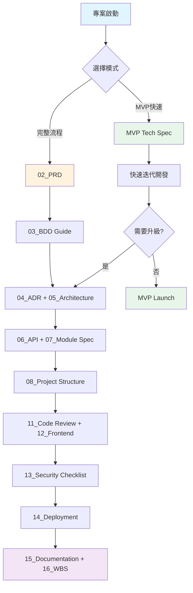

# VibeCoding 工作流程模板索引

> **最後更新：** 2025-10-03  
> **版本：** v2.0  
> **狀態：** 活躍 (Active)

---

## 📚 模板總覽

本目錄包含完整的產品開發流程模板，涵蓋從規劃到維護的各個階段。所有模板均可依據專案需求選擇**完整流程 (Full Process)** 或 **MVP 快速迭代 (Lean MVP)** 模式使用。

---

## 📑 模板清單

### 🎯 階段 0：總覽與工作流 (00-01)

| 序號 | 檔名 | 用途 | 適用階段 |
|:---:|:---|:---|:---|
| **00** | [workflow_manual.md](./00_workflow_manual.md) | 產品開發流程使用說明書，包含完整流程與 MVP 模式的選擇指南 | 全階段 |
| **01** | [development_workflow_cookbook.md](./01_development_workflow_cookbook.md) | 開發流程總覽手冊，說明從商業價值到高品質程式碼的完整鏈路 | 全階段 |

---

### 📋 階段 1：規劃階段 (02-03)

| 序號 | 檔名 | 用途 | 適用階段 |
|:---:|:---|:---|:---|
| **02** | [project_brief_and_prd.md](./02_project_brief_and_prd.md) | 專案簡報與產品需求文件，定義「為何做」與「做什麼」 | Planning |
| **03** | [behavior_driven_development_guide.md](./03_behavior_driven_development_guide.md) | 行為驅動開發指南，將需求轉化為精確的 BDD 情境 | Planning |

---

### 🏗️ 階段 2：架構與設計 (04-06)

| 序號 | 檔名 | 用途 | 適用階段 |
|:---:|:---|:---|:---|
| **04** | [architecture_decision_record_template.md](./04_architecture_decision_record_template.md) | 架構決策記錄模板 (ADR)，記錄重要技術決策與權衡 | Architecture |
| **05** | [architecture_and_design_document.md](./05_architecture_and_design_document.md) | 整合性架構與設計文檔，包含 C4 模型、DDD 戰略設計 | Architecture |
| **06** | [api_design_specification.md](./06_api_design_specification.md) | API 設計規範，定義介面契約、錯誤處理、版本控制策略 | Design |

---

### 🔧 階段 3：詳細設計 (07-10)

| 序號 | 檔名 | 用途 | 適用階段 |
|:---:|:---|:---|:---|
| **07** | [module_specification_and_tests.md](./07_module_specification_and_tests.md) | 模組規格與測試案例，使用契約式設計定義函式職責 | Design |
| **08** | [project_structure_guide.md](./08_project_structure_guide.md) | 專案結構指南，標準化目錄與檔案組織 | Design |
| **09** | [file_dependencies_template.md](./09_file_dependencies_template.md) | 檔案依賴關係模板，分析模組間的依賴與耦合 | Design |
| **10** | [class_relationships_template.md](./10_class_relationships_template.md) | 類別關係文檔，使用 UML 呈現靜態結構關係 | Design |

---

### 💻 階段 4：開發與品質 (11-12, 17)

| 序號 | 檔名 | 用途 | 適用階段 |
|:---:|:---|:---|:---|
| **11** | [code_review_and_refactoring_guide.md](./11_code_review_and_refactoring_guide.md) | Code Review 與重構指南，確保程式碼品質 | Development |
| **12** | [frontend_architecture_specification.md](./12_frontend_architecture_specification.md) | 前端架構規範，定義前端技術棧與設計模式 | Development |
| **17** | [frontend_information_architecture_template.md](./17_frontend_information_architecture_template.md) | 前端信息架構規範模板，定義用戶旅程、頁面結構、導航系統（通用模板） | Development |

---

### 🔒 階段 5：安全與部署 (13-14)

| 序號 | 檔名 | 用途 | 適用階段 |
|:---:|:---|:---|:---|
| **13** | [security_and_readiness_checklists.md](./13_security_and_readiness_checklists.md) | 綜合品質檢查清單，涵蓋安全、隱私與生產準備 | Security & Deployment |
| **14** | [deployment_and_operations_guide.md](./14_deployment_and_operations_guide.md) | 部署與運維指南，包含 CI/CD、監控與回滾策略 | Deployment |

---

### 📖 階段 6：維護與管理 (15-16)

| 序號 | 檔名 | 用途 | 適用階段 |
|:---:|:---|:---|:---|
| **15** | [documentation_and_maintenance_guide.md](./15_documentation_and_maintenance_guide.md) | 文檔與維護指南，確保知識保存與團隊協作 | Maintenance |
| **16** | [wbs_development_plan_template.md](./16_wbs_development_plan_template.md) | WBS 開發計劃模板，工作分解結構與進度管理 | Management |

---

## 🎯 使用流程圖

---

## 📖 快速導航

### 依據角色查找

#### 產品經理 (PM)
- [00_workflow_manual.md](./00_workflow_manual.md) - 理解整體流程
- [02_project_brief_and_prd.md](./02_project_brief_and_prd.md) - 撰寫 PRD
- [03_behavior_driven_development_guide.md](./03_behavior_driven_development_guide.md) - 定義 BDD 情境

#### 技術負責人 (TL)
- [01_development_workflow_cookbook.md](./01_development_workflow_cookbook.md) - 開發流程指南
- [04_architecture_decision_record_template.md](./04_architecture_decision_record_template.md) - 記錄技術決策
- [05_architecture_and_design_document.md](./05_architecture_and_design_document.md) - 系統架構設計

#### 架構師 (ARCH)
- [05_architecture_and_design_document.md](./05_architecture_and_design_document.md) - 架構設計
- [09_file_dependencies_template.md](./09_file_dependencies_template.md) - 依賴關係分析
- [10_class_relationships_template.md](./10_class_relationships_template.md) - 類別設計

#### 開發工程師 (DEV)
- [07_module_specification_and_tests.md](./07_module_specification_and_tests.md) - 模組規格
- [08_project_structure_guide.md](./08_project_structure_guide.md) - 專案結構
- [11_code_review_and_refactoring_guide.md](./11_code_review_and_refactoring_guide.md) - Code Review

#### 前端工程師 (Frontend DEV)
- [12_frontend_architecture_specification.md](./12_frontend_architecture_specification.md) - 前端架構規範
- [17_frontend_information_architecture_template.md](./17_frontend_information_architecture_template.md) - 前端信息架構模板

#### 安全工程師 (SEC)
- [13_security_and_readiness_checklists.md](./13_security_and_readiness_checklists.md) - 安全檢查清單

#### 運維工程師 (SRE/OPS)
- [14_deployment_and_operations_guide.md](./14_deployment_and_operations_guide.md) - 部署運維指南

---

## 🔄 版本更新記錄

### v2.1 (2025-10-03)
- ✅ 新增 `17_frontend_information_architecture_template.md` - 前端信息架構規範模板（通用模板）
- ✅ 在角色查找中新增「前端工程師」分類

### v2.0 (2025-10-03)
- ✅ 重新組織所有模板序號，確保清晰連續
- ✅ 將 `workflow_manual.md` 提升為 `00_`，作為總綱
- ✅ 完整命名 `ADR template` 為 `architecture_decision_record_template.md`
- ✅ 更新所有交叉引用路徑
- ✅ 新增本索引文件 (INDEX.md)

### v1.0 (2025-10-01)
- 初始版本，建立基礎模板結構

---

## 💡 使用建議

1. **首次使用**：先閱讀 [00_workflow_manual.md](./00_workflow_manual.md) 了解整體流程
2. **選擇模式**：根據專案特性選擇完整流程或 MVP 模式
3. **階段式推進**：依序使用各階段模板，確保文檔完整性
4. **持續更新**：隨專案進展更新對應文檔，保持同步

---

## 📞 支援與回饋

如有任何問題或建議，請：
1. 參考 [00_workflow_manual.md](./00_workflow_manual.md) 中的使用原則
2. 查閱相關階段的具體模板
3. 聯繫專案架構師或技術負責人

---

**Remember**: 文檔是專案的契約與單一事實來源 (SSOT)，請保持更新與準確性。

